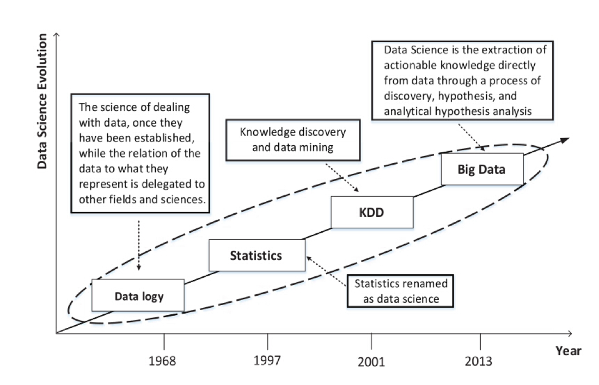
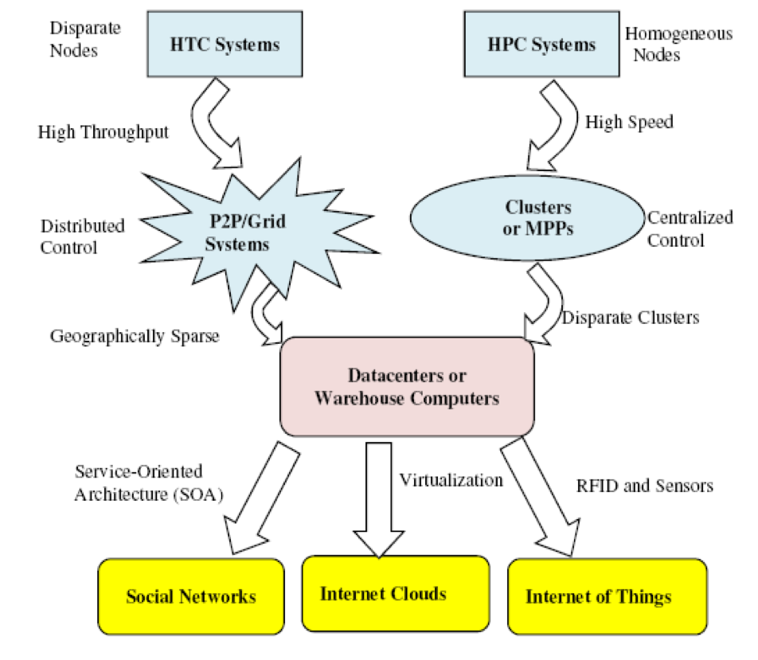
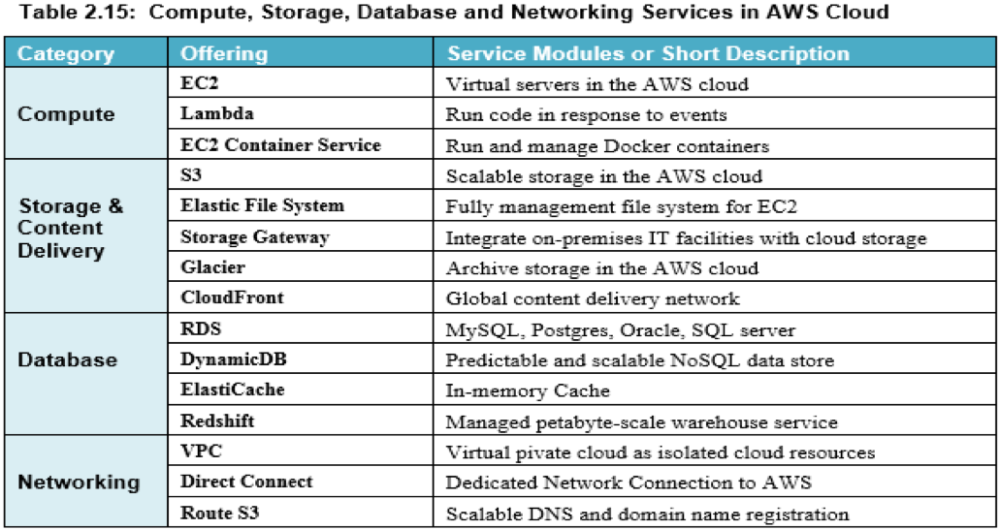
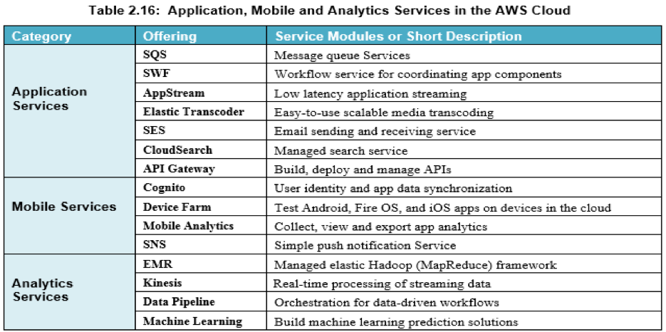
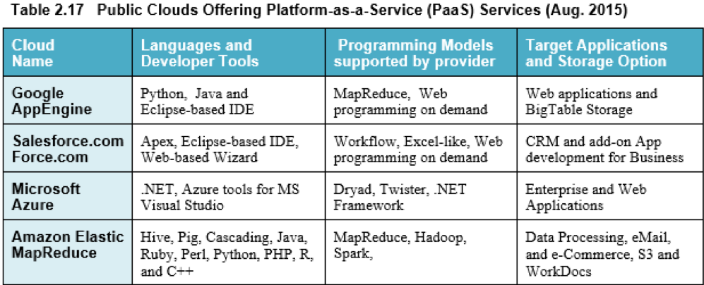

class: middle, center

# 大数据的信息基础设施

## 云计算

陈一帅

[yschen@bjtu.edu.cn](mailto:yschen@bjtu.edu.cn)

北京交通大学电子信息工程学院

## .footnote[网络智能实验室]

???

class: middle, center

本部分目的

从网络、存储和计算的基础设施演进

说明驱动大数据发展的底层物理技术因素

本部分内容

- 简介
- 存储模型
- 计算模型
- 网络模型

???
  - 传统网络结构
  - Clos 网络结构
  - 网络虚拟化

The development of the digital computer led computation to join experiment and theory as a third major paradigm of scientific discovery and engineering design. Supercomputers became essential lab instruments. In the 40 years that followed, the power of supercomputers has grown by a factor of over one billion. But now science is rapidly evolving into a fourth paradigm [153] of data-driven discovery.

T. Hey, S. Tansley, and K. Tolle. The Fourth Paradigm: Data-Intensive Scientific Discovery. Kindle, 2009.

---

# 内容

- .red[云的起源和定义]
- 云计算的服务模式
- 云分布式计算的特性

---

# 数据科学的演进

.center[.width-100[]]

???
statistics, such as Bayes clustering, categorizing the data. Basically the math department

大数据处理的各种方法

- HTC
  - High-Throughput Computing
  - P2P
  - 网格
- HPC
  - High-Performance Computing
  - 集群
  - MPP: Massively Parallel Processors
- 云

大数据处理的各种方法

.center[.width-90[]]

???

- HPC vs. HTC 系统

---

# 云与大数据的关系

- 大数据
  - 数据量大
  - 数据产生速度快
  - 数据维度高、类型多
- 要求底层信息基础设施具有可伸缩性（scalability）
- 云提供这种可伸缩性

???

- 虚拟化

> Big Data refers to digital data volume, velocity and/or variety whose management requires scalability across coupled horizontal resources

本章内容

- 背景
- .red[云的起源和定义]
- 云计算的服务模式
- 云分布式计算的特性

class: middle, center

云计算

.center[.width-90[]]

---

# 云的起源

- 大型网络公司业务规模庞大
  - 腾讯、百度、阿里、谷歌、亚马逊、微软
- 为自己的业务建设了大规模信息基础设施
  - 存储、计算、网络
- 这些信息基础设施利用率不高
  - 亚马逊首席执行官对其计算机数量和利用率低感到惊讶
  - 因为这是为高峰负载（圣诞节）设计的
- 开放它们
  - 2006 年 8 月 25 日，亚马逊宣布 EC2
  - 云的诞生

???

The technology companies whose business depends on understanding their online customers are the same companies that have built the cloud to handle data analytics workloads.

As a result, data science and machine learning are now among the most in-demand technical specialties [215].

R. Orihuela and D. Bass. Help wanted: Black belts in data, Jun 2015. http://www.bloomberg.com/news/articles/2015-06-04/help-wanted-black-belts-in-data.

To meet the needs of “big data” analysis, cloud builders are rapidly evolving cloud data centers architectures down paths pioneered by the supercomputer vendors.

云的起源

⇒ Birth of Cloud Computing in reality
(Prior theoretical concepts of computing as a utility)

- Amazon’s CEO was amazed by the number of computers in their datacenter and their low utilization
- Computing facilities are designed for peak load (Christmas)
- Needed a way to rent unused capacity, like renting their warehouses and other infrastructure
  ⇒ Develop an application programming interfaces (APIs) to remotely use computers.
- So began the computer rental business that we now call cloud computing.
- Sharing an underutilized resource is good for cloud service customers as well as for the cloud service providers.
  Ref: Raj Jain and Subharthi Paul, "Network Virtualization and Software Defined Networking for Cloud Computing - A Survey," IEEE Communications Magazine, Nov 2013, pp. 24-31, ISSN: 01636804, DOI: 10.1109/MCOM.2013.6658648,

---

# 云的定义

- 一台弹性计算机
  - 按需存储和计算
  - 对象存储以及虚拟机和容器的执行
- 一种模型
  - 对可配置资源（网络，服务器，存储，应用程序和服务）共享池的便捷、按需网络访问
  - 这些资源可以以最少的管理工作量或服务提供商交互，进行快速配置和释放

???

- 资源的可伸缩性
- Infrastructure as a service (IaaS)
  (NIST)

> Cloud computing is a model for enabling convenient, on-demand network access to a shared pool of configurable computing resources (e.g., networks, servers, storage, applications, and services) that can be rapidly provisioned and released with minimal management effort or service provider interaction.

- National Institute of Standards and Technology (NIST)
  http://www.nist.gov/itl/cloud/
- Key Characteristics:
- On-Demand self-service
- Scalable
- Shared
- Ubiquitous access
- Rapid provisioning/released
- Minimal management

四种技术的融合使云成为可能。

- 硬件虚拟化和多核芯片使在云中进行动态配置成为可能
- 网格计算技术奠定了计算云的必要基础
- 面向服务的体系结构（SOA），Web 2.0 和平台的 mashup 的最新进展将云推向了另一个新的台阶
- 自主计算和自动化数据中心操作已启用云

.center[.width-100[]]
(Courtesy of Buyya, Broberg and Goscinski

Why Cloud?

- Clouds are better than private data center, because of they are on-demand, large-scale, and dispersed.

10 Laws of Cloudonomics

1. Utility services cost less even though they cost more. (Customers don't pay when they don't use it).
2. On-Demand trumps forecasting. (Forecasting is often wrong.)
3. The peak of the sum is never greater than the sum of the peaks.
4. Aggregate demand is smoother than individual.
5. Average unit costs are reduced by distributing fixed costs over more units of output.
6. Superiority in numbers is the most important factor in the result of a combat
   (Numerical superiority is the key to winning battles.)
7. Space-time is a continuum.
   (You can reduce time by having more VMs)
8. Dispersion is the inverse square of the latency.
9. Don't put all your eggs in one basket.
   (High reliability with many data centers per CSP).
10. An object at rest tends to stay at rest.
    (Private datacenters are located in suboptimal locations: headquarters).
    While cloud data centers are located optimally)

Ref: Joe Weinman, "The 10 Laws of Cloudonomics," Sep 7, 2008, http://gigaom.com/2008/09/07/the-10-laws-of-cloudonomics

AWS

The introduction by Amazon of its Elastic Compute Cloud (EC2) service in 2006 marked the true beginning of cloud computing.

AWS 公共云由最高管理层，PaaS 和 IaaS 平台以及在全球各个区域的可用性区域中的数据中心之上构建的全球基础架构组成。

.center[.width-100[]]

实时 VM 迁移步骤

将 VM 从 Dom0 域实时迁移到启用 XEN 的目标主机

.center[.width-100[]]

---

# 云计算技术的组成

- 存储
  - 低成本，大容量
- 计算
  - 多核处理器
  - 数据中心，服务器集群
- 网络
  - 100G 以太网
  - 大规模高速 Clos 网络连接
  - 最小化任何规模的延迟

???

Why Big Data Now?

1. Low cost storage to store data that was discarded earlier
2. Powerful multi-core processors
3. Low latency possible by distributed computing: Compute clusters and grids connected via high-speed networks
4. Virtualization  Partition, Aggregate, isolate resources in any size and dynamically change it  Minimize latency for any scale
5. Affordable storage and computing with minimal man power via clouds
    Possible because of advances in Networking
6. Better understanding of task distribution (MapReduce), computing architecture (Hadoop),
7. Advanced analytical techniques (Machine learning)
8. Managed Big Data Platforms: Cloud service providers, such as Amazon Web Services provide Elastic MapReduce, Simple Storage Service (S3) and HBase – column oriented database. Google’ BigQuery and Prediction API.
9. Open-source software: OpenStack, PostGresSQL

使大数据成为可能的因素（大数据侧重分析）

1. Big data has become possible due to low cost storage, high performance servers, high-speed networking, new analytics
2. Google File System, BigTable Database, and MapReduce framework sparked the development of Apache Hadoop.
3. Key components of Hadoop systems are HDFS, Avro data serialization system, MapReduce or YARN computation engine, Pig Latin high level programming language, Hive data warehouse, HBase database, and ZooKeeper for reliable distributed coordination.
4. Discovering patterns in data and using them is called Analytics. It can be descriptive, predictive, or prescriptive
5. Types of Databases: Relational, SQL, NoSQL, NewSQL,
   Key-Value Pair (KVP), Document, Columnar, Graph, and
   Spatial

---

# 内容

- 背景
- 云的起源和定义
- .red[云计算的服务模式]
- 云分布式计算的特性

---

# 云的三种服务模式

- Infrastructure as a service (IaaS)
  - 提供基础设施，如虚拟机，存储和网络
  - 用户可以自己管理，在上面部署自己的操作系统和软件
  - Amazon AWS
- Platform as a service (PaaS)
  - 提供软硬件平台，包括硬件和操作系统，开发和管理工具
  - 用户可以利用这些工具，开发和部署他们的软件
  - Microsoft Azure
- Software as a service (SaaS)
  - 具有用户界面的完整应用程序，用户直接用
  - 如 Salesforce.com

???

Cloud Service Models

Application
Operating System
Hardware

- Infrastructure as a service (IaaS): Provide virtual machines, storage, and network facilities that users can manage. Users install their own operating systems and software, e.g., Amazon Web Services
- Platform as a service (PaaS): Includes hardware and operating systems, development and administrative tools. Users develop and deploy their software, e.g., Microsoft Azure
- Software as a service (SaaS): Complete application with a user interface, e.g., Google Docs, Gmail, Salesforce.com

---

# 云提供的服务 IaaS

- 以 Amazon AWS 为例
- 计算、存储、数据库、网络服务

.center[.width-100[]]

---

# 云提供的服务 PaaS

- 以 Amazon AWS 为例
- 应用、移动、分析服务

.center[.width-100[]]

---

# 云提供的服务 PaaS

.center[.width-100[]]

---

# 云提供的服务 EMR

- 大数据 EMR（E-MapReduce）PaaS 服务
  - 计算集群（Cluster）
- 节点类型
  - 管理节点：协调数据和任务的分布
  - 核心节点：运行任务，存储数据
  - 任务节点：运行任务
- 安装和配置了各种应用
  - Hadoop MapReduce，YARN（资源管理和分配），HDFS

---

# 云提供的服务 SaaS

- Salesforce CRM（客户关系管理）SaaS 服务
  - 销售云：管理客户资料，跟踪商机，优化活动
  - 服务云：创建，跟踪和路由服务案例，包括社交媒体网络服务
  - 市场云：社交营销，从社交媒体中识别销售线索，发现粉丝
  - 数据云：获取和管理 CRM 记录
  - 协作云：业务协作
  - 分析云：基于机器学习的销售绩效分析
  - 定制云：在标准 CRM 应用程序之上创建附加应用程序

---

# 部署私有云

- VMware vSphere 数据中心虚拟化套件
- OpenStack 开源云计算系统

---

# 内容

- 背景
- 云的起源和定义
- 云计算的服务模式
- .red[云分布式计算的特性]

---

# 分布式系统 CAP 特性

- 在包含多台计算机的分布式系统中，有三个可追求的特性
- 一致性（Consistency）
  - 所有计算机同时看到相同的数据
- 可用性（Availability）
  - 每个请求都收到有关是否请求的响应成功或失败
- 分区容限（Partition tolerance）
  - 即使网络故障阻止计算机进行通信，系统仍可继续运行

???

An obvious solution to scaling databases is to distribute and/or replicate data across multiple computers, for example by distributing different tables, or different rows from the same table.

However, distribution and replication also introduce challenges, as we now explain. Let us first define some terms. In a system that comprises multiple computers:
• Consistency indicates that all computers see the same data at the same time.
• Availability indicates that every request receives a response about whether it
succeeded or failed.
• Partition tolerance indicates that the system continues to operate even if a network failure prevents computers from communicating

---

# CAP 定理

- 定理
  - 无法创建具有所有 CAP 三个属性的分布式系统
- 含义
  - 无法在可用性和分区容忍度的同时实现严格的一致性
- 挑战
  - 随着计算机数量增长，系统单元出现故障可能性随之增加
  - 设计人员必须为特定系统选择高一致性还是高可用性

???

it is not possible to create a distributed system with all three properties. This situation creates a challenge with large transactional datasets. Distribution is needed for high performance, but as the number of computers grows, so too does the likelihood of network disruption among computers [65]. As strict consistency cannot be achieved at the same time as availability and partition-tolerance, the DBMS designer must choose between high consistency or high availability for a particular system.

P. Bailis and K. Kingsbury. The network is reliable. Queue, 12(7):20, 2014.

---

# 一致性 vs. 可用性

- 对可用性和一致性的选择取决于业务需求
- 例：在电子商务环境中
- 添加购物车
  - 可选择高可用性，保证向购物车添加商品的请求一定成功
  - 可向客户隐藏错误，并在以后进行处理
- 订单提交
  - 可选择高一致性
  - 因为几种服务（信用卡处理，运输和处理，报告）需要同时访问数据

???

The right combination of availability and consistency will depend on the needs of the service. For example, in an e-commerce setting, we may choose high availability for a checkout process to ensure that revenue-producing requests to add items to a shopping cart are honored. Errors can be hidden from the customer and sorted out later. However, for order submission—when a customer submits an order—we should favor consistency, because several services (credit card processing, shipping and handling, reporting) need to access the data simultaneously.

快速平台部署
快速，高效，灵活地部署云资源，为用户提供动态计算环境

虚拟集群随需应变
虚拟化的虚拟机群集已调配以满足工作负载变化时的用户需求

多租户技术
SaaS 将软件分发给大量用户，以便他们同时使用和共享资源

海量数据处理
Internet 搜索和 Web 服务通常需要大量的数据处理，尤其是为了支持个性化服务

网络规模的交流
支持电子商务，远程教育，远程医疗，社交网络，数字政府和数字 娱乐等

分布式存储
个人记录和公共档案信息的大规模存储需要在云上进行分布式存储

许可和计费服务
许可证管理和计费服务极大地使公用事业计算中的所有类型的云服务受益

- 应用云
  - 腾讯文档
- 平台云
  - 微软 Azure
- 计算和存储云
  - AWS

大数据云平台架构

预处理非结构化数据：
传统的关系数据库无法支持非结构化数据，因此我们要求 NoSQL 处理来自嘈杂和肮脏来源的不完整数据。这些数据通常缺乏准确性或不可追溯。许多博客或社交交流无法轻松验证，因此需要数据过滤和完整性控制。

社交图，API 和可视化工具
需要有效地处理非结构化社交媒体数据。这就需要经济高效的云和分布式文件系统来聚合，存储，处理和分析大数据。需要自下而上的技术来发现未知的结构和图案。

数据分析软件工具
在大数据云中是必需的。在随后的章节中，我们将介绍一些用于大数据分析的开源或商业工具。这些工具必须集成在一起，以最大程度地发挥协同作用。商业智能必须升级为归纳统计或在关键决策中支持预测分析。

机器学习和云分析算法
对有监督或无监督机器或深度学习的需求很大。数据科学家必须具有足够的领域知识，统计数据挖掘，社会科学和编程技能。因此，它需要跨领域的专家合作。

数据治理与安全
要求数据隐私，完整性控制，SLA 合规性，责任制和信任管理等。安全控制必须在全球范围内部署。数据隐私必须保留到细粒度的访问控制级别。

工作流

.center[.width-100[]]

---

# 小结

- 背景
- 云的起源和定义
- 云计算的服务模式
- 云分布式计算的特性

---

# 练习

- 调研国内外云平台，申请免费学生/试用账号
  - Azure: https://signup.azure.com
  - AWS: https://aws.amazon.com/cn/free/
  - Aliyun: https://free.aliyun.com/
  - 华为云: https://activity.huaweicloud.com/free_test/index.html
  - 腾讯云: https://cloud.tencent.com/act/free

- 调研它们提供的各种服务，指出其服务模式
  - 特别调研大数据服务，指出其服务模式

---

# 练习

- 完成报告
  - 【腾讯文档】Lab1、大数据平台调研
  - https://docs.qq.com/doc/DT3BGSFZDQWRQWnRr

???
- 调研它们提供的视频服务，指出其服务模式
