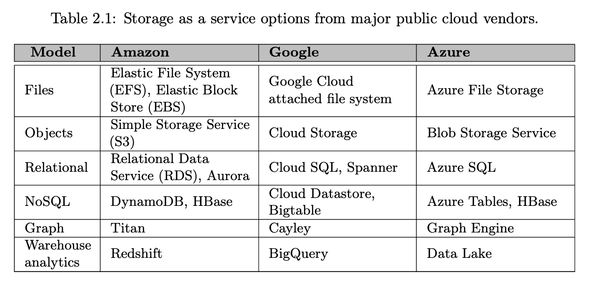
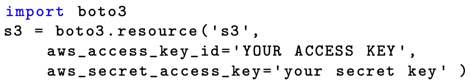
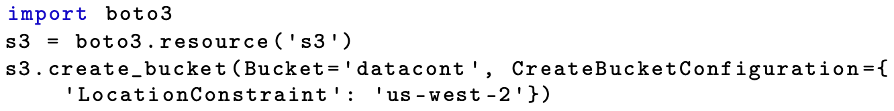
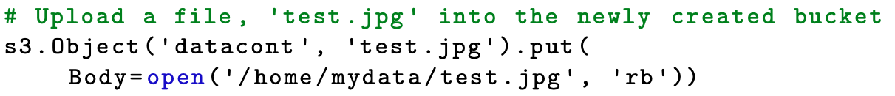
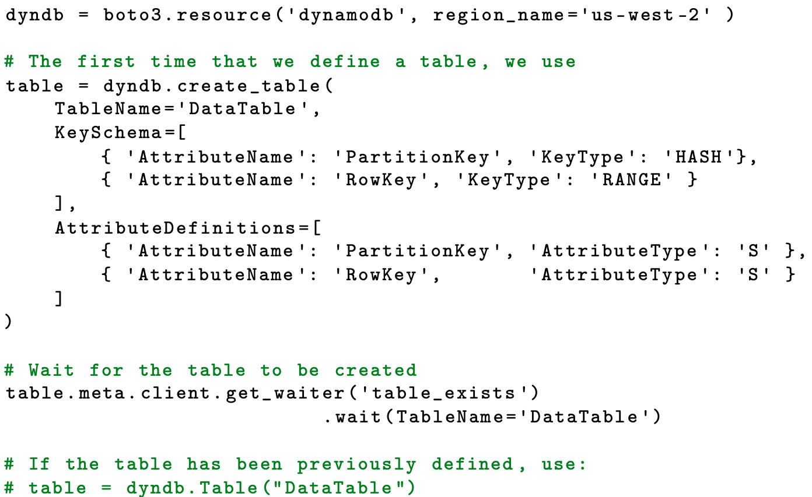
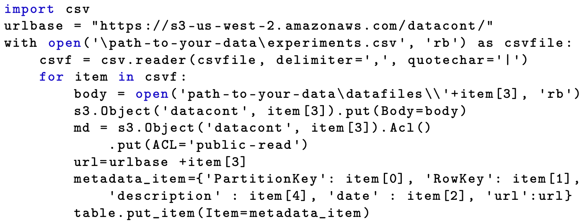

class: middle, center

# 大数据的信息基础设施

## 存储模型

陈一帅

[yschen@bjtu.edu.cn](mailto:yschen@bjtu.edu.cn)

北京交通大学电子信息工程学院

.footnote[网络智能实验室]

---

# 内容

- .red[基本概念]
- 分布式存储
- 存储模型

---

class: middle, center

# 基本概念

---

# 数据操作事务

- 事务
  - Transaction
  - 一系列数据操作组成的一个完整的逻辑过程
- 例
  - 银行转帐，从原账户扣除金额，以及向目标账户添加金额
  - 这两个数据库操作的总和，构成一个完整的逻辑过程，不可拆分
  - 这个过程被称为一个事务

---

# 存储系统 ACID 特性

- 数据库系统在写入或更新资料过程中，为保证事务正确可靠，必须具备的四个特性
- 原子性（atomicity）：不可分割性
- 一致性（consistency）
- 隔离性（isolation）：独立性
- 持久性（durability）

---

# 内容

- 基本概念
- .red[分布式存储]
- 存储模型

---

# 分布式存储

- 扩展数据库的明显解决方案是在多台计算机之间分布和/或复制数据
- 例如，通过分布不同的表或同一表的不同行
- 但分布和复制也带来挑战

---

# 云计算中的分布式存储

- 存储作为一种服务
- 分布式存储提供大数据存储服务
- 6 种存储模型

.center[.width-100[]]

---

# 内容

- 基本概念
- 分布式存储
- .red[存储模型]

---

# 文件系统

- 以 Amazon AWS 文件系统为例
  - 提供两种文件系统
- Elastic Block Store - 弹性块存储（EBS）
  - EC2 实例低延迟访问
  - 存储工作数据，支持频繁读取和写入，但太大而无法容在内存中
- Elastic File System - 弹性文件系统（EFS）
  - 通用文件存储
  - 为 EC2 实例提供文件系统访问语义（强一致性，文件锁），并发进程可同时访问（读取和写入）

???

Amazon’s Elastic Block Store (EBS)

designed for applications that require low-latency access to data from a single EC2 instance. For example, you might use it to store working data that are to be read and written frequently by an application, but that are too large to fit in memory.

Elastic File System (EFS)

a general-purpose file storage service. It provides a file system interface, file system access semantics (e.g., strong consistency, file locking), and concurrently-accessible storage for many Amazon EC2 instances. You might use EFS to hold state that is to be read and written by many concurrent processes.

---

# 对象存储

- 存储非结构化二进制对象
  - 二进制大型对象通常被称为 blob
- 对象由唯一的标识符标识
- 对象可具有与之关联的元数据
- 对象一旦上传就无法修改，只能删除
  - 或在支持版本控制的对象存储中进行版本升级

???

.center[.width-80[]]

Storage as a service options from major public cloud vendors.

Amazon S3

REST API
boto3 Python SDK
Web 界面也可以

Amazon Python Boto3 SDK

对象存储的实现

- 以 AWS 为例
- 两级对象
  - 对象容器
  - 一个对象容器内可容纳零个或多个对象

???

The object storage model, like the file system model, stores unstructured binary objects.
In the database world, objects are often referred to as blobs, for binary large object, and we use that name here when it is consistent with terminology adopted by cloud vendors.
An object/blob store simplifies the file system model in important ways: in particular, it eliminates hierarchy and forbids updates to objects once created.

Different object storage services differ in their details, but in general they support a two-level folder-file hierarchy that allows for the creation of object containers, each of which can hold zero or more objects.

Each object is identified by a unique identifier and can have various metadata associated with it.
Objects cannot be modified once uploaded: they can only be deleted—or, in object stores that support versioning, replaced.

---

# 对象存储模型的优势

- 在简单，性能和可靠性方面，具有重要优势
- 简化了文件系统模型
  - 消除了层次结构
- 一旦创建就无法修改的特性使构建高可靠、可扩展的实现变得容易
  - 可在多个物理存储设备之间复制每个对象，以提高弹性和（当有多个并发读取器时）性能
  - 无需专门的同步逻辑来处理并发更新
- 可在具有不同性能和成本参数的存储类别之间手动或自动移动对象

???

The object store model has important advantages in terms of simplicity, performance, and reliability. The fact that objects cannot be modified once created makes it easy to build highly scalable and reliable implementations. For example, each object can be replicated across multiple physical storage devices to increase resilience and (when there are many concurrent readers) performance, without any specialized synchronization logic in the implementation to deal with concurrent updates. Objects can be moved manually or automatically among storage classes with different performance and cost parameters.

---

# 对象存储模型的局限

- 几乎不支持对数据进行组织，不支持搜索
  - 用户必须知道对象的标识符才能访问它
- 不提供结构化处理数据的机制
  - 可能必须将整个对象下载到计算机上以对其内容进行计算
- 无法以文件系统的方式将对象作为文件系统挂载，或使用现有工具进行访问

???

The object store model also has limitations. It provides little support for organizing data and no support for search: A user must know an object’s identifier in order to access it. Thus, an object store would likely be inadequate as a basis for organizing the 1,000,000 environmental records of UC2: We would need to create a separate index to map from file characteristics to object identifiers. Nor does an object store provide any mechanism for working with structured data. Thus, for example, while we could load each UC2 dataset into a separate object, a user would likely have to download the entire object to a computer to compute on its contents. Finally, an object store cannot easily be mounted as a file system or accessed with existing tools in the ways that a file system can.

---

# 对象存储操作示例

- 以 Amazon AWS 为例
  - 采用 AWS boto3 Python API
- 第一步：创建 S3 资源
  - 设定资源的访问密钥

.center[.width-100[]]

---

# 对象存储操作示例

- 第二步：创建 S3 存储桶（Bucket）
  - 在资源中创建 Bucket，名称：datacont
  - 指定其地理区域
- 将在其中存储数据 objects

.center[.width-100[]]

---

# 对象存储操作示例

- 第三步：将数据对象加载到桶里
  - 上传图片到 Bucket 中

.center[.width-100[]]

---

# NoSQL 数据库

- 关系数据库
  - 适用于中等大小、高度结构化数据集
- NoSQL 数据库
  - 支持大规模数据量和用户量
  - 处理不容易以表格形式表示的非结构化数据
- 键值存储
  - 可组织大量记录
  - 每个记录将任意键与任意值相关联

???

A relational DBMS is almost certainly the right technology to use for highly structured datasets of moderate size. But if your data are less regular (if, for example, you are dealing with large amounts of text or if different items have different properties) or extremely large, you may want to consider a NoSQL DBMS. The design of these systems has typically been motivated by a desire to scale the quantities of data and number of users that can be supported, and to deal with unstructured data that are not easily represented in tabular form. For example, a key-value store can organize large numbers of records, each of which associates an arbitrary key with an arbitrary value. (A variant called a document store permits text search on the stored values.)

---

# NoSQL DB 的 ACID 特性

- 云中的 NoSQL 数据库通常分布在多个服务器上，并且还复制到不同的数据中心
- 因此，它们通常无法满足所有的 ACID 属性
- 一致性通常被最终的一致性所取代
- 这意味着跨副本的数据库状态可能暂时不一致

???

NoSQL databases in the cloud are often distributed over multiple servers and also replicated over different data centers. Hence they often fail to satisfy all of the ACID properties. Consistency is often replaced by eventual consistency, meaning that database state may be momentarily inconsistent across replicas.

---

# NoSQL DB 操作示例

- 以 AWS DynamoDB 为例
  - AWS 的大数据平台 EMR 基于 DynamoDB
- 基于可扩展键值模型
- 通过行分配数据
  - 一行中的所有元素都映射到同一设备
  - 要确定数据所在设备，只需查找 PartitionKey
  - 该哈希将散列到行所在的物理存储设备的索引
- 可通过 Elasticsearch 进行文本搜索

???

NoSQL systems such as DynamoDB are distributed over multiple storage devices

DynamoDB is a powerful NoSQL database based on an extensible key- value model: for each row, the primary key column is the only required attribute, but any number of additional columns can be defined, indexed, and made searchable in various ways, including full-text search via Elasticsearch

DynamoDB distributes data via row: for any row, every element in that row is mapped to the same device. Thus, to determine the device on which a data value is located, you need only look up the PartitionKey, which is hashed to an index that determines the physical storage device in which the row resides. The RowKey specifies that items are stored in order sorted by the RowKey value.

---

# 创建 DynamoDB 表

.center[.width-100[]]

???

create the DynamoDB table in which we will store metadata and references to S3 objects.

---

# 存储数据

- 存入元数据和对 S3 对象的引用
  - csv.read 从 CSV 文件中读取元数据
  - s3.Object 将数据对象从文件移至 Blob 存储
  - table.put_item 在表中存入元数据

.center[.width-100[]]

???

- Item[0] 项目 ID，Item[1] 实验 ID，Item[2] 日期，Item[3] 文件名，Item[4] 注释
- 通过 ACL ='public-read'明确声明数据文件的 URL 是公开可读的

read the metadata from the CSV file, move the data objects into the blob store, and enter the metadata row into the table

item[3] as filename, item[0] as itemID, item[1] as experimentID, item[2] as date, and item[4] as comment. Note that we need to state explicitly, via ACL='public-read', that the URL for the data file is to be publicly readable.

http://aws.amazon.com/sdk-for-python/

---

# 其它存储模型

- 图数据库
  - 存储关系
- 数据仓库
  - 优化查询

---

# 小结

- 基本概念
  - 事务
  - ACID
- 分布式存储
- 存储模型
  - 文件系统
  - Object 存储
  - 关系数据库
  - NoSQL 数据库

---

# 练习

- 利用云计算账号，练习至少一种数据模型的操作
  - 界面操作
  - 编程操作
