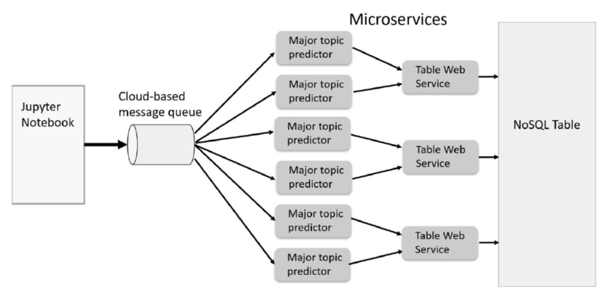

class: middle, center

# 大数据的信息基础设施

## 计算虚拟化

陈一帅

[yschen@bjtu.edu.cn](mailto:yschen@bjtu.edu.cn)

北京交通大学电子信息工程学院

## .footnote[网络智能实验室]

---

# 内容

- .red[虚拟化]
- 虚拟机
- 容器
- 微服务
- 微服务实例

???

class: middle, center

虚拟化

云计算基于虚拟化

???

Resources virtualization and representative software products.
Virtualization

五级
Servers：虚拟机，VMWare EXS Server
Desktop 虚拟桌面，
Networks VPN，VLAN，OpenStack
Storage，NAS，S3
Application：容器，Docker

---

# 虚拟化

- 程序
  - 一些指令
- 操作系统（OS）
  - 允许多个用户程序同时运行，分享资源
  - 进行状态管理、程序上下文切换、I/O 访问控制
- 程序不能进行状态管理、I/O 访问指令，因为会接入其它程序的状态
  - 要通过操作系统执行这些指令
- 提供看起来真实，但实际上是在软件中处理的这些指令的过程，被称为虚拟化

???

计算机资源与程序

Any modern computer has a set of basic resources: CPU data registers, memory addressing mechanisms, and I/O and network interfaces. The programs that control the computer are just sequences of binary codes corresponding to instructions that manipulate these resources, for example to ADD the contents of one register to the contents of another.

OS

Important instructions for performing context switches, in which the computer stops executing one program and starts executing another. These state management instructions plus the I/O instructions are termed privileged. Such instructions are usually directly executed only by the OS, because you do not want users to be able to access state associated with other computations.

The OS has the ability to allow user programs (encapsulated as processes) to run the unprivileged instructions. But as soon as the user program attempts to access an I/O operation or other privileged instruction, the OS traps the instruction, inspects the request, and, if the request proves to be acceptable, runs a program that executes a safe version of the operation.

虚拟化

- 其他类型的虚拟化（例如虚拟内存）在操作系统的指导下由硬件直接处理
- 1960 年代末和 1970 年代初，IBM 和其他公司在虚拟化方面做了很多工作，最终证明可以虚拟化整个计算机
  - R. J. Creasy. The origin of the VM/370 time-sharing system. IBM Journal of Research and Development, 25(5):483–490, 1981.

???

This process of providing a version of the instruction that looks real but is actually handled in software is called virtualization.

Other types of virtualization, such as virtual memory, are handled directly by the hardware with guidance from the OS.

In the late 1960s and early 1970s, IBM and others created many variations on virtualization and eventually demonstrated that they could virtualize an entire computer [104].

???

# 内容

- 虚拟化
- .red[虚拟机]
- 容器
- 微服务
- 微服务实例

---

# 虚拟机

- Virtual Machine（VM）
- 在虚拟机管理程序上运行的 OS
- 是一个完整机器的软件映像，可以将其加载到服务器上并像其他程序一样运行

.center[.width-100[]]

???

We refer to the guest OSs running on the hypervisors as VMs.

Some hypervisors run on top of the host machine OS as a process, such as VirtualBox and KVM

A virtual machine is just the software image of a complete machine that can be loaded onto the server and run like any other program.

The server in the data center runs a piece of software called a hypervisor that allocates and manages the server’s resources that are granted to its “guest” virtual machines.

the key idea is that when you run in a VM, it looks exactly like a server running whatever operating system the VM is configured to run.

---

# 两种虚拟机

- Native 虚拟机
  - 基于虚拟机管理程序 Hypervisor
  - Hypervisor 在 OS 之下，允许多个 OS 同时运行，分享同一个硬件资源
  - 管理和分配服务器资源
  - 如 Citrix Xen，Microsoft Hyper-V，VMWare ESXi
- Hosted 虚拟机
  - 基于 VMM
  - 虚拟机管理程序作为进程运行在主机操作系统上
  - 如 VirtualBox 和 KVM

---

# 例：XEN Hypervisor

- Hypervisor 在 OS 之下
- 允许多个 OS 同时运行，分享同一个硬件资源

.center[.width-100[]]

???

a program that manages the virtualization of the hardware on behalf of multiple distinct OSs.

The OS allows multiple user processes to run simultaneously by sharing the resources among them; the hypervisor below the OS allows multiple OSs to share the real physical hardware and run concurrently.

Many hypervisors are available today, such as Citrix Xen, Microsoft Hyper-V, and VMWare ESXi.

---

# 虚拟机带来的好处

- 云可以选择使用哪个服务器来运行请求的 VM 实例
- 如需要，可在一台服务器上同时运行多个 VM
- 同一服务器上的不同 VM 中运行的用户应用程序之间彼此之间几乎完全没有察觉
- 可以监视每个 VM 的运行状况，记录事件并重启 VM
- 一个 VM 实例崩溃，不会使整个服务器崩溃

???

cloud management system (sometimes called the fabric controller) can select which server to use to run the requested VM instances, and it can monitor the health of each VM.

If needed, the cloud monitor can run many VMs simultaneously on a single server. If a VM instance crashes, it does not crash the server.

The cloud monitor can record the event and restart the VM.

User applications running in different VMs on the same server are largely unaware of each other.

升级集群弹性并提高共享服务器的利用率。
硬件级的虚拟化
XEN，KVM，Hyper V，VMWare，VirtualBox

---

# 虚拟化的好处

- 最小化硬件成本（CapEx）
  - 一台物理硬件上的多个虚拟服务器
- 能够轻松将 VM 移至其他数据中心
  - 提供灾难恢复，硬件维护
  - 跟随太阳（活跃的用户）或跟随月亮（便宜）
- 合并空闲的工作负载，释放未使用的物理资源
  - 用户流量是突发性的和异步的，提高设备利用率，省电
- 更轻松的自动化（降低 OpEx）
  - 简化的硬件和软件供应/管理
- 可扩展、灵活，支持多种操作系统

???

Advantages of Virtualization

- Minimize hardware costs (CapEx)
  Multiple virtual servers on one physical hardware
- Easily move VMs to other data centers
- Provide disaster recovery. Hardware maintenance.
- Follow the sun (active users) or follow the moon (cheap power)
- Consolidate idle workloads. Usage is bursty and asynchronous. Increase device utilization
- Conserve power
  Free up unused physical resources
- Easier automation (Lower OpEx)
  Simplified provisioning/administration of hardware and software
- Scalability and Flexibility: Multiple operating systems

Ref: http://en.wikipedia.org/wiki/Platform_virtualization
Ref: K. Hess, A. Newman, "Practical Virtualization Solutions: Virtualization from the Trenches," Prentice Hall, 2009,
ISBN:0137142978

---

# 灵活的计费

- 例：亚马逊 AWS 的三种虚拟机实例的计费方式
  - On-demand instances
  - Reserved instances：1~3 年
  - Spot instances：竞价，闲时用，区域有关
- 弹性配置器
  - Ryan Chard 弹性配置器，成本降低多达 95％

???
    - R. Chard, K. Chard, K. Bubendorfer, L. Lacinski, R. Madduri, and I. Foster. Cost-aware cloud provisioning. In IEEE 11th International Conference on e-Science, pages 136–144, 2015.


on-demand instances
Amazon, for example, these range from less than a cent per hour for a nano instance to several dollars per hour for a big-storage or graphical processing unit (GPU) system. And that is just for on-demand instances, instances that you request when you need them and pay for by the hour.

Reserved instances provide lower costs (by up to 75%) when you reserve for between one and three years.

spot instances allow you to bid on spare Amazon EC2 computing capacity. You indicate the price that you are prepared to pay, and if Amazon has unused instances and your bid is above the current bid price, you get the machines that you asked for—with the proviso that if your bid price is exceeded during the lifetime of your instances, the instances are terminated and any work executing is lost. Spot prices vary considerably; but you can save a lot of money in this way, especially if your computations are not urgent.

Spot instances, can vary across Amazon regions. Thus, a really cost-conscious cloud user might be tempted to search across different instance types and regions for the best deal for a particular application. That would be a time- consuming process if you had to do it yourself, but researchers have built tools to do just that.

Ryan Chard, for example, has developed a cost-aware elastic provisioner that can reduce costs by up to 95% relative to a less sophisticated approach [90].

R. Chard, K. Chard, K. Bubendorfer, L. Lacinski, R. Madduri, and I. Foster. Cost-aware cloud provisioning. In IEEE 11th International Conference on e-Science, pages 136–144, 2015.

---

# 虚拟机的问题

- 成本问题
  - 每个 VM 都需要一个操作系统（OS）
  - 每个操作系统都需要许可证 ⇒ CapEx
  - 每个操作系统都有自己的计算和存储开销
  - 需要维护，更新 ⇒ OpEx
  - VM 成本 = 添加了 CapEx + OpEx
- 性能问题
  - 启动操作系统，需要额外的 Overhead
  - VM 是完整的 OS 实例，因此可能需要几分钟才能启动

???

Problems of Virtualization

Each VM requires an operating system (OS)

- Each OS requires a license ⇒ CapEx
- Each OS has its own compute and storage overhead
- Needs maintenance, updates ⇒ OpEx
- VM Tax = added CapEx + OpEx

---

# 内容

- 虚拟化
- 虚拟机
- .red[容器]
- 微服务
- 微服务实例

???

class: middle, center

# 容器

---

# 容器

- 另一种虚拟化方法
- 具有虚拟机的所有良好特性，同时更轻量级
- 在同一操作系统上运行许多应用
  - 这些应用共享操作系统及其开销
- 但不会互相干扰
  - 未经明确许可就无法访问彼此的资源

???
- 像公寓一样 ⇒ 容器

- Run many apps in the same virtual machine
- These apps share the OS and its overhead
- But these apps can’t interfere with each other
- Can’t access each other’s resources without explicit permission
- Like apartments in a complex ⇒ Containers

---

# 容器的隔离

- 容器将应用程序及其所有库依赖关系和数据打包到一个易于管理的单元中
- 每个容器有自己的网络，主机名，域名，进程，用户，文件系统，IPC，互不干扰

---
# Docker
-  允许在包括所有应用程序依赖项的容器中运行应用程序
- 该应用程序可以看到一个完整的私有进程空间，文件系统和网络接口
  - 例如，容器中的“显示进程”（在 Linux 上为 ps）命令将仅显示容器中的进程
- 与同一主机操作系统上其他容器中的应用程序隔离

---

# 容器的轻量级

- 在操作系统上提供隔离，轻量级
- 比 VM 轻
  - 是一个应用
  - 应用和它的依赖库、配置、数据的打包
- 启动快
  - 可以在几秒钟内将应用程序初始化并运行
- 比 Process 重
  - 一个容器内能运行多个 Process

???

微服务。容器

- Virtual Machines provide scalability, mobility, and cost reduction but need OS which increase resource requirements
- Containers provide isolation on a single OS and are lightweight
- Docker allows managing containers
- Docker Swarm and Kubernetes allow orchestrating a large number of containers
- Docker provides overlay networking and security

---

# 容器的低成本

- 在一个操作系统上运行多个容器
- 所有容器共享操作系统
- CapEx 和 OpEx

???

Multiple containers run on one operating system on a virtual/physical machine

- All containers share the operating system ⇒ CapEx and OpEx
- Containers are isolated ⇒ cannot interfere with each other
- Own file system/data, own networking ⇒ Portable

Docker 正被 containerd 取代
Kubernete 用 CRI-containerd

Key Reference: N. Poulton, "Docker Deep Dive," Oct 2017, ISBN: 9781521822807 (Not a Safari Book)

---

# 容器的优点

- 具有虚拟机的所有良好特性
- 可移植
  - 容器从 Image 中生成，也可以另存为 Image
  - 同一个 Image 可以在个人计算机，数据中心或云中运行
  - 可以停下来、保存并移动到另一台计算机上或以后运行
- 可扩展
  - 可以在同一台计算机或不同计算机上运行多个副本
- 灵活
  - 可根据容器构建时的设计来限制或不限制操作系统资源

???

When you launch the container, the application can be configured to start up, go through its initialization, and be running in seconds.

Containers have all the good properties of VMs

- Come complete with all files and data that you need to run
- Multiple copies can be run on the same machine or different machine ⇒ Scalable
- Same image can run on a personal machine, in a data center or in a cloud
- Operating system resources can be restricted or unrestricted as designed at container build time
- Isolation: For example, “Show Process” (ps on Linux) command in a container will show only the processes in the container
- Can be stopped. Saved and moved to another machine or for later run

Ref: M. K. Weldon "The Future X Network: A Bell Labs Perspective," CRC Press, 2016, 476 pp., ISBN:9781498779142

---

# 容器的原理

- Linux 内核功能，绑定和容纳进程的资源调用
  - 基于 namespace 实现名称空间隔离（isolation）
  - 基于控制组（cgroup）实现资源限制

???

- 关键功能
  - 联合文件系统，或高级多层统一文件系统（AuFS）
  - 写时复制的特殊技术，使系统可以在多个容器中重用许多数据对象
- 这些功能允许
  - 在主机文件系统上分层放置新的专用虚拟文件系统组件
  - 基于这些存储在分层虚拟文件系统中的库，为应用程序运行特别的分区进程空间

???

Linux kernel had some nice features that could be used to bound and contain the resource utilization of processes: in particular, control groups and name space isolation. These features allow for the layering of new private virtual file system components on top of the host file system and a special partitioned process space for applications to run using libraries virtually stored in the layered file system.

a program running in a container looks like it is running in its own VM, but without the extra baggage of a complete OS. A contained application uses the resources of the host OS, which can even control the amount of resource devoted to each container: for example, the CPU percentage and the amount of memory and disk space.

---

# 容器的分层实现

- Image 是逐层构建的，每个 Image 都有很多层
- Docker 首先在称为 Alpine 的基础 Linux 内核上运行
  - 其他操作系统功能在该基础之上分层
- 例如：
  - 先安装 Ubuntu OS，一层
  - 然后安装 Python 软件包，一层
  - 安装 Python 的安全补丁，一层

---

# 容器的分层实现

- 层是容器高性能和可移植的关键
- 层可以在许多容器之间共享
  - 安装迅速
- 容器实例可以与其他容器实例共享库
  - 启动迅速
  - 相对于 VM，也可以在一台主机上运行更多容器

???

Docker allows applications to be provisioned in containers that encapsulate all application dependencies. The application sees a complete, private process space, file system, and network interface isolated from applications in other containers on the same host operating system.

When Docker is installed on Linux, Windows 10, or Mac, it runs on a base Linux kernel called Alpine that is used for every container instance.

additional OS features are layered on top of that base. This layering is the key to container portability across clouds.

- Each image has many layers
- Image is built layer by layer
- Layers in an image can be inspected by Docker commands - Each layer has its own 256-bit hash
- For example:
- Ubuntu OS is installed, then
- Python package is installed, then
- a security patch to the Python is installed
- Layers can be shared among many containers

UFS

how the file system in a container is layered on top of the existing host services.

The key is the Union File System (more precisely, the advanced multilayered unification file system (AuFS) and a special property called copy on write that allows the system to reuse many data objects in multiple containers.

Docker images are composed of layers in the Union File System. The image is itself a stack of read-only directories. The base is a simplified Linux or Windows file system. As illustrated in figure 6.1, additional tools that the container needs are then layered on top of that base, each in its own layer.

When the container is run, a final writable file system is layered on top.

As an application in the container executes, it uses the writable layer. If it needs to modify an object in the read-only layers, it copies those objects into the writable layer. Otherwise, it uses the data in the read-only layer, which is shared with other container instances. Thus, typically only a little of the container image needs to be actually loaded when a container is run, which means that containers can load and run much faster than virtual machines. In fact, launching a container typically takes less than a second, while starting a virtual machine can take minutes.

The Docker Union File System is layered on a standard base.

Containers have the advantage of being extremely lightweight.
Once you have downloaded a container to a host, you can start it and the application(s) that it contains quasi-instantly.
Part of the reason for this speed is that a container instance can share libraries with other container instances.
VMs, because they are complete OS instances, can take a few minutes to start up.
You can run many more containers on a single host machine than you can effectively run the same number of VMs.

VM 和容器的比较

Figure 4.1 illustrates the difference between the software stack of a server running multiple VMs versus a server running a single OS and multiple containers on a typical server in a cloud.

Virtual machines vs. containers on a typical cloud server.

虚拟机管理程序与 Docker 引擎分别用于创建虚拟机和应用程序容器

---

# Docker

- 使用 Google 的 Go 编程语言编写
- 管理容器，提供覆盖网络和安全性
- 提供容器之间的隔离，帮助他们共享操作系统
- 最初由 Docker.com 开发，现已开源
- 可从 Docker.com 下载用于 Linux，Windows 和 Mac
- 两个版本：
  - 社区版（CE）：免费进行实验
  - 企业版（EE）：用于带付费支持的部署
- Docker Swarm 和 Kubernetes 管理大量容器

???

- Docker allows managing containers
- Docker Swarm and Kubernetes allow orchestrating a large number of containers
- Docker provides overlay networking and security

mid-2013, a little company called dotCloud released a tool that provided a better way to deploy encapsulated applications. This tool became Docker [71], and dotCloud became Docker, Inc. docker.com .

D. Bernstein. Containers and cloud: From LXC to Docker to Kubernetes. IEEE Cloud Computing, 1(3):81–84, 2014.

Hyper-V Containers

- Microsoft allows two kinds of containers:
- Windows Server Containers: Multiple containers on a single
  VM (like Docker containers)
- Hyper-V containers: Each container runs on its own VM
  ⇒ No need for a Linux

Kata Containers

- Lightweight virtual machines
- Dedicated VMs to run one and only one container
- Combines “Intel Clear Containers” and “HyperV runV”
- Open source project under OpenStack Foundation
- Compatible with the OCI specs for Docker containers
- Compatible with CRI for Kubernetes
- Performance like containers, isolation and security like VMs
- Six Components: Agent, Runtime, Proxy, Shim, Kernel and QEMU 2.9
- Kubernetes will be extended to provision VMs (Kata Containers)
- OpenStack’s VM orchestration engine (Nova) will be extended to handle containers
- Package once and run anywhere
- VMware, Google, and Amazon are all moving towards this approach
- No installable distribution of Kata containers yet (April 22, 2018)

N. Poulton, "Docker Deep Dive," Oct 2017, ISBN: 9781521822807 (Not a Safari Book) Highly Recommended.

OS 级的虚拟化，用户 app 的隔离

Docker 引擎访问 Linux 内核功能以实现不同应用程序容器的隔离虚拟化

Docker 的组成

- daemon
  - API 和其他功能
- containderd
  - 执行逻辑。负责容器的生命周期
  - 开始，停止，暂停，取消暂停，删除容器
- runc
  - 轻量级的运行时 CLI，在创建容器后存在
- shim
  - 使容器保持运行状态。保持标准输入/标准输出打开

???

- daemon: API and other features
- containderd: Execution logic. Responsible for container
  lifecycle. Start, stop, pause, unpause, delete containers.
- runc: A lightweight runtime CLI
- shim: runc exists after creating the container.
  shim keeps the container running. Keep stdin/stdout open.

---

# Image 存储库（Registries）

- Image 存储在 Registries 中
  - 每个 Image 都有几个标签，例如 v2，最新，...
  - 每个 Image 都通过其 256 位哈希值进行标识
- 主机上有本地存储库
- 网络存储库
  - Docker Hub 存储库，经过 Docker 审查的 Image
  - 非官方存储库，未经审核的 Image，谨慎使用
- 启动 Image 时，在本地存储库中找不到的任何组件，会从指定位置下载

???
Image Registries

- Containers are built from images and can be saves as images
- Images are stored in registries
- Local registry on the same host
- Docker Hub Registry: Globally shared - Private registry on Docker.com
- Any component not found in the local registry is downloaded from specified location
- Official Docker Registry: Images vetted by Docker
- Unofficial Registry: Images not vetted (Use with care)
- Each image has several tags, e.g., v2, latest, ...
- Each image is identified by its 256-bit hash

---

# Build 自己的容器

- 创建脚本，标识所需的库、源文件和数据
- 在电脑上运行脚本以测试容器
- 将容器上传到网络存储库，从那里可以将其下载到任何云

???

Building a container to run a single application is simple compared with the task of customizing a VM to run a single application. All you need to do is

create a script that identifies the needed libraries, source files, and data. You can then

run the script on your laptop to test the container

uploading the container to a repository, from where it can be downloaded to any cloud

Importantly, containers are completely portable across different clouds. In general, VM images cannot be ported from one cloud framework to another.

---

# 创建脚本

- 创建 Dockerfile，描述应用程序、依赖包、以及如何运行的
- 例：NodeJS Web服务器

```docker
FROM Alpine
LABEL maintainer=“xx@gmail.com”
RUN apk add –update nodejs nodejs –npm
COPY . /src
WORKDIR /src
RUN nmp install
EXPOSE 8080
ENTRYPOINT [“node”, “./app.js”]
```

---

# 脚本说明

- 从 Alpine Linux 开始
  - 注：也可以从其它容器开始
- 谁写的这个容器
- 使用 apk 安装 nodejs
- 复制应用程序文件
- 设置工作目录
- 安装应用程序依赖项
- 打开端口 8080
- 运行主要应用 app.js

???

- Create a Dockerfile that describes the application, its
  dependencies, and how to run it
  FROM Alpine
  LABEL maintainer=“xx@gmail.com” RUN apk add –update nodejs nodejs –npm COPY . /src
  WORKDIR /src
  RUN nmp install
  EXPOSE 8080
  ENTRYPOINT [“node”, “./app.js”]

Start with Alpine Linux
Who wrote this container
Use apk package to install nodejs Copy the app files from build context Set working directory
Install application dependencies Open TCP Port 8080
Main application to run

Open Container Initiative (OCI)

- A company called CoreOS defined alternative image format and container runtime API’s
- Led to formation of OCI under Linux Foundation to govern container standards
- OCI Image spec
- OCI Runtime spec
- Everyone including Docker is now moving to OCI

---

# 生成容器

- 基于 Dockerfile，使用 docker build 命令构建容器
- 下载
  - 首次运行 docker build 时，会下载所有组件，需要时间
  - 组件下载后，缓存在本地计算机上
- 安装
  - 所有安装（如 pip）均已运行并分层到文件系统中，甚至对 Python 代码也进行了分析以检查错误
  - 由于这种预安装，在运行容器时，一切都已经存在，所以运行起来特别快

???

FROM jupyter/scipy-notebook
MAINTAINER your name <yourname@gmail.com>
RUN pip install bottle
COPY images /images
COPY bottleserver.py /
ENTRYPOINT ["ipython", "/bottleserver.py" ]

FROM
build on jupyter/scipy-notebook, a well-maintained container in the Docker Hub.

ENTRYPOINT line tells Docker what to execute when the container runs.

The first time you run docker build, it downloads all the components for jupyter/scipy-notebook, Boto3, and Bottle, which takes a minute or so.

After these components have been downloaded, they are cached on your local machine.

Note that all the pip installs have been run and layered into the file system. Even the Python code was parsed to check for errors (see step 7).

Because of this preinstallation, when the container is run, everything is there already.

---

# Docker Hub

- https://hub.docker.com/
- 公共资源，可以在其中存储你的容器，搜索和下载数百个公共容器
- 创建一个免费的 Docker 帐户，并将容器保存到 Docker Hub

```docker
docker push yourname/bottlesamp
```

- 然后就可以将容器下载到云中并运行

???

a public resource where you can store your own containers, and search for and download any of the hundreds of public containers.

---

# 运行容器

```docker
Docker run -d -p 8000:8000 yourname/bottlesamp
```

- 下载

  - 首次运行时，会下载所有组件，需要时间
  - 组件下载后，缓存在本地计算机上

- 其它命令
  - ls, exec, stop, start, rm, inspect

???

Docker Commands

- docker container run: Run the specified image
- docker container ls: list running containers
- docker container exec: run a new process inside a container
- docker container stop: Stop a container
- docker container start: Start a stopped container
- docker container rm: Delete a container
- docker container inspect: Show information about a container

---

# Docker Mount 主机文件系统

- 在容器操作系统中挂载主机目录
  - 容器可以与主机共享数据
  - 多个容器也可以共享该目录，进行通信
- 例
  - 启动一个 Linux Ubuntu 容器，把 Mac 电脑的/tmp 目录挂载为容器里的/localtmp 目录

```docker
docker run -it -v /tmp:/localtmp ubuntu
```

- 注
  - 如果在 Windows 10 上运行，需要访问 Docker 设置，提供 Docker 权限以查看和修改驱动器 C

???

In addition to the file system layers in the container image, you can mount a host machine directory as a file system in the container’s OS. In this way a container can share data with the host. Multiple containers can also share these mounted directories and can use them for basic communication of shared data.

To mount a local directory on your laptop as a volume on the Docker container file system, use the -v localdir:/containername flag. (If you are running on Windows 10, you need to access the Docker settings and give
Docker permission to see and modify drive C.)

docker run -it -v /tmp:/localtmp ubuntu

launch a Linux Ubuntu container with the Mac’s /tmp directory mounted as /localtmp

---

# Docker 安全

- 使用了 Linux 中所有内置的安全机制，并且更多
  - 加密节点 ID
  - 相互认证
  - 加密集群存储
  - 加密网络流量
  - 签名镜像
  - 安全扫描检测漏洞

???
Docker Security

- All built-in security mechanisms in Linux are used and more
- Cryptographic node IDs
- Mutual Authentication
- Automatic Certificate Authority configuration
- Automatic Certificate Renewal on expiration
- Encrypted Cluster Store
- Encrypted Network traffic
- Signed images in Docker Content Trust (DCT)
- Docker Security Scanning detects vulnerabilities
- Docker secrets are stored in encrypted cluster store, encrypted transmission over network, and stored in in-memory file system when in use

---

# 内容

- 虚拟化
- 虚拟机
- 容器
- .red[微服务]
- 微服务实例

---

# 微服务

- 在一个容器中运行 Web 服务器
- 在另一个容器中运行数据库服务器
- 两个容器可以彼此发现并通信
- 微服务

???

Containers allow you to package up an application and all of its library dependencies and data into a single, easy-to-manage unit.

When you launch the container, the application can be configured to start up, go through its initialization, and be running in seconds.

For example, you can run a web server in one container and a database server in another; these two containers can discover each other and communicate as needed. Or, if you have a special simulation program in a container, you can start multiple instances of the container on the same host.

---

# 微服务

- 消息 + 参与者
  - 大型云应用程序的主要设计范式
  - 计算由许多进行消息通信的参与者执行
  - 每个参与者都有自己的内部状态
  - 收到消息后开始行动
  - 根据消息，更改内部状态，向其他参与者发送消息
  - 参与者可实现为功能单一的 Web 服务 （Unix 设计原则）
- 如果服务无状态，就是微服务
  - 微服务通常被实现为容器实例

???

computing is performed by many actors that communicate via messages.

- Each actor has its own internal private memory and goes into action when it receives a message. Based on the message, it can change its internal state and then send messages to other actors. You can implement an actor as a simple web service. If you limit the service to being largely stateless, you are now in the realm of microservices, a dominant design paradigm for large cloud applications. Microservices are often implemented as container instances

---

# 微服务系统模型

- 微服务构成群（Swarm）
- 微服务通过网络进行异步通信

.center[.width-100[]]

???

Conceptual view of a swarm of communicating microservices or actors.

asynchronous swarm of communicating processes or services distributed over a virtual network in the cloud

individual processes may be stateless, such as a simple web service, or stateful, as in the actor programming model.

---

# 微服务适合大规模互联网应用

- 大型在线服务的需求
  - 需要支持数千个并发用户
  - 在维护和升级的同时，还必须保持每天 24 小时在线
- 微服务集群，可伸缩

.center[.width-100[]]

???

design and build a large, heterogeneous application that is secure, maintainable, fault tolerant, and scalable.

DevOps

particularly important for large online services that need to support thousands of concurrent users.

The app must remain up twenty-four hours a day while being maintained and upgraded.

This task is closely related to a software engineering methodology called DevOps, which integrates product delivery, quality testing, feature development, and maintenance releases in order to improve reliability and security and provide faster development and deployment cycles.

From the programmer’s perspective this is a “you built it, so now you run it” philosophy. Updates to parts of this system occur while the system is running, so the developers are tightly integrated with the IT professionals who manage the system.

---

# 微服务

- 每天 Billion 级请求，使系统可扩展性成为核心要求
- Unix 和 Linux 的设计哲学
  - 一个程序只作一个事情，做得很好
  - 和其它的程序合作
- 服务器集成式的软件应用被分解，变成微服务
  - 基于容器的微服务模型
  - 更好管理、迁移、扩展、资源调度
- 大数据是其中的核心模块

???
网络也进化了
云，容器，导致网络增长

10G 标配，100G 支持

“The evolution of application architecture”

数据科学

- 分析，编程，算法
- 数学，统计，模型
- 领域知识

---

# Scale

- 最初可以部署在单个 VM 实例上
- 随着业务增长，它可能需要扩展以在高峰时间使用 100 甚至 10,000 台服务器
- 然后在业务缓慢时进行缩减

???

an online media streaming site may initially be deployed on a single VM instance. As its business grows, it may need to scale to use 100s or even 10,000s of servers at peak times, and then scale back when business is slow.

---

# 微服务组件设计

- 将应用程序划分为小型、独立的微服务组件
- 每个微服务必须能独立于其他微服务进行管理
  - 复制，扩展，升级和部署
- 每个微服务仅具单一功能，在有限上下文中运行
  - 责任有限，对其他服务的依赖也有限
- 所有微服务都应能支持不断发生故障和恢复
- 尽可能重用现有可信服务，如数据库，缓存和目录

---

# 微服务组件间通信

- 组件之间通过简单，轻便的机制进行通信
- 通信机制
  - REST Web 服务调用
  - RPC 机制（例如 Google 的 Swift）
  - 高级消息队列协议（AMQP）

???

partition the application into small, independent service components communicating with simple, lightweight
mechanisms.

The microservice paradigm design rules dictate that each microservice must be able to be managed, replicated, scaled, upgraded, and deployed independently of other microservices.

Each microservice must have a single function and operate in a bounded context; that is, it has limited responsibility and limited dependence on other services.

When possible one should reuse existing trusted services such as databases, caches, and directories.

All microservices should be designed for constant failure and recovery.

The communication mechanisms used by microservice systems are varied: they include REST web service calls, RPC mechanisms such as Google’s Swift, and the Advanced Message Queuing Protocol
(AMQP).

---

# 微服务的广泛应用

- 微服务理念已被广泛采用
  - Netflix，Google，Microsoft，Spotify 和 Amazon
- Web 服务器或移动应用程序的后端
  - 接受来自远程客户端的连接，并根据客户端请求执行一些计算并返回响应
- 远程传感控制系统
  - 当地球传感器检测到以明显方式发生的地面震动时，会发出地震警告
- 大数据系统

???

The microservice philosophy has been adopted in various forms by many companies, including Netflix, Google, Microsoft, Spotify, and Amazon.

The cloud is designed to host applications that are realized as scalable services, such as a web server or the backend of a mobile app. Such applications accept connections from remote clients and, based on the client request, perform some computation and return a response.

processes events from remote sensors, with the goal of informing a control system on how to respond, as when geosensors detecting ground motion tremors occurring in a significant pattern sound an earthquake warning.

内容

- 虚拟化
- 虚拟机
- 容器
- 微服务
- .red[大规模微服务的管理]
- 微服务实例

---

# 微服务的管理

- 大规模微服务应用，需要管理大量分布式通信服务
- 管理平台
  - 启动实例
  - 停止实例
  - 创建新版本
  - 扩展实例数量

???

To build a substantial microservice application, you need to build on a platform that can manage large collections of distributed, communicating services.

use a resource manager to launch instances, stop them, create new versions, and scale their number up and down.

---

# 管理工具

- Mesos
- Docker Swarm
  - Docker 容器调度程序
- Docker Kubernetes
  - Google 云容器调度程序
  <!-- - Compose: Docker 容器组管理工具，允许容器通过消息相互通信 -->

---

# Mesosphere

- 集群管理
- 基于 Berkeley Mesos 系统
- 数据中心、分布式操作系统（DCOS）
- Web 界面
- 可以管理云中应用程序

---

# Mesosphere

- 组成部分
  - Apache Mesos 分布式系统内核
  - Marathon 初始化系统，监视程序和服务，自动修复故障
  - Mesos-DNS 服务发现实用程序
  - ZooKeeper 高性能协调服务，管理已安装的 DCOS 服务
- 结构
  - 一个主节点，一个备份主节点，一组运行容器的工作线程

???

Mesosphere (from Mesosphere.com) is a data center operating system (DCOS) based on the original Berkeley Mesos system for managing clusters.

four major components:

1. The Apache Mesos distributed system kernel.
2. The Marathon init system, which monitors applications and services and,
   like Amazon ECS and Kubernetes, automatically heals any failures.
3. Mesos-DNS, a service discovery utility.
4. ZooKeeper, a high-performance coordination service to manage the installed DCOS services.

a master node, a backup master, and a set of workers that run the service containers.

Apache Mesos, and Mesosphere on Azure.

Mesos [154] provides another distributed operating system with a web interface that allows you to manage many applications in the cloud at the same time.

, and they depend on robust container management infrastructure such as Mesos [154] and Kubernetes [79]

B. Hindman, A. Konwinski, M. Zaharia, A. Ghodsi, A. D. Joseph, R. H. Katz, S. Shenker, and I. Stoica. Mesos: A platform for fine-grained resource sharing in the data center. In USENIX Symposium on Networked Systems Design and Implementation, pages 22–22, 2011.

---

# Docker Swarm

- 可管理数千个容器
- Swarm
  - 通过网络协作的一组节点
  - 一个服务可能在一个 Swarm 上运行
- 主机的两种模式
  - 单引擎模式：不参与
  - 群体模式：参与 Swarm

???

- Orchestrating thousands of containers
- Swarm: A group of nodes collaborating over a network
- Two modes for Docker hosts:
- Single Engine Mode: Not participating in a swarm
- Swarm Mode: Participating in a Swarm
- A service may run on a swarm
- Each swarm has a few managers that dispatch tasks to workers.
- Managers are also workers (i.e., execute tasks)

---

# Swarm 管理

- 每个 Swarm 都有一些 Manager，将任务分派给 Worker
  - Manager 也是 Worker（即执行任务）
- Manager 们 选择一个 Leader，它真正跟踪 Swarm
  - 分配任务，重新分配失败的 Worker 的任务，...
- 其他 Manager 在 Leader 失败时重新选举 Leader
- 可以根据需要扩大或缩小服务

???
The managers select a leader, who really keeps track of the swarm

- Assigns tasks, re-assigns failed worker’s tasks, ...
- Other mangers just monitor passively and re-elect a leader if
  leader fails
- Services can be scaled up or down as needed

- Several Docker commands:
- docker service : Manage services
- docker swarm: Manage swarms -
- docker node: Manage nodes

Docker Swarm Commands

- docker swarm init
- docker swarm join-token - docker node ls
- docker service
- docker service
- docker service
- docker service
- docker service
- docker service
- docker service

Washington University in St. Louis
http://www.cse.wustl.edu/~jain/cse570-18/
©2018 Raj Jain

create ls
ps inspect scale update rm

---

# Kubernetes

- Google 开源的容器管理器
- Linux Foundation 中的 Cloud Native Computing Foundation（CNCF）项目
- 非常流行
- 类似 Swarm
- 将 Swarm 称为集群（Cluster）

???
Kubernetes

- Open Source Container Orchestration alternative
- Original source released by Google
- Cloud Native Computing Foundation (CNCF) project in Linux Foundation
- Pre-cursor to Swarms
- Facilities similar to Swarms
- A set of related containers is called a “Pod” A Pod runs on a single host.
- Swarm is called a “Cluster”

Docker Swarm tools and Google’s Kubernetes container management [26, 79] (which Google uses for its own container management).

The Kubernetes project. http://kubernetes.io.

E. Brewer. Kubernetes and the path to cloud native. In 6th ACM Symposium on Cloud Computing, pages 167–167. ACM, 2015.

---

# 基于 Pod 的 Kubernetes

- Pod 是一个或多个容器，以及这些容器共享的一组资源的集合
- Kubernetes 中调度的基本单位是 Pod
- 启动后，一个 pod 驻留在单个服务器或 VM 上
  - 因此共享相同的 IP 和端口空间，可以通过 localhost 之类的常规方式找到彼此
  - 还可以共享本地的存储卷

???
pod

The basic unit of scheduling in Kubernetes is the pod, a set of one or more Docker-style containers together with a set of resources that are shared by the containers in that pod. When launched, a pod resides on a single server or VM. This approach has several advantages for the containers in that pod. Because the containers in a pod all run on the same VM, they all share the same IP and port space and thus find each other through conventional means such as localhost. They can also share storage volumes that are local to the pod.

---

# Kubernetes 命令

- 启动 Jupyter 并启动其端口 8888

```kubernete
  kubectl run jupyter --image=jupyter/scipy-notebook
                     --port=8888
```

- 在外部显示，并连接负载均衡器

```kubernete
  kubectl expose deployment jupyter
                    --type=LoadBalancer
```

- 获取服务说明

```kubernete
  kubectl describe services jupyter
```

???

# Launch Jupyter and expose its port 8888

kubectl run jupyter --image=jupyter/scipy-notebook --port=8888

# To make visible externally, attach a load balancer

kubectl expose deployment jupyter --type=LoadBalancer

# Get service description

kubectl describe services jupyter

---

# 内容

- 虚拟化
- 虚拟机
- 容器
- 微服务
- .red[微服务实例]

---

# 实战：云中创建微服务

- 以 Amazon EC2 Container Service (ECS) 为例
- 需要定义三个组件
  - 一个或多个 EC2 Clusters
  - 任务定义：指定容器信息，例如任务中包含多少个容器，将使用哪些资源，如何链接它们以及将使用哪些主机端口
  - Docker 镜像仓库：Amazon 托管的 Docker 映像存储库。将映像存储在此处可能会使它们在需要时更快地加载，但也可使用公共 Docker Hub 存储库

???

三个组件

One or more sets of EC2 instances, each a logical unit called a cluster. You always have at least one Default cluster, but you can add more.

• Task definitions, which specify information about the containers in your application, such as how many containers are part of your task, what resources they are to use, how they are linked, and which host ports they are to use.

• Amazon-hosted Docker image repositories. Storing your images here may make them faster to load when needed, but you can also use the public Docker Hub repository discussed in chapter 6.

创建角色

- 微服务采用基于角色的安全
- 需要创建称为角色的特殊安全实体，该实体授权个人，应用程序或服务代表您访问各种云资源
- 在容器的部署元数据中添加对角色的引用，以便每次实例化容器时都将应用该角色
  - 如 Amazon Identity and Access Management (IAM) 系统

???

role-based security. What this means is that you can create special secure entities, called roles, that authorize individuals, applications, or services to access various cloud resources on your behalf. As we illustrate below, you can add a reference to a role in a container’s deployment metadata so that each time the container is instantiated, the role is applied.

create two roles in the Amazon Identity and Access Management (IAM) system

---

# 云中创建微服务

- 进入 Amazon ECS 控制台
- 创建集群（Cluster）
  - 命名，给出所需的 EC2 实例类型并提供实例数
- 提供任务定义
- 指定 Docker 镜像
- 创建服务，设定 8 个 微服务
  - 第一次创建服务时，需花大约一分钟从公共 Hub 下载 2 GB Docker 映像并将其加载到集群的 VM 中。在随后的运行中，由于该映像是本地映像，因此仅花费了几秒钟即可启动该服务

???

Amazon ECS console, simply click create cluster , and then give it a name. You next say what EC2 Instance type you want and provide the number of instances.

注册 task 定义
指定 docker image

create service
8 个微服务

The first time we created this service, it took about a minute to download the 2 GB Docker image from the public Hub and load it into our cluster VMs. In subsequent runs, it took only a few seconds to start the service, because the image was local.

---

# 提供输入，保存输出

- 使用 Amazon SQS service 的队列服务，将消息送入集群
- 将结果存到 DynamoDB NoSQL DB 里

---

# 示例：文档分类

- 从各种 Feed 中提取文档
- 将文档送入云的消息队列中
- 使用一组微服务将这些文档分类为物理，生物学，数学，金融和计算机科学各类
- 使用第二组将这些文档再分类为子主题领域
- 结果推入 NoSQL 表

---

# 基础架构

- 一组微服务，完成所有分类

.center[.width-100[]]

???

pulls document abstracts from the various feeds and then uses one set of microservices to classify those abstracts into the major topics of physics, biology, math, finance, and computer science, and a second set to classify them into subtopic areas,

we feed the documents from a Jupyter notebook into a cloud-based message queue. The classifier microservices pull documents from the queue, perform the analysis, and push results into a NoSQL table

分类器微服务

---

# 升级架构

- 两组微服务：主题选择器服务，表存储 Web 服务
- 根据工作量，配置不同的容器数

.center[.width-100[]]

???

partitions the microservice into a major topic selector service and a web service that handles the table storage.

---

# 最终架构

- 完整主题领域分类器的示意图

.center[.width-100[]]

???

Diagram of the full subject area classifier.

存储虚拟化

百度网盘
腾讯文档

---

# 小结

- 虚拟化
- 虚拟机
- 容器
  - Docker
- 微服务
  - Mesos，Kubernete
- 微服务实例
  - 文档分类

---

# 练习

- 匈牙利布达佩斯理工大学，微服务练习
- 起始代码和作业说明
  - https://github.com/ricsinaruto/simple-soa-projects
- docs目录
  - 2 Rest API 练习
  - 4 Microservices 练习
- Java 编程
- PostMan 测试
  - https://www.getpostman.com/
