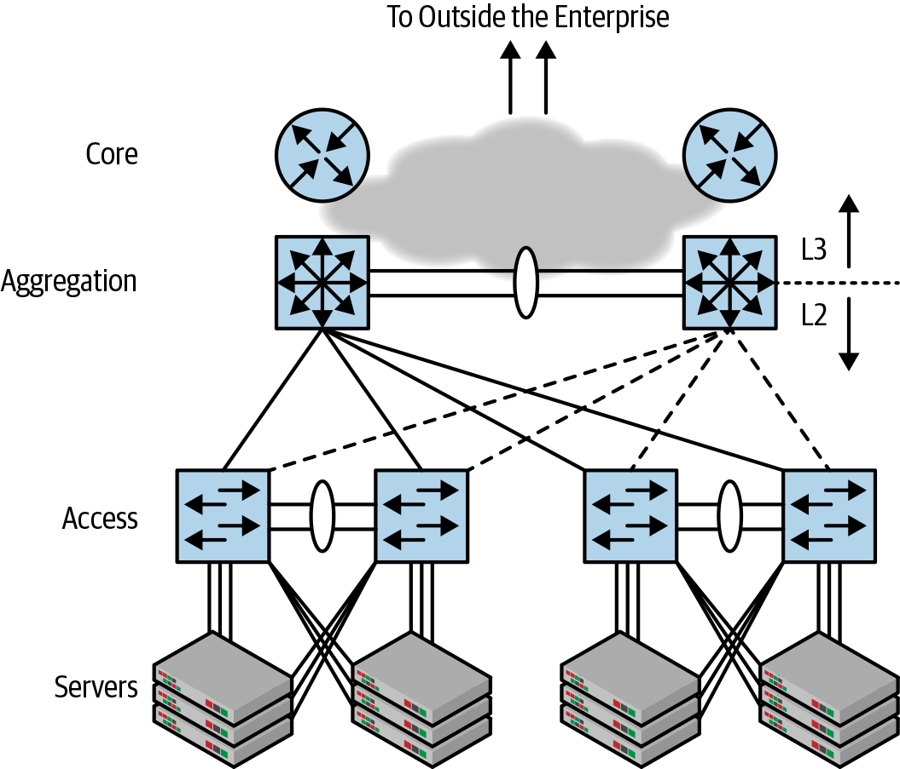
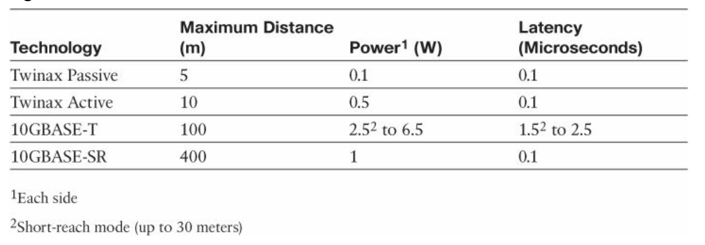
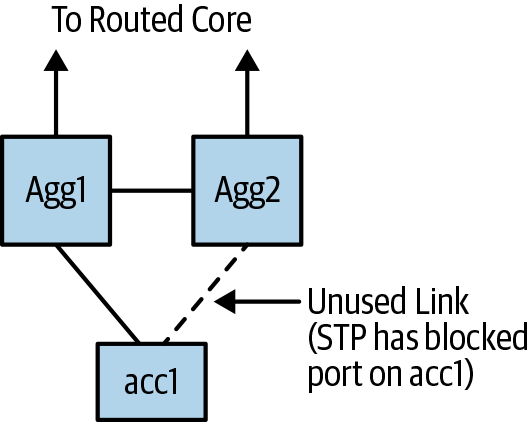
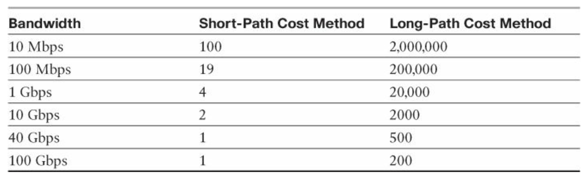

class: middle, center

# 大数据的信息基础设施

## 传统网络结构

陈一帅

[yschen@bjtu.edu.cn](mailto:yschen@bjtu.edu.cn)

.footnote[网络智能实验室]

北京交通大学电子信息工程学院

---

# 背景

- .red[传统网络结构]
- 数据中心以太网
- STP 桥接机制及其难题

---

# 传统网络设计

- Access-Aggregation-Core

.center[.width-70[]]

???

often shortened to access-agg-core or just access-agg.

---

# 背景

- 传统网络结构
- .red[数据中心以太网]
- STP 桥接机制及其难题

---

# 数据中心以太网

- 1973 年，Xerox Palo Alto 研究中心（PARC）
- 局域网
  - 可变大小的帧格式，尽力而为传递，错误-检测机制
- CSMA/CD 链路控制
  - 10Mbps，100 Mbps，1 Gbps 版本同时具有 CSMA /CD 和全双工版本
  - 10G 及以上更高速版本中没有 CSMA/CD
  - 现在甚至在家里或 10 Mbps 时都没有 CSMA/CD

???

Quiz: True or False?

Which of the following statements are generally true?
TF
- Ethernet is a local area network (Local < 2km)
- Token ring, Token Bus, and CSMA/CD are the three most common LAN access methods.
- Ethernet uses CSMA/CD.
- Ethernet bridges use spanning tree for packet forwarding.
- Ethernet frames are 1518 bytes.
- Ethernet does not provide any delay guarantees.
- Ethernet has no congestion control.
- Ethernet has strict priorities.

---

# 以太网速度

- 常用配置
  - 住宅，企业办公室中：1 Gbps
  - 数据中心：10 Gbps，过渡到 40 Gbps 和 100 Gbps
  - 某些运营商核心网络：100G
- 100G 仍比 10×10G 贵
- 进展
  - IEEE 802.3cu 正在使用 400G 以太网标准
  - 以太网联盟正在讨论 800G/1.6T 标准

???
Ethernet Speeds

- IEEE 802.3cu is working on 400G Ethernet standard. Ethernet Alliance is discussing 800G/1.6T standards
- 10Mbps, 100 Mbps, 1 Gbps versions have both CSMA/CD and Full-duplex versions
- No CSMA/CD in 10G and up
- No CSMA/CD in practice now even at home or at 10 Mbps
- 1 Gbps in residential, enterprise offices
- 10 Gbps in Data centers, moving to 40 Gbps and 100 Gbps
- 100G in some carrier core networks
  100G is still more expensive than 10×10G

---

# 以太网的分层结构

- 分层架构，是以太网经久不衰的最大原因
- 系统组织为数据链路层和物理层，将与介质相关的方面与与框架相关的操作区分开
- 可以自由采用新的布线和传输速度，同时使用完全相同的第 2 层特性

???

从那时起，IEEE 一直指导协议数据速率的发展，从 10 Mbps（以太网）到 100 Mbps（快速以太网）到 1 Gbps（千兆位以太网）到 10 Gbps（10 千兆位以太网）到 40 Gbps（40 千兆位以太网）再到 100 Gbps（100 千兆以太网）。

a layered architecture. This last goal is arguably the biggest contributor to the longevity of Ethernet.

The protocol’s systemic organization, broken into a data link layer and a physical layer, has segregated the medium-dependent aspects of the coaxial cable from the frame-related operations. Consequently, Ethernet was free to adopt new cabling and transmission speeds while using the very same Layer 2 characteristics, such as frame format with variable size, carrier sense multiple access collision detect (CSMA/CD) link control, best-effort delivery, and error-detection mechanisms.

IEEE has since this occasion stewarded the protocol data rate development from 10 Mbps (Ethernet) to 100 Mbps (Fast Ethernet) to 1 Gbps (Gigabit Ethernet) to 10 Gbps (10 Gigabit Ethernet) to 40 Gbps (40 Gigabit Ethernet) and to 100 Gbps (100 Gigabit Ethernet).

---

# 命名

- 三个值
  - 代表 Mbps 传输速度的数字
  - BASE 表示基带传输
  - 一两个字母指定使用的媒体
- 10BASE-T
  - 10 Mbps
  - 基带传输
  - 双绞线电缆（Twisted-pair）

???

three values:

a number representing the transmission speed in Mbps,

BASE denoting that baseband transmission is used, and

one or two letters designating the used media.

In that manner, 10BASE-T represents Ethernet baseband transmission in 10 Mbps using twisted- pair cables.

---

# 媒体

- 同轴
- 双绞线
- 光纤
  - 多模、单模
- 直连双轴电缆
  - 在数据中心非常流行

???

coaxial, twisted-pair, optical fiber, and recently, direct-attach twinaxial cables.

coaxial 不太用了。

twisted-pair 最流行： originated from telephony wiring systems (in fact, its patent is authored by the telephone father himself, Graham Bell).

The wires on a pair are twisted together to reduce electromagnetic interference (EMI) from external sources, including crosstalk interference from adjacent pairs.

光纤

Multimode fiber (MMF): Designed for shorter distances, this cabling allows multiple modes of light propagating through the fiber. This type of fiber has a core diameter of 50 or 62.5 microns and a cladding diameter of 125 microns.

Single-mode fiber (SMF): Designed for longer distances, this cabling only allows one mode of light to propagate through the fiber. It has a core diameter between 8 and 10.5 microns and a cladding diameter of 125 microns. It permits lower light dispersion than MMF and, for that reason, has a higher cost.

---

# Twinax cables

- 在数据中心非常流行
  - IEEE 要求传输 10E12 位 1 个错误
  - 双芯电缆的误码率（传输 10E18 位为 1 个错误）低得多
- 不同媒介，10 Gigabit Ethernet 的性能比较

.center[.width-100[]]

???

Twinax cables have achieved high popularity in data centers because of their high benefit/cost ratio.

10 Gigabit Ethernet Characteristics

twinax cables present a much lower bit error rate (1 error in 10E18 bits transmitted) than the IEEE requirements for 10 Gigabit Ethernet connections (1 error in 10E12 bits transmitted).

---

# 以太网段

- Segment（段）
  - 与使用同轴电缆作为共享通信介质的原始以太网总线有关
  - 在一个段中，所有连接的设备都接收所有传输的帧
- 以太网集线器（Hub）也属于一段
  - 被引入以替代易于出错的同轴总线
- 段定义了冲突域
  - 一个帧在该段上传时，传输另一个帧会出现错误

---

# 以太网桥

- 桥
  - 允许多个网段之间通信，不会形成一个大的冲突域

---

# 广播域

- 桥定义了广播域
  - 以太网中，广播是必须的
  - 如果桥未在该网段上检测到其目的 MAC 地址，它将帧从一个网段传输到另一网段
  - 它必须将广播帧转发到所有桥接段
  - ARP 学到的 MAC 只保留 300s，DHCP 也依靠广播
- 桥的广播机制
  - flooding，来者不回
  - Spanning Tree 避免 loop

---

# 交换机

- 交换机
  - 桥概念的演变
  - 它的转发过程基于硬件
  - 通常具有比网桥更多的端口
  - 一个交换机也定义了一个广播域

???

Segment

: It relates to the original Ethernet bus that used coaxial cables as shared communication media. In a segment, all transmitted frames are received by all connected devices. Ethernet hubs also constitute a segment and were introduced as a replacement for the error-prone coaxial buses. A segment also defines a collision domain because the shared media allows that a frame can be erroneously transmitted while another frame is still being transported on the segment.

Bridge: A device created to allow the communication between multiple Ethernet segments without the formation of one big collision domain. A bridge transports Ethernet frames from one segment to another if its destination MAC address was not detected on this segment. A bridge also defines a broadcast domain because it must forward broadcast frames to all bridged segments.

Switch: An evolution of the concept of bridges. Its forwarding process is hardware based, and usually has more ports than a bridge. A switch also defines a broadcast domain.

还是一个广播域

---

# 背景

- 传统网络结构
- 数据中心以太网
- .red[STP 桥接机制及其难题]

---

# STP 环破除

- Spanning Tree Protocol
- 为了容忍链路失败，会有冗余链路
- 冗余链路带来 Loop
- 与 IP 数据包不同，以太网帧没有生存时间（TTL）标头字段
- 在 Loop 中，ARP，DHCP 广播包，带未知 MAC 地址的包会无限循环
- 几毫秒内，把整个链路撑满，网络崩溃

---

# STP 环破除

- 破除环

.center[.width-60[]]

???

The switch’s behavior for broadcast frames (“always forward a broadcast frame to every Ethernet interface except the one that received it”) basically provokes the loop.

In a few microseconds, as Steps 2, 3, and 4 happen continuously, the loop can consume all available bandwidth, and no other traffic is able to use the network.

带未知 MAC 地址的包也会

Unlike IP packets, Ethernet frames do not have a Time-to-Live (TTL) header field

---

# STP 环破除

- Radia Pearlman（也称为“互联网之母”）1980 年代创建
- 检测桥接网络中的环路，阻止所选端口中的流量
- 默认路径成本

.center[.width-100[]]

???

Created in the 1980s by Radia Pearlman (also known as the “mother of the Internet”), STP detects loops in a bridged network and blocks traffic in chosen ports

STP 的 weight

---

# STP 环破除算法

- 类似距离矢量算法
- 交换机根据以下决策选择是否阻止所选端口中的流量（“死亡”）
  - 最小的根网桥 ID
  - 到根网桥的最低路径成本
  - 最小发送方网桥 ID
  - 最小端口号
- 也叫死亡匹配

???

a switch will select the “best” BPDU according to the following decision sequence (also known, informally, as the “BPDU death match”):

Lowest root bridge ID
Lowest path cost to root bridge Lowest sender bridge ID
Lowest port ID

---

# STP 环破除收敛过程

- Radia Pearlman 可爱的 Algorhyme 诗

```
I think that I shall never see
A graph more lovely than a tree.
A tree whose crucial property
Is loop-free connectivity.
A tree that must be sure to span
So packets can reach every LAN.
First, the root must be selected.
By ID, it is elected.
Least-cost paths from root are traced.
In the tree, these paths are placed.
A mesh is made by folks like me,
Then bridges find a spanning tree.

```

???

There are three clear phases that define Spanning Tree Protocol convergence, as Radia Pearlman described in her lovely Algorhyme poem:

“An Algorithm for Distributed Computation of a Spanning Tree in an Extended LAN” ©1985 Association for Computing Machinery, Inc. Reprinted by permission.

---

# Flooding 的可扩展性问题

- 无论如何分割，自学习桥的““flood and learn””模型都无法扩展
- MAC 地址不是分层的。因此，MAC 转发表是对 VLAN 和数据包的目标 MAC 地址的简单 60 位查找
- 通过泛洪和学习来学习一百万个 MAC 地址，并由于超时而定期重新学习它们，几乎每个网络架构师都认为这是不可行的
- 终端或者虚拟终端将被迫处理百万个数据包的周期性洪泛

???

“Flooding
No matter how you slice it, the “flood and learn” model of self-learning bridges doesn’t scale. MAC addresses are not hierarchical. Thus, the MAC forwarding table is a simple 60-bit lookup of the VLAN and destination MAC address of the packet. Learning one million MAC addresses via flood and learn, and periodically relearning them due to timeouts, is considered unfeasible by just about every network architect. The network-wide flooding is too much for end stations to bear. In the age of virtual endpoints, the hypervisor or the host OS sees every single one of these virtual networks. Therefore, it is forced to handle a periodic flood of a million packets.

---

# STP 在实际中的难题：不稳定，不可预测

- 一个普通的故障就可能导致环，因此带来严重故障，如
  - 对等 STP 出于某种原因而无法及时发送 hello 数据包（例如，因为它正在处理 ARP 风暴），则其他对等 STP 假定远端没有运行 STP，并开始将数据包转发出链路到不堪重负的开关。这将立即导致环路，并引发广播风暴，从而完全破坏网络。
  - 一个案例：交换硅片有一个错误，该错误导致数据包泄漏出阻塞的交换机端口，无意间形成了环路，从而引发了广播风暴

---

# STP 在实际中的难题：不稳定，不可预测

- STP 根选举程序可能会被取消，导致错误的设备被选举为根
  - 案例：向网络中添加新设备时，遇到了太多的网络故障，以至于要求交换机端口在配置之前被禁用。默认情况下，在禁用端口的情况下，新添加的交换机上的 STP 不会自动加入网络并选择根
- 许多活动部件（通常是专有部件）的存在也导致网络变得不可预测且难以进行故障排除

???

“Unpredictability
A routine failure can cause STP to fail dramatically. If a peer STP is unable to send hello packets in time for whatever reason (because it is dealing with an ARP storm, for example), the other peers assume that there is no STP running at the remote end and start forwarding packets out the link to the overwhelmed switch. This promptly causes a loop and a broadcast storm kicks in, completely destroying the network. This can happen under many conditions. I remember a case back in the early days when the switching silicon had a bug that caused packets to leak out blocked switch ports, inadvertently forming a loop and thus creating a broadcast storm.”

“STP also has a root election procedure that can be thrown off and result in the wrong device elected as the root. This happened, for example, at a rather large customer site, during my Cisco days, when a new device was added to the network. The customer had so many network failures as a result of this model that it demanded that switch ports be shipped in a disabled state until they were configured. With the ports administratively disabled by default, STP on a newly added switch didn’t accidentally join a network and elect itself the root.

The presence of many moving parts, often proprietary, also causes networks to become unpredictable and difficult to troubleshoot.”

---

# 小结

- 传统网络结构
- 数据中心以太网
- STP 桥接机制及其难题

---

# 思考题

- STP 算法
