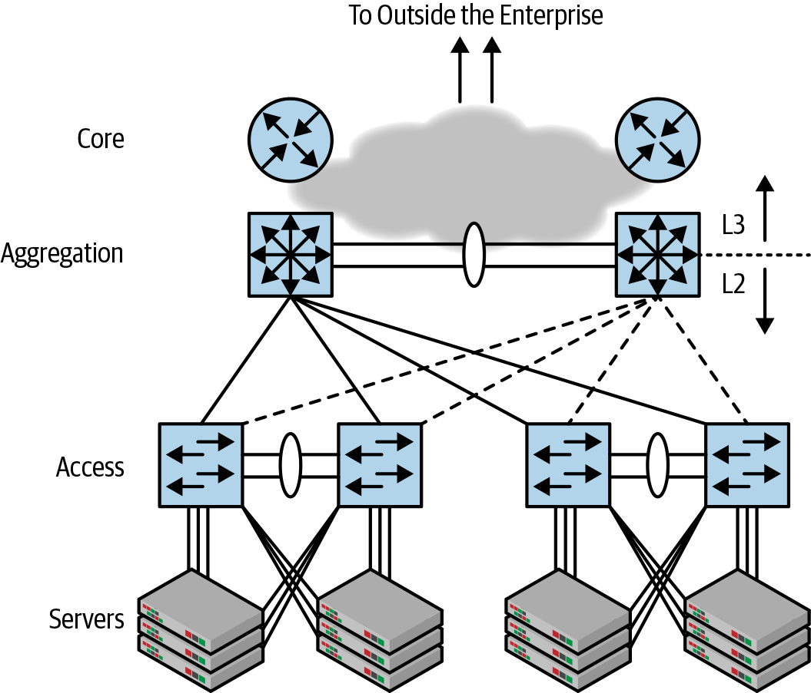

class: middle, center

# 大数据的信息基础设施

## Clos 网络拓扑

陈一帅

[yschen@bjtu.edu.cn](mailto:yschen@bjtu.edu.cn)

.footnote[网络智能实验室]

北京交通大学电子信息工程学院

---

# 内容

- .red[传统三层网络结构的不足]
- Clos 交换结构
- Fat-Tree 实现
- Clos 数学
- 实际网络规模限制与设计
- 多级 Clos 设计
- 部署和管理
- 容器网络

---

# 传统三层网络拓扑

- Access-Aggregation-Core

.center[.width-70[]]

???

often shortened to access-agg-core or just access-agg.

---

class: middle, center

# 三层网络实际中遇到的难题

---

# VLAN 配置难题

- VLAN 终止于聚合交换机的桥接和路由边界
  - 不能跨越多个聚合交换机，因为它们通过 L3 连接
- 在两对不同的聚合交换机之间不能存在相同的 VLAN
- VLAN 配置很费力
  - 不够灵活，无法让网络工程师根据客户需求将任何可用的空闲端口分配给 VLAN
  - 这意味着网络设计人员必须根据所需的端口数量仔细规划虚拟网络的增长

???

“Inflexibility
In Figure 1-4, VLANs terminate at the aggregation switch, at the boundary of bridging and routing. It is not possible to have the same VLAN be present across two different pairs of aggregate switches. In other words, the access-agg-core design is not flexible enough to allow a network engineer to assign any available free port to a VLAN based on customer need. This means that network designers must carefully plan the growth of a virtual network in terms of the number of ports it needs.”

Problem with 3-Tier Topology

- Failure of a single link can reduce the available bandwidth by half
- With more than two aggregation switches, spanning tree becomes unpredictable in case of certain failures.
- Two aggregation switch => They are the bottleneck
- It is not possible for VLANs to span across multiple pairs of
  aggregation switches since the pairs are connected by L3
- VLAN provisioning becomes laborious

---

# ARP 负荷问题

- 两个 Aggregate 交换机必须响应大量的 ARP
  - Windows Vista 将默认的 ARP 刷新计时器从一两分钟降低到了 15 秒，以符合 RFC 4861（“ IP 版本 6 的邻居发现”）标准
  - 该 ARP 刷新的频率如此之高，以至于它们带来已广泛部署的聚合交换机很大的问题
  - 过多的 ARP 导致 CPU 阻塞，以致其他控制协议失败，从而导致整个网络崩溃
- 随着虚拟机和容器形式的虚拟端点的出现，此问题变得成倍恶化，因为聚合交换机必须处理的端点数量增加了，即使没有增加这些框下连接的物理主机的数量。

???

“Burden of ARP
Remember that aggregation boxes needed to respond to ARPs? Now imagine two boxes having to respond to a very large number of ARPs. When Windows Vista was introduced, it lowered the default ARP refresh timer from a minute or two to 15 seconds to comply with the RFC 4861 (“Neighbor Discovery for IP version 6”) standard. The resulting ARP refreshes were so frequent that they brought a big, widely deployed aggregation switch to its knees. In one interesting episode of this problem that I ran into, the choking up of the CPU due to excessive ARPs led to the failure of other control protocols, causing the entire network to melt at an important customer site. The advent of virtual endpoints in the form of VMs and containers caused this problem to become exponentially worse as the number of endpoints that the aggregation switches had to deal with increased, even without increasing
“the number of physical hosts connected under these boxes.

---

# STP 两台聚合交换机限制难题

- 解决东西向带宽日益增长的需求的一种常见方法是使用更多的聚合交换机
- 但 STP 禁止使用两个以上的聚合交换机
  - 如果由于链接和/或节点故障而导致拓扑发生更改，则超出上述限制的 STP 最终拓扑无法预测、无法使用
- STP 仅能使用两个聚合交换机的限制严重限制了网络带宽
  - 使用两个以上的聚合交换机，如果发生某些故障，生成树将变得不可预测
  - 两个聚合交换机 => 它们是瓶颈
  - 单条链路故障可以将可用带宽减少一半

???

Limitations of switches and STP
A common way to deal with the increased need for the east-west bandwidth is to use more aggregation switches. However, STP prevents the use of more than two aggregation switches. Any more than that results in an unpredictable, unusable topology in the event of topology changes due to link and/or node failures. The limitation of using only two aggregation switches severely restricts the bandwidth provided by this network design. This limited bandwidth means that the network suffers from congestion, further affecting the performance of applications.”

---

# 容错设计复杂

- 需要对 Access-Agg-Core 网络进行精心设计，才能防止在链路失败时此类网络发生拥塞
- Agg1 和 Agg2 交换机均宣布对连接到 acc1 的子网的可达性
  - 如果 Agg1 和 acc1 之间的链接失败，Agg1 需通过 Agg1 和 Agg2 之间的链接将数据包发送到 acc1
  - 这意味着 Agg1 和 Agg2 之间的链路带宽需要仔细设计。否则，由于链接故障而发送的流量超出计划的流量，导致应用程序性能下降
  - 这使网络设计，容量规划和故障处理变得复杂

???

“As a final nail in this coffin, reality has shown us that nothing is too big to fail. When something that is not expected to fail does indeed fail, we don’t have a system in place to deal with it. ISSU is similar in a sense to nonstop Unix kernels, and how many of those are in existence today in the data center?

Unless the access-agg-core network is carefully designed, congestion can quite easily occur in such networks. To illustrate, look again at Figure 1-3. Both the Agg1 and Agg2 switches announce reachability to the subnets connected to acc1. This subnet might be spread across multiple access switches, not limited to just acc1. If the link between Agg1 and acc1 fails, when Agg1 receives a packet from the core of the network destined to a node behind acc1, it needs to send the packet to Agg2 via the link between Agg1 and Agg2, and have Agg2 deliver the packet to acc1. This means the bandwidth of the link between Agg1 and Agg2 needs to be carefully designed; otherwise, sending more traffic than planned due to link failures can cause unexpected application performance issues.
Even under normal circumstances, half the traffic will end up on the switch that has a blocked link to the access switch, causing it to use the peer link to reach the access switch via the other aggregation switch. This complicates network design, capacity planning, and failure handling.”

---

# 失败发生时性能问题

- 数据中心规模庞大，失败是确定的。对故障的响应至关重要
- 爆炸半径（blast radius）衡量单个故障造成的破坏程度
  - 故障越接近故障点，故障域的粒度越细，爆炸半径越小。
- Access-agg-core 模型易于出现爆破半径大的故障，例如
  - 单个链路的故障将可用带宽减半
  - 单个聚合交换机的故障使整个网络瘫痪，因为整个网络的流量带宽减少了一半

???

“Failure Domain
Given the large scales involved in the web-scale data centers, failure is not a possibility but a certainty. Therefore, a proportional response to failures is critically important.
The data center pioneers came up with the term blast radius as a measure of how widespread the damage is from a single failure. The more closely contained the failure is to the point of the failure, the more fine-grained is the failure domain and the smaller is the blast radius.

The access-agg-core model is prone to very coarse-grained failures; in other words, failures with large blast radiuses. For example, the failure of a single link halves the available bandwidth. Losing half the bandwidth due to a single link failure is quite excessive, especially at large scales for which at any given time, some portion of the network will have suffered a failure. The failure of a single aggregate switch brings the entire network to its knees because the traffic bandwidth of the entire network is cut in half. Worse still, a single aggregate switch now will need to handle the control plane of both switches, which can cause it to fail, as well. In[…]”

---

# 应用变化带来流量变化

- 微服务带来服务器之间的流量增长
- 南-北 vs. 东-西流量
- 以前，大部分流量都是南北
  - 数据中心服务器与外部客户端之间
- 现在趋势是服务器之间进行大数据分析的流量
  - 东西向流量
- 需要更扁平的网络
- 类似于 Fat-Tree 的拓扑

???
Larger Servers to Micro-Services

- Increasing network demand

North-South vs. East-West Traffic

- Previously, most of the traffic was north-south
  - Between servers in the data center and clients out-side
- Now the trend is towards traffic between servers for big data analysis
  - East-West traffic
  - Requires flatter network - Fat-tree like topologies

---

# 内容

- 传统三层网络结构的不足
- .red[Clos 交换结构]
- Fat-Tree 实现
- Clos 数学
- 实际网络规模限制与设计
- 多级 Clos 设计
- 部署和管理
- 容器网络

---

# 交换结构

- 交换结构（switched fabric）（使用交换机的网络拓扑）的主要目标是通过使用仅具有有限数量的端口的交换机来连接大量端点（处理器或服务器）
- 通过巧妙地连接交换元件并形成拓扑，网络可以互连大量端点

???

a switched fabric — a network topology that uses switches — the main goal is to connect a large number of endpoints (processors or servers) by using switches that only have a limited number of ports. By cleverly connecting switching elements and forming a topology, a network can interconnect an impressive amount of endpoints.

---

# Clos 交换网络

- Charles Clos（贝尔实验室）在 1953 年提出的用于电话交换系统的多级电路交换网络
- 允许使用相对较小的交换机来构建非常大型的交换网络
  - 减少交叉点的数量

.center[.width-80[]]

???

Using this topology, Charles Clos made it economical to build very large telephony networks with relatively small switches. In a similar fashion, we can use the Clos topology to build very large packet-switched networks using simple fixed-form-factor switches—a game changer. The new topology and the economics that go along with it modernize everything from how we think about failure to how we buy switches, how we do inventory management, and how we manage the network.

- 三个阶段：输入，中间和输出。输入级具有 n 个输入和到中间级的 m 个连接，而输出级具有 n 个输出和到中间级的 m 个连接。每个输入级开关连接到每个中间级开关一次。每个中间级开关一次连接到每个输出级开关。有 t 个输入级开关和 t 个输出级开关，因此中间级有 t 个输入和 t 个输出。

尽管这与图 2-1 看起来非常不同，但实际上它与它整齐地映射。如果您想象输出级开关向后折叠，使其与输入级开关位于中间级开关的同一侧，则可以轻松地看到中间级开关是脊椎开关，而输入和输出级开关只是叶子。如果您使 n = m = t，您将得到我之前绘制的叶-脊拓扑，这是网络从业人员今天使用的拓扑。”

.center[.width-100[]]

Classic three-stage Clos topology

“The topology is described as having three stages: input, middle, and output. The input stage has n inputs and m connections to the middle stage, whereas the output stage has the n outputs and m connections to the middle stage. Each input stage switch is connected once to every middle stage switch. Each middle stage switch is connected to each output stage switch once. There are t input stage switches and t output stage switches, so the middle stage has t inputs and t outputs.

Although this looks very different from Figure 2-1, it actually maps neatly to it. If you imagine the output stage switch folded back so that it lies on the same side of the middle stage switch as the input stage switch, you can easily see that the middle stage switches are spine switches, and the input and output stage switches are just the leaves. If you make the n=m=t, you get the leaf-spine topology I drew earlier, which is what network practitioners use today.”

clos 拓扑 + 网络 disaggregation

---

# Clos 交换网络

- 可以具有任意奇数级，例如 5
- 3 级 Clos（n，m，r）
  - 入口（r 个 n×m）
  - 中间（m 个 r×r）
  - 出口（r 个 m×n）

.center[.width-80[]]

---

# Clos 交换网络的折叠表示

- 折叠：将输入和输出合并到一个交换机中

.center[.width-50[]]

.center[.width-40[]]

---

# Clos 折叠实现

- 通常将服务器和分支交换机置于单个机架中，交换机位于机架的顶部
- 因此，通常将叶子称为机架顶部（ToR）交换机

.center[.width-100[]]

---

# Clos 优点

- 高容量网络
  - 任何两台服务器之间都有两条以上路径
  - 添加更多骨干交换机，增加更多路径
  - 不建议在一个叶子和一个骨干间添加更多链接以增加路径
- 除了互连功能外，所有其它协议功能都放到边缘叶子交换机
  - 比如，不像聚合交换机，骨干不负责响应终端的 ARP 请求
  - 添加更多叶子，骨干上的控制平面负载只会略微增加

???

为什么用 clos，因为

两层: spine (脊柱) + leaf

“It is common practice to put the servers and the leaf switch in a single hardware rack, with the switch at the top of the rack. So the leaf is often called a top of rack (ToR) switch.”

“This topology produces a high-capacity network, because there are more than two paths between any two servers. Adding more spines increases the available bandwidth between leaves. Adding more links between a leaf and a spine is not recommended to achieve this goal. ”

“In Clos, all functionality except interconnection is pushed out to the edges, so the control-plane load on a spine increases only marginally as more leaves are added to it. For example, the spines are not responsible for responding to the Address Resolution Protocol (ARP) requests of the end stations, like an aggregate switch would. As a consequence, we’ll soon see how easy it is to determine the maximum number of servers that can be connected in such a network.”

---

# Scale-In vs. Scale-out

- Scale-In 扩展型结构
  - 由于拥有横向扩展架构，Clos 的增长非常稳定
  - 可以通过添加更多的叶子和服务器，增加网络支持的工作量
  - 仅将骨干交换机用于增加叶子交换机之间的带宽
  - 这样的体系结构称为 Scale-In 扩展体系结构
- 相反，在 access-agg 拓扑中，网络的扩展是通过增强聚合交换机的 CPU 来提供的
  - Scale-out

???

“Clos grows in a very consistent way thanks to having what’s called a scale-out architecture. You increase the amount of work supported by the network by adding more leaves and servers. The spines are then used only to scale the available bandwidth between the edges. In contrast, in the access-agg-core architecture, the scaling of services was provided by beefing up the aggregation box’s CPUs. Such an architecture is called a scale-in architecture.”

---

# Clos 下的网络路由

- 基于 STP 的聚合核心网络的基本限制是其仅支持两个聚合交换机
- Clos 不用生成树协议（STP）用作交换机互连控制协议
- 桥接仅在边缘（即在单个机架内）支持
- 跨机架桥接使用更现代的网络虚拟化解决方案，如虚拟可扩展局域网（VXLAN）

???

Routing as the Fundamental Interconnect Model

A fundamental limitation of the access-agg-core network is its ability to support only two aggregation switches. Readers might be wondering how the Clos topology can then support more than two spines. The short answer is that the Spanning Tree Protocol (STP) is not used as the switch interconnect control protocol. Does this mean bridging is not supported in Clos topologies? Bridging is mainly supported only at the edges, meaning within a single rack. To achieve bridging across racks, we use a more modern network virtualization solution such as the Virtual eXtensible Local Area Network (VXLAN)”

---

# 流管理

- ECMP
  - 流哈希（Flow hashing）
  - 但还是会出现 Elephant flow
- 上下行流量不均衡
  - Oversubscription

---

# 上下行流量均衡

- Oversubscription
- 一个交换机的下行链路与上行链路带宽之比
- 叶子节点
  - 下行链路面向服务器，上行链路面向主干
  - 1：1 意味着总下行链路带宽等于总上行链路带宽
  - 许多网络使用 2：1 或 4：1
- 中间节点
  - 大多数数据中心都确保更高层节点 1：1

???

“oversubscription of a switch is defined as the ratio of downlink to uplink bandwidth. ”

“In leaves, downlinks are the server-facing links, and uplinks are the spine-facing links. So an oversubscription ratio of 1:1 means that the total downlink bandwidth is equal to the total uplink bandwidth. ”

“not all data centers preserve a 1:1 oversubscription at the leaf. Many use a 2:1 or 4:1 oversubscription ratio. But most data centers ensure that higher tiers (discussed in “Scaling the Clos Topology”) in the Clos network have a 1:1 oversubscription ratio. So in a three-tier or four-tier Clos network, an oversubscription ratio that is not 1:1 might be found at the leaf level, but only at that level.”

---

# 非阻塞网络

- 1：1 Oversubscription 网络也称为无阻塞网络
  - 非竞争性的：从一个下行链路到上行链路的流量不会与来自其他下行链路的流量竞争
- 可重排的无阻塞
  - 根据流量模式，流哈希能够区分不同的流
  - 可通过重新排列来自同一下行链路的不同下行链路的流以使用其他上行链路，使网络再次畅通无阻

???

“A 1:1 oversubscribed network is also called a nonblocking network (technically, it is really noncontending), because traffic from one downlink to an uplink will not contend with traffic from other downlinks. However, even with an oversubscription ratio of 1:1, the Clos topology is technically only rearrangably nonblocking. Depending on the traffic pattern, flow hashing can result in packets from different downlinks using the same uplink (as described in “Flows and Congestion”). If you could rearrange the flows from different downlinks that end up on the same uplink to use other uplinks, you could make the network nonblocking again. Hence the name rearrangably nonblocking.”

上下行链路不均衡
non-blocking 交换机

---

# Clos 交换网络性能

- 如果 m > n，则可重排（Rearrangeably）无阻塞
- 如果 m > 2n-1，则 Strict-sense 无阻塞
  - 现有呼叫可不受影响

.center[.width-70[]]

???

Multi-stage circuit switching network proposed by Charles Clos in 1953 for telephone switching systems

- Allows forming a large switch from smaller switches
  The number of cross-points is reduced - Lower cost (then)
- 3-Stage Clos(n, m, r): ingress (rn×m), middle (mr×r), egress (rm×n)
- Strict-sense non-blocking if m > 2n-1. Existing calls unaffected.
- Rearrangeably non-blocking if m > n
- Can have any odd number of stages, e.g., 5
- Folded: Merge input and output in to one switch

Ref: http://en.wikipedia.org/wiki/Clos_network

---

# Clos 思考题

- 绘制一个三级 clos（4，5，3）拓扑及其折叠版本
- n = 4, m = 5, r = 3

???

- Draw a 3-stage clos(4, 5, 3) topology and its folded version. n = 4, m = 5, r = 3

---

# 内容

- 传统三层网络结构的不足
- Clos 交换结构
- .red[Fat-Tree 实现]
- Clos 数学
- 实际网络规模限制与设计
- 多级 Clos 设计
- 部署和管理
- 容器网络

---

# Fat-tree

- Charles E. Leiserson 1985 年提出
- 任何节点，下行链接数量等于上行链接数量
- 因此，树的根节点链路最多

.center[.width-70[]]

???

Fat-Tree networks were proposed by Charles E. Leiserson in 1985. Such network is a tree, and processors are connected to the bottom layer. The distinctive feature of a fat-tree is that for any switch, the number of links going down to its siblings is equal to the number of links going up to its parent in the upper level. Therefore, the links get “fatter” towards the top of the tree, and switch in the root of the tree has most links compared to any other switch below it

---

# 实现

- 采用 Clos 交换结构
- 各级使用相同的交换机
- 边缘交换机，上行端口数目等于下行端口数
  - 达到了 Fat-tree 的效果

.center[.width-100[]]

---

# 示例

- 6 个相同的 36 端口交换机
  - 4 个作为边缘交换机，2 个作为核心交换机
- 边缘交换机 18 个端口连服务器
  - 剩余 18 个端口分两组，每组 9 个连核心交换机

.center[.width-100[]]

---

# 示例

- 达到 Fat-tree 的效果
  - 边缘交换机连服务器数量等于到父节点链接数量：18 个
- 与原始 Fat-tree 的区别
  - 中间交换机有多个父节点（在这种情况下为 2 个）
  - 原始 Fat-tree 中每个中间节点只有一个父节点

.center[.width-100[]]

---

# 性能

- 设每端口速率为 1Gbps
- 路由选择时使用 ECMP
- 结果：任何两个服务器间吞吐量 1 Gbps
- 缺点：布线复杂

.center[.width-100[]]

???

Ref: Teach yourself Fat-Tree Design in 60 minutes, http://clusterdesign.org/fat-trees/

Fat-Tree DCN Example

- 6 identical 36-port switches. All ports 1 Gbps. 72 Servers.
- Each access switch connects to 18 servers. 9 Uplinks to first aggregation switch. Other 9 links to 2nd aggregation switch.
- Throughput between any two servers = 1 Gbps using ECMP Identical bandwidth (36 Gbps) at any bisection.
- Negative: Cabling complexity

Ref: Teach yourself Fat-Tree Design in 60 minutes, http://clusterdesign.org/fat-trees/

---

# 内容

- 传统三层网络结构的不足
- Clos 交换结构
- Fat-Tree 实现
- .red[Clos 数学]
- 实际网络规模限制与设计
- 多级 Clos 设计
- 部署和管理
- 容器网络

---

# 容量

- 求骨干交换机最大数量
- 都使用 n 端口交换机
- 1：1 oversubscription
  - 叶子一半端口连服务器，另一半连骨干交换机
  - n 端口交换机，有 n/2 个连骨干的端口
- 最多连 n/2 个骨干交换机

.center[.width-50[]]

???

Half of leaf switch ports are towards servers and the other half towards spine

- With 36 port switches - 18 ports to spine - 2, 3, 6, 9, 18 spine switches
- Maximum # of spine switches = 1⁄2 # of ports on leaf switches

Servers

- Largest configuration with n-port switches: n2/2 servers can be connected using n+n/2 switches.

---

# 服务器数

- Clos 拓扑中可以连接的服务器的最大数量为 $n^2/2$
  - 最多 n/2 个骨干交换机
  - 把 n 个叶子交换机连在一起
  - 每个叶子节点连 n/2 个服务器
  - 需 $n+n/2$ 个交换机

.center[.width-50[]]

---

# 服务器数

- n = 64
  - 96 个交换机，连接 2,048 个服务器
- n = 128（两倍）
  - 192 台交换机，8,192 台服务器（四倍）

.center[.width-50[]]

???

“Assuming we’re using n-port switches for both leaf and spine, and assuming a 1:1 oversubscription, the maximum number of servers that can be connected in the Clos topology shown in Figure 2-1 is n^2/2. ”

“If you use more realistic numbers, such as 64-port switches, the total number of servers that can be connected is 642/2 = 2,048 servers. If you double the number of ports on the switch and buy 128-port switches, the total number of servers quadruples to 1282/2 = 8,192 servers. This assumes that all n-ports are of the same bandwidth.

Clos 数学：交换机数

The total number of switches needed in a fully built-out two-tier Clos topology with n port switches is n + n/2. For a 64-port switch, therefore, the total port count is 64 + 64/2 = 96 switches.

To understand this, consider that each spine switch can support n leaf switches. Every leaf switch can connect half its ports to the spines and the other half to the servers. A spine can connect all n ports to leaves. So an n-port switch will have n leaves connecting to n/2 spines, yielding the formula just shown.”

---

# 练习

- 使用 4 端口交换机绘制最大的 Fat-tree 拓扑
  - 假设每个服务器都连接到一个叶子交换机，而叶子交换机被多宿主到骨干交换机。没有核心层。
  - 可以连接多少台服务器？
  - 需要多少个交换机？
- 使用 64 端口交换机
  - 最多可以连接多少台服务器?
  - 此时需要多少个交换机？

???

Homework 3B
Homework 3B

1. Draw the largest Fat-tree topology using 4-port switches. Assume each server is connected to a single leaf switch while the leaf switches are multi-homed to spine switches. There is no core tier.
2. How many servers can be connected in the above configuration?
3. How many switches in all are required in the above configuration?
4. How many servers can be connected using 64-port switches.
5. How many switches are required to form the spine and the
   leaves using 64-port switches.

---

# 内容

- 传统三层网络结构的不足
- Clos 交换结构
- Fat-Tree 实现
- Clos 数学
- .red[实际网络规模限制与设计]
- 多级 Clos 设计
- 部署和管理
- 容器网络

---

# 两级 Fat-Tree 拓扑的优势

- 能够很好地处理东-西向流量（横向流量）
- 叶子和骨干采用同样的设备
  - 维护和更换更容易
- L2 转发仅在每个机架中的叶子交换机使用
  - 机架间路由用新协议 VXLAN
- 叶子可以相同成本通过任何骨干到达另一片叶子
  - ECMP 简化了路由
- 流哈希选择骨干交换机
  - 流的所有包都用相同路径发送，避免乱序到达
  - 流 = {源 IP，目标 IP，L4 协议，源端口，目标端口）

???

Advantages of 2-Tier Architecture

- Homogeneous Equipment: Spine and leaf switches both have the same number of ports with the same speed.
  - Maintenance and replacements is easier
- L2 forwarding is used only in each rack.
  - a new protocol (VXLAN) is used for routing between racks
- A leaf can reach any other leaf via any spine at the same cost - Equal cost multi-path (ECMP) simplifies routing
- All packets of a flow are sent using the same path to avoid out- of-order arrivals.

- Flow = {Source IP, Dest IP, L4 Protocol, Source Port, Dest Port)
- Flow hashing is used to select a spine switch

---

# 优势

- 一切都改变了
  - 考虑故障
  - 购买交换机
  - 库存管理
  - 网络管理
- 更简单
- 更节省

---

# 实际中机架服务器数量限制

- 微服务器技术能够将 96 台服务器装入一个机架
- 但常见是每个机架 20 或 40 台服务器
- 机架空间限制：每个机架 40 个服务器
- 冷却和电源限制：
  - 电源限制每个机架最多只能支持 20 台服务器
  - 图形处理单元（GPU）更增加功耗，进一步减少数量

???

“Rack space limitations limit servers to 40 per rack in the larger data centers. But cooling and power availability dictate that most racks house maybe less than 40 servers per rack. Most sites are designed for around 10 KVA (Kilo-Volt-Amperes) power. If you want to stay with air cooling, 45 KVA is the the limit of possible power today. Depending on location, the power limitations hold many enterprises back to 20 servers per rack. The addition of Graphical Processing Units (GPUs) can also add to the power consumption of a server, further reducing the number of servers you can fit in a rack. I’ve run into enterprises using microserver technology to fit 96 servers into a single rack. But the common numbers I’ve seen are 20 or 40 servers per rack.”

---

# 实际中端口带宽配置

- 目前的交换芯片支持 64-128 个 100GE 端口
- 更高速连骨干交换机（ISL：inter-switch link）
- 用更少骨干交换机获得相同 Oversubscription
- 叶子交换机常用配置
  - 6 个 100GbE 端口 + 48 个 10GbE 端口
  - 8 个 100GbE 端口 + 48 个 25GbE 端口
  - 100G 的连骨干，低速率的连服务器
- 骨干交换机常用配置
  - 32-128 个 100GbE 端口

???

“have servers at one speed and the inter-switch link (ISL) at a higher speed.”

“you can use fewer spine switches to support the same oversubscription ratio. ”

---

# 例: 配置 1

- 每个机架 40 个服务器，交换机 64 个 10GbE 端口
- 将 20 个空闲端口用于上行，2:1 oversubscription
- 两层 Clos 中能够连接 64×40 = 2,560 个服务器

.center[.width-100[]]

---

# 例: 配置 2

- 通常将 24 个 10GbE 端口组合为 6 个 40GbE 端口
  - 使用其中 4 个，连到四个主干交换机
- 400:160 = 2.5:1 oversubscription
  - 10G 的 40 个端口为 400，而 40G 的 4 个端口为 160
  - 完全满足小型数据中心的要求

.center[.width-100[]]

???

“40 servers per rack, on a 64 10GbE–port switch, we have 24 free ports. If we use only 20 of these for an uplink bandwidth of 200GbE, we get an oversubscription ratio of 400:200 or 2:1.

With this math, you can hook up 64 × 40 = 2,560 servers in a two-tier Clos. This is higher than the theoretical number of 2,048 servers (64 × 32).

Most operators combine the 24 ports of 10GbE into 6 ports of 40GbE (assuming the switching silicon supports it) but use only 4 for a 4-spine network.

As shown in Figure 2-4, this leads to an oversubscription of 400:160 or 2.5:1 (40 ports of 10G is 400, and 4 ports of 40G is 160). This is quite acceptable for these small data centers.”

“Switching silicon commonly available today is 32 or 64 ports of 100GbE and 32 ports of 40GbE. As mentioned earlier, enterprises decide on one of the 10GbE/40GbE or 25GbE/100GbE speed combinations and stick to them. ”

服务器一般只能到 10G 或者 25G。

---

# 骨干交换机故障设计

- 大规模提供商使用多达 16 或 32 个骨干交换机
- 最少用 4 个
- 容忍错误
  - 16 个骨干交换机，单个骨干交换机或链接丢失仅导致总带宽减少 1/16
  - 4 个骨干交换机，损失四分之一

???

“Large web-scale providers and some others use as many as 16 or 32 spines. Four spines is the smallest I have encountered. So with 16 spines, the loss of a single spine node or link results in only a 1/16th reduction of total bandwidth. Even with four spines, the loss is one-quarter as opposed to half.”

---

# 叶子交换机故障设计

- 叶子的丢失会影响与其连接的所有服务器
- 大型数据中心中，这没有问题，因为它们有成千上万个机架，因此丢失的服务器上的工作可以简单地放弃并重新安排在其他服务器上
- 较小的数据中心在每个机架中放置两个叶子交换机，将每个机架中的服务器连接到两个叶子交换机上

???

“In contrast to losing a spine or a link to a spine, the loss of a leaf affects all the servers connected to it. In large data centers, this is not too troublesome because they have hundreds and thousands of racks, so work on the lost servers can simply be abandoned and rescheduled on other servers. Smaller data centers place two leaf switches in each rack and connect the servers in each rack to both leaves.”

---

# 内容

- 传统三层网络结构的不足
- Clos 交换结构
- Fat-Tree 实现
- Clos 数学
- 实际网络规模限制与设计
- .red[多级 Clos 设计]
- 部署和管理
- 容器网络

---

# 多级（Tier) Clos 设计

- 将两级扩展到三级
- 两种方案
  - Facebook 方案
  - 微软，亚马逊方案
- 假设 1:1 oversubscription ratio

.center[.width-50[]]

---

# 方案 1：Virtual chassis

- Facebook 方案
- 叶子下面接交换机
- 相当于一个虚拟 8 端口骨干交换机

.center[.width-100[]]

---

# 方案 2：Pod 模型

- 微软，亚马逊方案
- 上面再加一层
- 相当于一个虚拟 8 端口 Pod 叶子节点

.center[.width-100[]]

---

# 三级 Clos 方案

- 维持了 1：1 的 oversubscription
- 在拓扑每个级别都获得了两个 ECMP

.center[.width-80[]]

---

# 三级 Clos 方案

- 问题：20 个交换机，支持 16 个服务器？

.center[.width-90[]]

???

“This topology adheres to maintaining an oversubscription of 1:1. As expected with a four-port switch, we get an ECMP of two at every level of the topology up to the leaf layer.”

Variations

- Higher-speed Inter-Switch Links (ISLs) may be used:

- 1 Gbps server/10 Gbps ISL, 10 Gbps Server/40 Gbps ISL
- Reduces number of spine switches required
  (Smaller number of ECMP may result in some congestion. Also, loss of a spine may have a more severe impact)

  - Two leaves per rack. Hosts are dual-ported.
  - Three-tier Clos: n3/4 servers using n+n2 switches
    Virtual 8-port spine switch
    Virtual 8-port Pod Leaf

- http://en.wikipedia.org/wiki/Fat_tree

- http://en.wikipedia.org/wiki/Clos_network

A. Greenberg, "VL2: A Scalable and Flexible Data Center Network," CACM, Vol. 54, NO. 3, March 2011, pp. 95-104, http://research.microsoft.com/pubs/80693/vl2-sigcomm09-final.pdf

Teach yourself Fat-Tree Design in 60 minutes, http://clusterdesign.org/fat-trees/

---

# 服务器数

- n 端口交换机组成的三层 Clos 网络可以支持服务器数量为 $n^3 / 4$
  - 对两种方式都成立
- n = 64, 可支持服务器总数为 $64^3/4 = 65,536$
  - 2 层 Clos 可支持服务器数量为 2,048
  - 这是一个很大的提高
- n = 128，可支持 524,288 服务器

???

“the number of servers that can be supported by a three-tier Clos network built up of n-port switches is n3/4. For a 64-port switch, the total number of servers that can be supported is 643/4 = 65,536. Remember, in a 2-tier Clos, the number of servers that could be supported was 2,048. This is a significant bump up. With 128-port switches, we can support 1283/4 = 524,288 servers. This equation holds true for both ways of building three-tier Clos networks.”

---

# 交换机数

- 三层 Clos 拓扑所需交换机总数为 $n +n^2$。
- n = 64，需 64 +（64^2）= 4,160 个交换机

---

# 交换机数推导：使用 Pod 模型

- 每个 Pod 中 n 个交换机
  - 骨干为端口数一半（n / 2）
  - 叶子数量为端口数一半（n / 2）
- 最多 n 个超级主干交换机，连接 n 个 Pod
- 总共 n +（n×n）= $n + n^2$ 个交换机

.center[.width-60[]]

???

“The total number of switches needed in a fully built-out three-tier Clos topology is given by the formula n + (n2). With 64-port switches, we get 64 + (642) = 4,160 switches. To understand this, let’s use the pod model, knowing that the total from this model will also be the same for the virtual chassis model. Each pod has as many spines as half the number of ports, n/2, and each spine supports as many leaves as half the number of ports, which is also n/2. So each pod has (n/2 + n/2) = n switches. Each spine connects up to half the number of its ports into a super-spine switch, and we know that there are as many super-spine switches as ports, which is n. So each of the n super-spine switches hook into a network of n spine switches, producing a total number of switches given by the formula n + (n × n) = n + n2 switches.”

---

# 延时

- 3 跳或 5 跳
- Virtual chassis 更均匀

.center[.width-50[] .width-50[]]

???

- Virtual chassis 模型
  - 任两个叶子之间的路径相同
  -
  延时

“in the virtual chassis model (b), the path from any one of the leaves (labeled T× in the figure) to any other leaf is much more uniform than in the pod model (c).

The pod model has an average of three hops from any server in a pod to another server in the same pod, but five hops to another server in a different pod. So there are two distinctly different latencies, one within the pod and one across pods.

In the virtual chassis model, every server is on average five hops away from every other server, so the latency is much more uniform across the entire network.”

因此，

“Data centers that tend to run a single application, such as Facebook, tend to use the virtual chassis model. On the other hand, data center operators that operate a cloud and that need to localize customer instances tend to use the pod model. The pod model also allows the operators to run different applications in each pod, varying the size of the pod as necessary. However, it is not uncommon for sites with a single application to use the pod model.”

---

# 应用场合

- 大多数数据中心运营商都倾向于使用 pod 模型来构建数据中心，以便增量扩展
  - Pod 模型中，如果大多数流量限制在 Pod 中，可以从较少超骨干交换机开始
  - 这在 virtual chassis 模型中不好实现
- 当数据中心运营商制定了非常清晰的扩展计划并知道不会浪费前期投资时，通常会使用虚拟机箱模型，方便实施

???

- 假设 64 端口 100GbE 交换机，可以使用五个叶子交换机（假设每个机架 40 台服务器）和五个主干交换机为 200 个服务器集群构建 Pod 拓扑，假设超额认购率为 2 ：1（每个上行链路端口两个面向服务器的端口），总共 10 台交换机。
- 在虚拟机箱模型中，需要五个虚拟机箱，每个虚拟机箱带有一个主干和五个超级主干交换机，总共（5 + 1）×6 + 5 交换机= 41 个交换机

“incrementally build out,”

“In the virtual chassis model, you start with the minimum number of super-spine and spine switches inside a virtual chassis to build out the network. This number must be multiplied by the number of virtual chassis necessary to preserve the desired oversubscription. In addition, you’ll need enough leaf switches to handle the minimum server count.

In the pod model, you can start with fewer super-spine switches if most of the traffic is confined to the pod. Unfortunately, this is not possible in the virtual chassis model.”

“Assuming 32-port 100GbE switches—a common model as of this writing—you can build a pod topology for a 200-server cluster using five leaf switches (assuming 40 servers per rack) and five spine switches, assuming an oversubscription ratio of 2:1 (two server-facing ports for every uplink port) for a total of 10 switches.

In the virtual chassis model, you’ll need five virtual chassis, each with one spine and five super-spine switches for a total of (5 + 1) × 6 + 5 switches = 41 switches.

For this reason, most data center operators that I’ve seen tend to use the pod model to build out data centers. The virtual chassis model is often used when the data center operator has a very clear expansion plan and knows that the upfront investment will not be wasted.”

---

# 内容

- 传统三层网络结构的不足
- Clos 交换结构
- Fat-Tree 实现
- Clos 数学
- 实际网络规模限制与设计
- 多级 Clos 设计
- .red[部署和管理]
- 容器网络

---

# 外网连接

.center[.width-100[]]

---

# 路由

- VXLAN 基于 UDP，需要 L3 路由
- 对数据中心有用的 DV 协议是 BGP
  - BGP 在数据中心最流行
  - BGP 支持 IPv4，v6，Mac 地址，流信息，组播地址，MPLS，支持最广泛，安全性也最好
  - 每个叶子一个 AS，一个 Pod 一个 AS，所有最高级交换机一个 AS，这样就可以避免包回传
  - 混合云：企业私有云和公有云互连，用 BGP 很合理
  - BGP 的安全机制最好，可以配置路由来源，过滤过来的路由广播

---

# 路由

- 对数据中心有用的 LS 协议是 OSPF 和 IS-IS
  - OSPF 也很常用，因为企业网管理员熟悉它
  - OSPF 为了扩展，加了层级，控制 LS Flooding
  - 两级：主干、非主干
  - EVPN 使用 OSPF
  - IS-IS 也支持多级，每级 300 个路由器没有问题

???

Routing 协议选择
Kubernete 需要路由

主机 routing：Kube-router，Calico

Clos 拓扑中的路由
Kubernete 需要路由

show ip ro 看路由表

ip route show 看内核的 FIB

FRR 看 RIB

show ip route

traceroute 发现路由问题
DC 中，大多数接口都是 unnumbered 地址
BGP 需要直连路由，因此就需要每个端口有一个 IP 地址
FRR 中加了 unnumbered BGP，解决这个问题

主机 routing：Kube-router，Calico
主机可能带来路由失败。需要注意

配置路由 map，来 filter 过来的路由广播
BGP 的安全机制最好

双向 forwarding 检查：检查两个路由器之间的 path 的失败

BGP：每个叶子一个 AS，一个 Pod 一个 AS，所有最高级路由器一个 AS

BGP 在数据中心最流行

混合云：企业的云 + 公有云

用 BGP 连（这么说，BGP 现在应该很有用了）

图 14-1 bgp peering
图 14-2 bgp state machine
best-path metrics
bgp messages
DC 里面就用 eBGP

OSPF

“It was 20-minute invention...I designed it without pencil and paper. Without pencil and paper you’re forced to avoid all avoidable complexities.
Edsger Djikstra”

OSPF 也很常用，因为企业网管理员熟悉它。

EVPN 使用 OSPF

决定 LS flooding domain
area
backbone area
nonbackbone area

服务器也运行 OSPF
用 ECMP

OSPF timer：hello 间隔，dead 间隔，重传间隔，传输时延，SPF 计算 timer

邻居状态：one-way，two-way，exstart，exchange，full

命令
ospf router-id
ip ospf area
area
network prefix

安全

---

# 网络故障时的 Debug

- 很难
- Netflix 的 USE 模型
  - Utilization, Saturation, Errors
- 检查以下数据可能是有益的
  - 叶子节点的 Uplink 的利用率
  - 延时

???

用 syslog 把 data push 到一个 server
Kafka stream data 到一个 collector
计算节点： collectd， statsd，Prometheus， InfluxDB

- google “Site Reliability Engineering (O’Reilly)” 书）
  sFlow 采集包，看目前网络中是什么流

---

# 现状

- Network bisection 带宽
  - 衡量在指定的时间段内从超级计算机的一半流向另一半的数据流量
- 谷歌 2015 年声称其 bisection 带宽超过 1 PB /s（$10^{15}$ b/s）
  - 足以让 100,000 台服务器以 10 Gb /s 的速度交换信息

???

A quantity called the network bisection bandwidth is a measure of how much data traffic can flow from one half of the supercomputer to the other half in a specified period of time. The networks used in supercomputers have an extremely high bisection bandwidth.

Google claims today to have a bisection bandwidth of more than 1 petabit/s (1015 b/s)—which, as they point out, is “enough for 100,000 servers to exchange information at 10 Gb/s each” [250].

A. Vahdat. A look inside Google’s data center networks, 2015.
https://cloudplatform.googleblog.com/2015/06/A-Look-Inside-Googles- Data-Center-Networks.html.

---

# 内容

- 传统三层网络结构的不足
- Clos 交换结构
- Fat-Tree 实现
- Clos 数学
- 实际网络规模限制与设计
- 多级 Clos 设计
- 部署和管理
- .red[容器网络]

---

# 单主机

- 一个主机上的多个容器可以互相通信
  - docker0 桥，每启一个容器，会建一个 veth，从容器的 netns 绑定到 docker0 桥上

.center[.width-70[]]

???

子网：172.17.0.0/16
iptables -L -t nat
和外面通过 NAT 通信

---

# 单主机

- Macvlan 直接运行在物理接口上，性能更高

.center[.width-100[]]

---

# 多主机

- 多个主机上的多个容器互相通信
  - VXLAN L2 虚拟网络，统一地址管理

.center[.width-70[]]

???

- Overlay 模式
  docker network create -d overlay

Docker Overlay Networking

- Nodes in a swarm may not be in the same LAN
- VXLAN is used to provide virtual overlay networking

- 容器和外界的通信，通过虚拟以太接口
- 容器网络的四种操作模式
  1）无网络
  2）主机网络

用 ip -d link show 检查容器内的网络类型

nsenter 命令也可以

Kube-router

- linux bridge + routing daemon
  Kubernete 就这样配置

systemctl restart docker
CNCF：Cloud Native Computing Foundation

CNI：容器 Net Interface
IP 地址管理

---

# Kubernete 网络

- 用容器部署微服务
- Pod：一套容器，总是一起运行。共享统一的 namesapce 和 cgroup
- Service：一套 pods 提供一个 service，有一个名字，一个 IP 地址
- 可以根据 load 启动或者关闭或者替换 Pod

???
实现：linux bridge + routing daemon

---

# Kube-router

- 用 BGP 广播容器地址
- 用 iptables 或 IP 虚拟服务器（IPVS）做负载均衡

.center[.width-80[]]

---

# 小结

- 传统三层网络结构的不足
- Clos 交换结构
- Fat-Tree 实现
- Clos 数学
- 实际网络规模限制与设计
- 多级 Clos 设计
- 部署和管理
- 容器网络

---

# 练习

- 绘制Fat-tree拓扑
- 调研云计算平台采用的网络拓扑

---

# 参考

- Cloud Native Data Center Networking\_ Architecture, Protocols, and Tools-2019

- A. Shieh, “Sharing the Data Center Network,” NSDI 2011, http://www.usenix.org/event/nsdi11/tech/full_papers/Shieh.pdf
