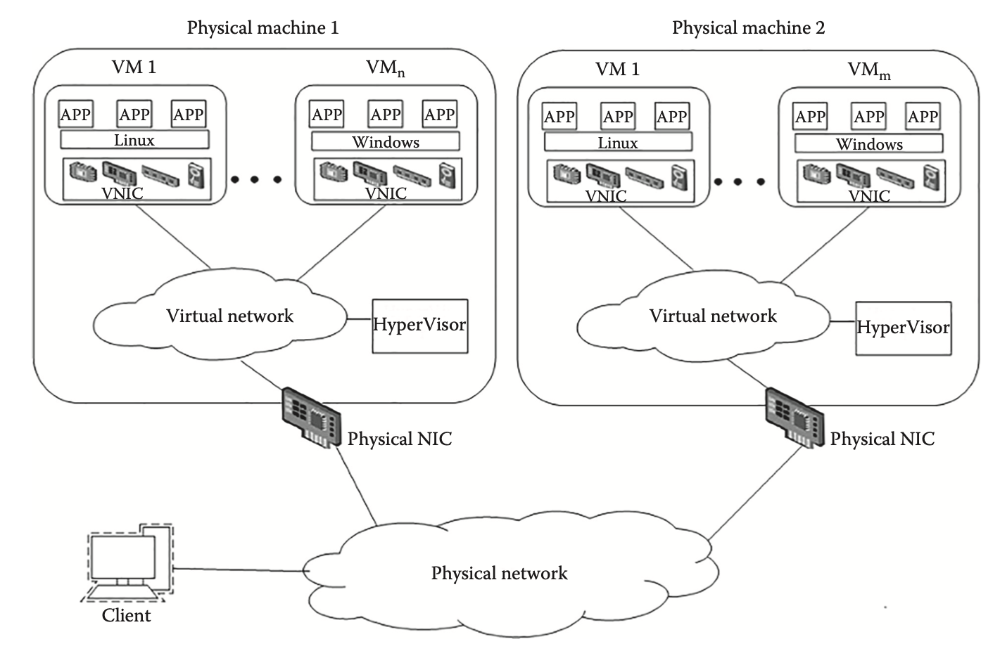
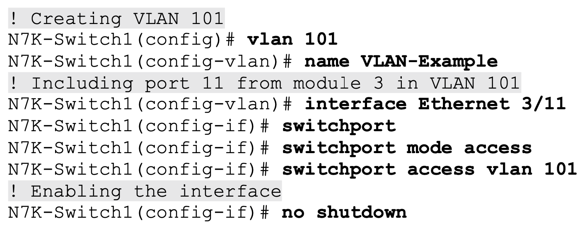
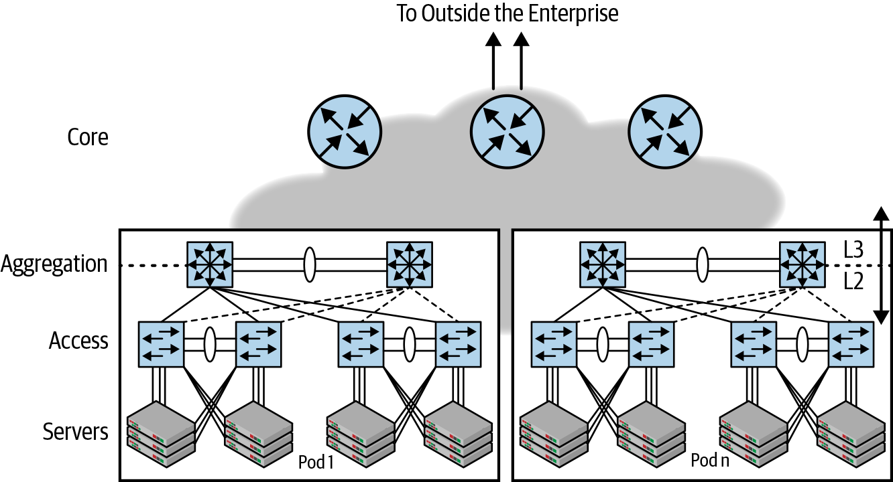
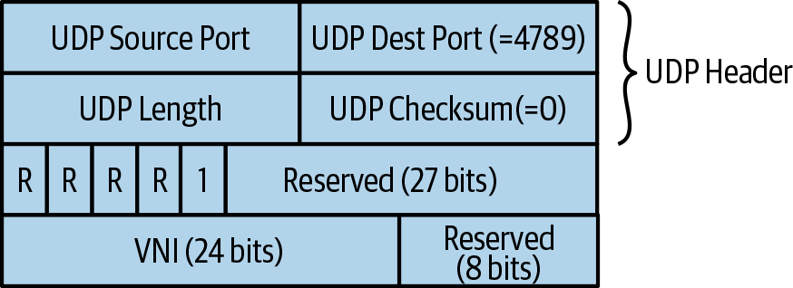
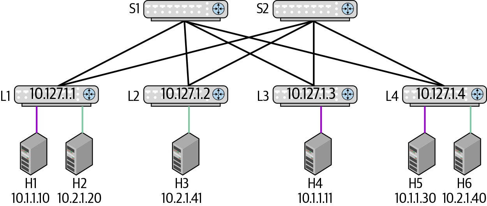
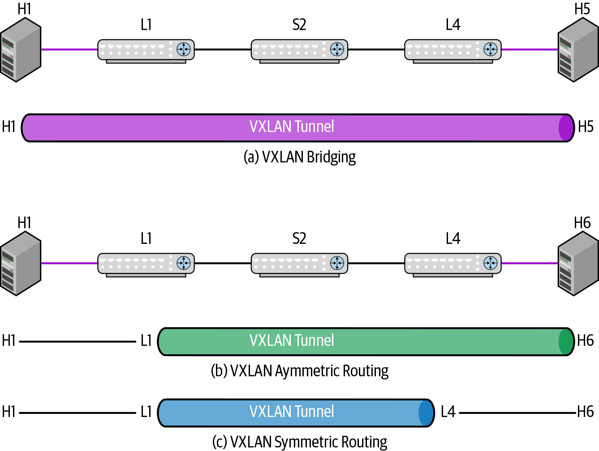
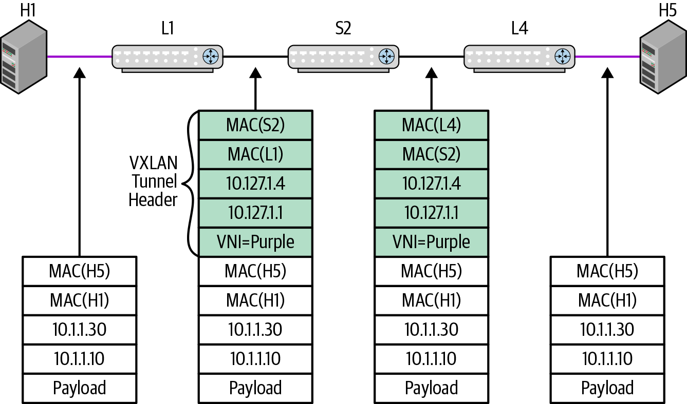
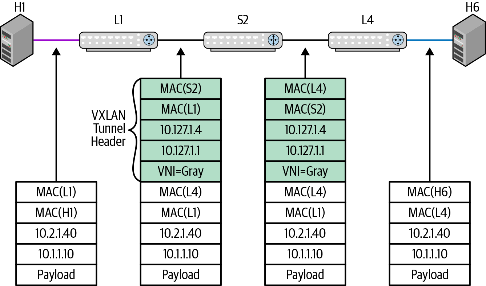

class: middle, center

# 大数据的信息基础设施

## 网络虚拟化

陈一帅

[yschen@bjtu.edu.cn](mailto:yschen@bjtu.edu.cn)

.footnote[网络智能实验室]

北京交通大学电子信息工程学院

---

# 内容

- .red[背景]
- 网络的分区扩展和虚拟化
- VLAN 技术
- VXLAN 技术

---

# 网络解聚合

- 硬件和软件（OS）分离，可分别买
- 硬件
  - Bare-metal 网络交换机（或白盒交换机）
  - 商用交换芯片（Broadcom Trident 芯片，Barefoot）
- 软件
  - 用自己的 NOS 和 App

???
Arista 就是这样的厂商

- Facebook OCP 包括这样的交换机

---

# OS 的网络栈

- OS 是资源和应用之间的 moderator
- 本地网络状态，路由表，ARP 表，VXLAN 隧道，ACL，Bridge 表，计数器，都在 NOS 的 Kernel 里
- 用“用户空间”的设备驱动，写进交换芯片中

???

- 程序可以起一个 Netlink socket，和 Kernel 通信
  Netlink
  Linux 内核里的一个 feature
  API，可以编程 kenel 里的网络结构，也是一个 Pub-Sub 总线
  一种 Socket

图 4-4，

---

# 内容

- 背景
- .red[网络的分区扩展和虚拟化]
- VLAN 技术
- VXLAN 技术

---

# 网络分区

- 分区，为了可扩展
- 一个设计概念，IT 架构师在遇到诸如
  - 主机组的流量隔离
  - 不同的安全区域
  - 具有重叠 IP 地址的不同设备组
  - 不同的路径行为
  - 共享故障域
- 最常见的
  - 交换式以太网使用 VLAN 来分区
- 网络虚拟化

???

Partition 为了 scaling

network partitioning
is a design concept that IT architects deploy whenever they face challenges such as

Traffic isolation for groups of hosts
Distinct security areas
Different device groups with overlapping IP addresses Different path behavior
Shared failure domains

switched Ethernet networks use VLANs 来 partition

---

# 以太网 VLAN 分区扩展

- 桥非常流行
  - 硬交换机、上层协议（IP、IPX）对桥是透明的
  - 0 配置，桥会自学习，上来就用

* 基于桥的虚拟网：VLAN
  - 限制 flooding 只对有自己虚拟网节点的端口
  - 一个桥或交换机，只支持一个广播域。
  - VLAN 提供多个广播域，提高网络利用率

???

A VLAN can be defined as a broadcast domain in a single Ethernet switch or shared among connected switches.

Whenever a switch interface that belongs to a VLAN receives a broadcast Ethernet frame (destination MAC address is ffff.ffff.ffff), the device must forward this frame to all other ports that are defined in the same VLAN.

---

class: middle, center

# 网络虚拟化

---

class: middle, center

# 虚拟化的定义

虚拟化意味着应用程序可以使用资源，而无需考虑资源的位置，技术接口，实现方式，使用的平台以及可用资源的数量。

???

里克·范德兰斯

《商业智能系统的数据虚拟化研究》

Virtualization

“Virtualization means that Applications can use a resource without any concern for where it resides, what the technical interface is, how it has been implemented, which platform it uses, and how much of it is available.”
-Rick F. Van der Lans
in Data Virtualization for Business Intelligence Systems

---

# 虚拟化的好处

- 共享：分解大量资源，大容量或高速的服务器
- 隔离：免受其他租户的保护，例如虚拟专用网
- 聚合：将许多资源合并到一个资源中，例如存储
- 动态：快速分配，更改/移动，负载平衡（例如虚拟机）
- 易于管理：⇒ 简单（分发，部署，测试）

???

5 Reasons to Virtualize

1. Sharing: Break up a large resource Large Capacity or high-speed E.g., Servers
2. Isolation: Protection from other tenants E.g., Virtual Private Network
3. Aggregating: Combine many resources into one, e.g., storage
4. Dynamics: Fast allocation, Change/Mobility, load balancing, e.g., virtual machines
5. Ease of Management ⇒ Easy
   distribution, deployment, testing

---

# 网络虚拟化

- 接口
- 链路
- 前向表
- 策略表（接入控制）
- NAT
- 缓存
- 队列
- 整个网络

---

# 网络虚拟化效果

- 允许租户在多租户网络中形成覆盖网络，租户自己可以控制
  - 连接层：租户网络可以是 L2，而提供者是 L3，反之亦然
  - 地址：MAC 地址和 IP 地址
  - 网络分区：VLAN 和子网
  - 节点位置：自由移动节点
- 使提供商可以为大量租户提供服务，无需担心
  - 客户网络中使用的内部地址
  - 客户节点数
  - 客户节点位置
  - 客户分区（VLAN 和子网）的数量和设置

???
Network virtualization allows tenants to form an overlay network in a multi-tenant network such that tenant can control:

1. Connectivity layer: Tenant network can be L2 while the provider is L3 and vice versa
2. Addresses: MAC addresses and IP addresses
3. Network Partitions: VLANs and Subnets
4. Node Location: Move nodes freely
5. Network virtualization allows providers to serve a large number of tenants without worrying about:
6. Internal addresses used in client networks
7. Number of client nodes
8. Location of individual client nodes
9. Number and values of client partitions (VLANs and Subnets)

---

# 基于虚拟网络的云计算平台

.center[.width-100[]]

???
Book Internet Infrastructure\_ Networking, Web Services, and Cloud Computing-CRC Press (2018)

---

# 虚拟网络类型

- 虚拟的网络
  - L2
  - L3
- 实现方式
  - Inline
  - Overlay

---

# 虚拟的 L2 网络

- VLAN
  - L2 using L2
  - STP（Spanning Tree）广播管理
  - 用得最广
  - 将相互直接通信的网络设备和主机组合在一起
- VXLAN
  - L2 using L3
  - 在 UDP 之上

---

# 虚拟的 L3 网络

- VRF
  - 虚拟路由和前向
  - 为虚拟专用网（VPN）提供路由和路径隔离
  - Router 实现
  - 每个虚拟网络都有一个分别的路由表
  - 路由表查找时有一个 VRFID
  - 物理网卡带一个虚拟网络标签，指示逻辑接口
- MPLS
  - L3 using L3

???

VLANs were created to group together network devices and hosts that communicate directly with each other. Nowadays, VLANs continue to perform the same role, but with several enhancements and variations.

VRFs were created as part of Multiprotocol Label Switching (MPLS) to provide routing and path isolation to Virtual Private Networks (VPN).

---

# 实现方式

- Inline
  - 每个路由器或交换机都设置
  - VLAN，VRF
  - VRF 的每个虚拟网络都有一个分别的路由表
- Overlay
  - 基于隧道
  - 只有边缘路由器才设置，里面的路由器不知道
  - MPLS，VXLAN，IP-based VPN

---

# 内容

- 背景
- 网络的分区扩展和虚拟化
- .red[VLAN 技术]
- VXLAN 技术

---

# VLAN 分配方法

- 可以基于下面的方法分配 VLAN 帧
  - 源接口
  - 源 MAC 地址
  - 源 IP 地址
  - 应用程序（由 TCP 或 UDP 目标端口定义）
- 最常见的 VLAN 分配方法是基于源接口

???

结果，可以将访问端口定义为发送和接收的帧属于单个 VLAN 的接口。

assign a frame to a VLAN:
Source interface
Source MAC address
Source IP address
Application (defined by TCP or UDP destination port)

By far, the most common VLAN assignment method is based on source interface. As a result, an access port can be defined as an interface whose transmitted and received frames belong to a single VLAN.

---

# 示例：VLAN 创建

- 在 Cisco NX-OS 网络操作系统中创建 VLAN 和配置访问端口
  - 创建名为“VLAN-Example”的 VLAN 101，
  - 将以太网接口（来自模块 3 的端口 11）配置为一个桥接接口，一个访问端口，将其加入 VLAN 101 中，并启用

.center[.width-100[]]

???

creation of a VLAN and the configuration of an access port in the NX-OS network operating system, which is available on the entire Cisco Data Center switching portfolio

VLAN 101 was created with a name “VLAN-Example.” Afterward, an Ethernet interface (port 11 from module 3) was configured as a Layer 2 (bridged) interface, an access port, included in VLAN 101, and finally enabled.

但不用端口来建立交换机连接

用 VLAN trunks

In a trunk, each frame has a tag that contains a VLAN identifier. Therefore, it is possible for the receiving switch to recognize the VLAN a frame belongs to.

注意
一个 VLAN 可以包括多个子网
图 3-8
两个 VLAN 可以共享一个子网

---

# VLAN 局限

- 在传统的 Access-Agg-Core 网络设计中，VLAN 在聚合交换机处终止
- 两个聚合交换机不能存在相同的 VLAN

.center[.width-90[]]

???

VLANs terminate at the aggregation switch, at the boundary of bridging and routing. It is not possible to have the same VLAN be present across two different pairs of aggregate switches. In other words, the access-agg-core design is not flexible enough to allow a network engineer to assign any available free port to a VLAN based on customer need. This means that network designers must carefully plan the growth of a virtual network in terms of the number of ports it needs.

---

# VLAN 局限

- VLAN ID 为 12 位长，导致网络中最多 4,096 个单独的 VLAN
  - 在多租户数据中心中，4096 个 VLAN 是不够的
- 租户需要控制其 MAC，VLAN 和 IP 地址分配
  - 重叠的 MAC，VLAN 和 IP 地址
- STP 生成树的交换机数量众多，效率低下
  - 禁用了太多链接
  - 通过 IP equal cost multipath（ECMP）能够获得更好的吞吐量

???
Problem:

VLAN limitations
Traditionally, a VLAN ID is 12 bits long, leading to a maximum of 4,096 separate VLANs in a network. At the scale of the cloud, 4,096 VLANs is paltry. Some operators tried adding 12 more bits to create a flat 24-bit VLAN space, but 24-bit VLAN IDs are a nightmare. Why? Remember that we had an instance of the STP running per VLAN? Running 16 million instances of STP was simply out of the question. And yes, Multi-Instance STP (MSTP[…]”

- 4096 VLANs are not sufficient in a multi-tenant data center
- Tenants need to control their MAC, VLAN, and IP address assignments ⇒ Overlapping MAC, VLAN, and IP addresses
- Spanning tree is inefficient with large number of switches ⇒ Too many links are disabled
- Better throughput with IP equal cost multipath (ECMP)

---

# 桥接网络的配置难题

- 桥接网络需要很多协议。包括 STP 及其变体，FHRP，链路故障检测以及特定于供应商的协议，例如 VLAN 中继协议（VTP）
- 所有这些协议都大大增加了桥接解决方案的复杂性。这意味着当网络出现故障时，必须检查多个不同的运动部件以识别故障原因

???

ISSU 解决了由接入 agg 核心网络设计引起的问题。但这会带来很多复杂性。尽管 ISSU 已经成熟并且某些实现做得很合理，但是由于复杂性的增加，它既减慢了错误修复速度，也减慢了新功能的开发速度。由于 ISSU，甚至软件测试也变得更加复杂。

“As shown in the study of the evolution of access-agg-core networks, bridged networks require a lot of protocols. These include STP and its variants, FHRP, link failure detection, and vendor-specific protocols such as the VLAN Trunking Protocol (VTP). All of these protocols significantly increase the complexity of the bridging solution. What this complexity means in practice is that when a network fails, multiple different moving parts must be examined to identify the cause of the failure.
VLANs require every node along the path to be VLAN aware. If a configuration failure leads a transit device to not recognize a VLAN, the network becomes partitioned which results in complex, difficult-to-pin down problems.
ISSU was a fix to a problem caused by the design of access-agg-core networks. But it drags in a lot of complexity. Although ISSU has matured and some implementations do a reasonable job, it nevertheless slows down both bug fixes and the development of new features due to the increased complexity. Even the software testing becomes more complex as a result of ISSU.

---

# VLAN 配置的难题

- 在云中，租户来来往往非常快。因此，快速配置虚拟网络至关重要。
  - VLAN 要求网络中的每个节点都配置有 VLAN 信息才能正常运行。但是添加 VLAN 也会增加控制平面上的负载。这是因为使用 PVST，要发送的 STP hello 数据包数等于端口数乘以 VLAN 数
- VLAN 要求路径中的每个节点都能够识别 VLAN。如果配置失败导致传输设备无法识别 VLAN，则网络将变得分区，从而导致复杂且难以固定的问题

---

# VLAN 配置的难题

- 单个不堪重负的控制平面可以轻松关闭整个网络。因此，添加和删除 VLAN 是一个手动，费力的过程，通常需要几天的时间。
- 添加新节点也需要仔细计划。添加新节点会导致该节点需要生成的 STP 数据包数量发生变化，从而有可能使其超出其扩展限制的边缘。
- 因此，即使设置一个新节点也可能是一个漫长的过程，涉及许多人退出，每个人都伸出手指并希望一切顺利

???

“Lack of Agility
In the cloud, tenants come and go at a very rapid pace. It is therefore crucially important to provision virtual networks quickly. As we’ve discussed, VLAN requires every node in the network to be configured with the VLAN information for proper functioning. But adding a VLAN also adds load on the control plane. This is because with PVST, the number of STP hello packets to be sent out is equal to the number of ports times the number of VLANs. As discussed earlier, a single overwhelmed control plane can easily take the entire network down. So adding and removing VLANs is a manual, laborious process that usually takes days.
Also as discussed earlier, adding a new node requires careful planning. Adding a new node causes a change to the number of STP packets the node needs to generate, potentially pushing it over the edge of its scaling limit. ”

“So even provisioning a new node can be a lengthy affair involving many people to sign off, each crossing their fingers and hoping all goes well.”

---

# VLAN 小结

- 虚拟的网络类型
  - L2
- Inline
  - 每个交换机都设置

---

class: middle, center

# 解决办法

基于路由的更简洁的方案

---

# 内容

- 背景
- 网络的分区扩展和虚拟化
- VLAN 技术
- .red[VXLAN 技术]

---

# VXLAN

- Overlay 方式
  - 基于隧道
  - vSwitch 用作 VTEP（VXLAN 隧道端点）
- Ethernet over UDP over IP
  - 将 L2 帧封装在基于 IP 的 UDP 中，然后发送到目标 VTEP。
  - L2 using L3

???

8-16 VXLAN
VMware
L3，隔离多个 tenant
（L2 solution is Q-in-Q and MAC-in-MAC)

Ref: M. Mahalingam, D. G. Dutt, et al. "VXLAN: A Framework for Overlaying Virtualized Layer 2 Networks over Layer 3 Networks," IETF RFC 7348, August 2014.

- 224 Virtual Network Instances (VNIs)
- Only VMs in the same VXLAN can communicate
- vSwitches serve as VTEP (VXLAN Tunnel End Point).
  ⇒ Encapsulate L2 frames in UDP over IP and send to the destination VTEP(s).
- Segments may have overlapping MAC addresses and VLANs but L2 traffic never crosses a VNI

---

# VXLAN

- 隔离多个 tenant
  - 仅同一 VXLAN 中的 VM 可以通信
  - 解决了云环境中多个租户的 MAC 地址，VLAN 和 IP 地址重叠的问题
- 无需更改 VM
  - Hypervisors 管理程序负责所有细节

???

- VXLAN solves the problem of multiple tenants with overlapping MAC addresses, VLANs, and IP addresses in a cloud environment.
- A server may have VMs belonging to different tenants
- No changes to VMs. Hypervisors responsible for all details.
- Uses UDP over IP encapsulation to isolate tenants

VXLAN uses Ethernet over UDP over IP

---

# 例：VXLAN

- 数据包头

.center[.width-100[]]

---

# 例：VXLAN

- 紫线、绿线，两个虚拟网络
- 讨论两个例子
  - 本网：H1 -> H5
  - 跨网：H1 -> H6

.center[.width-100[]]

---

# 例：VXLAN

.center[.width-100[]]

---

# 本网：VXLAN Bridge

.center[.width-100[]]

- H1 发出的包一点也没有改变

---

# 跨网：VXLAN routing

- 不对称
- L1 找到 H6 的 MAC，进入绿色的 VN

.center[.width-100[]]

---

# 跨网：VXLAN routing

- 对称
- L1 找到 L4 的 MAC，用一个新的 VN

.center[.width-100[]]

---

# 失败

- L2 基于 STP，特别容易失败，会导致 loop
- L3 可以应对，把节点移除
- 建议直接在 L3 上
- AWS 就拒绝 L2 和组播

???

EVPN

在 MPLS 网络上应用一段时间了，稳定。

在 L3 网络上，build 一个 L2 的虚拟网络
用 BGP 做控制协议
VXLAN 做包封装
提供网络虚拟化的控制平面

配置 EVPN 桥和路由，配置 eBGP，iBGP，OSPF，实现网络虚拟化

验证网络配置

系统验证
cabling 验证
接口配置验证
路由配置验证
网络虚拟化验证
应用的网络验证
数据平面验证

---

# 小结

- 背景
- 网络的分区扩展和虚拟化
- VLAN 技术
- VXLAN 技术

---

# 练习

- 调研云计算平台支持的虚拟网络技术
