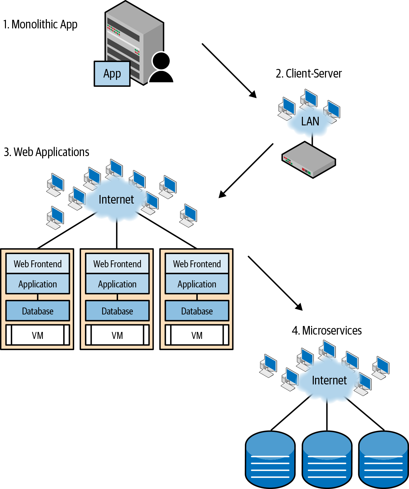
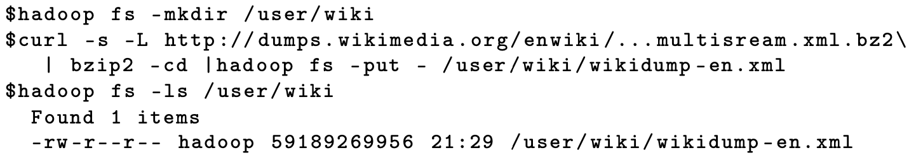
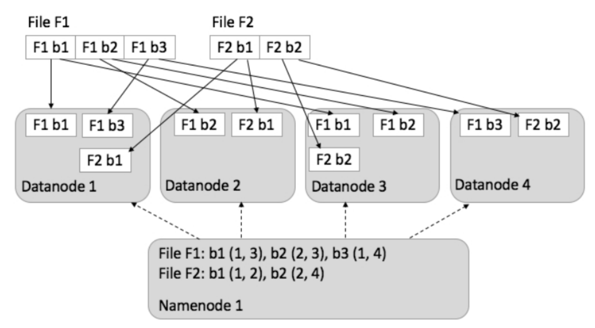
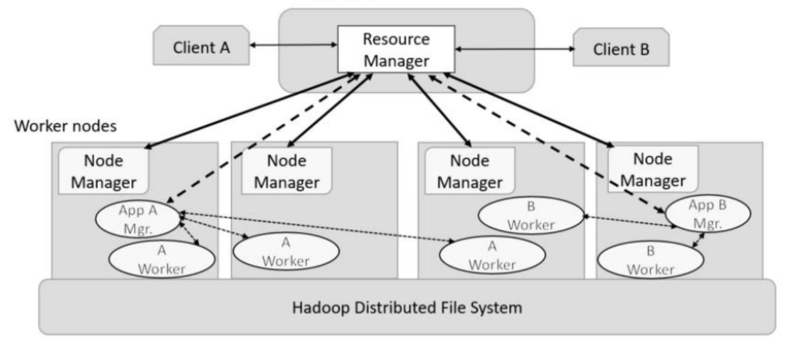

class: middle, center

# 大数据编程模型和使用技巧

## Hadoop/YARN

陈一帅

[yschen@bjtu.edu.cn](mailto:yschen@bjtu.edu.cn)

.footnote[网络智能实验室]

北京交通大学电子信息工程学院

---

# 内容

- Hadoop HDFS
- YARN

???

数据科学

- 数据科学
  - 通过发现、假设、分析，直接从数据中提取可操作的知识
- 数据科学家
  - 一种职业，他对业务需求，领域知识，分析技能和编程专业知识有足够的掌握，可以在大数据生命周期的每个阶段进行工作，完成这一端对端的科学过程

???

> Data Science is the extraction of actionable knowledge directly from data through a process of discovery, hypothesis, and analytical hypothesis analysis.

> A Data Scientist is a practitioner who has sufficient knowledge of the overlapping regimes of expertise in business needs, domain knowledge, analytical skills and programming expertise to manage the end-to-end scientific method process through each stage in the big data lifecycle.

Spark system [265], originally developed at University of California Berkeley, is more flexible than Hadoop and is a form of BSP computing that can be used interactively from Jupyter.

M. Zaharia, M. Chowdhury, M. J. Franklin, S. Shenker, and I. Stoica. Spark: Cluster computing with working sets. In 2nd USENIX Workshop on Hot Topics in Cloud Computing, 2010. https://www.usenix.org/legacy/event/hotcloud10/
tech/full_papers/Zaharia.pdf.

Google has released a service called Cloud Datalab, based on Jupyter, for interactive control of its data analytics cloud.

The Microsoft Cloud Business Intelligence (Cloud BI) tool supports interactive access to data queries and visualization.

???

大数据的起源

- 今天我们所知道的公有云最初是作为内部数据中心创建的
  - 支持电子商务，电子邮件和 Web 搜索服务
  - 涉及大数据集的获取
  - 为了优化这些服务，公司开始对这些数据进行大量分析
- 这些数据中心变成公共云之后，为这些分析任务开发的方法越来越多地作为服务和开源软件提供

???

What we know today as public clouds were originally created as internal data centers to support services such as e-commerce, e-mail, and web search, each of which involved the acquisition of large data collections. To optimize these services, companies started performing massive amounts of analysis on those data. After these data centers morphed into public clouds, the methods developed for these analysis tasks were increasingly made available as services and open source software.

???

大数据应用开发的演进

- 虚拟化
  - CPU 能力飙涨，服务器虚拟化，以利用 CPU
- 扁平化
  - MapReduce 计算模型，使网络中的通信流量，从 C-S 变成 S-S
- 微服务

???

大数据应用开发的环境

.center[.width-60[]]

???

- 开放给

???

微服务

- 每天 Billion 级请求，使系统可扩展性成为核心要求
- Unix 和 Linux 的设计哲学
  - 一个程序只作一个事情，做得很好
  - 和其它的程序合作
- 服务器集成式的软件应用被分解，变成微服务
  - 基于容器的微服务模型
  - 更好管理、迁移、扩展、资源调度
- 大数据是其中的核心模块

???
网络也进化了
云，容器，导致网络增长

10G 标配，100G 支持

“The evolution of application architecture”

数据科学

- 分析，编程，算法
- 数学，统计，模型
- 领域知识

???

Scale

- 最初可以部署在单个 VM 实例上
- 随着业务增长，它可能需要扩展以在高峰时间使用 100 甚至 10,000 台服务器
- 然后在业务缓慢时进行缩减

???

an online media streaming site may initially be deployed on a single VM instance. As its business grows, it may need to scale to use 100s or even 10,000s of servers at peak times, and then scale back when business is slow.

???

内容

- 大数据平台和应用开发的演进
- .red[MapReduce 计算模型的兴起]
- 本部分内容介绍
- Hadoop HDFS
- YARN

???

HPC

- 超级计算机体系结构的设计重点是处理器互连网络的性能
- 使用专门的硬件和通信协议来实现亚微秒范围内的消息延迟
- HPC 应用程序可以扩展到中等大小的群集。

???

HPC applications can scale to modest-sized clusters.

Supercomputer architectures are designed with a heavy emphasis on the performance of the processor interconnection network. They use specialized hardware features and communication protocols to achieve message latencies in the sub-microsecond range.

???

BSP

- bulk synchronous parallelism 批量同步并行
- 最初作为分析并行算法的模型而提出
- 基于反复执行独立计算，交换数据然后在障碍处进行同步的执行过程
  - 当某个进程在其程序中遇到障碍时，它将停止，直到同步组中的所有其他线程/进程到达同一点为止
- BSP 模型的现代示例：Google MapReduce
- 应用：Hadoop 和 Spark

???

bulk synchronous parallelism (BSP) [139]. Originally proposed as a model for analyzing parallel algorithms, BSP is based on processes or threads of execution that repeatedly perform independent computations, exchange data, and then synchronize at a barrier. (When a process reaches a barrier in its program, it stops and cannot proceed until all other threads/processes in the synchronization group reach the same point.) A contemporary example of the BSP model is the MapReduce style made famous by Google and now widely used in its Hadoop and Spark realizations.

A. V. Gerbessiotis and L. G. Valiant. Direct bulk-synchronous parallel algorithms. Journal of Parallel and Distributed Computing, 22(2):251–267, 1994.

???

MapReduce

- MapReduce 是 BSP 计算的特例
- 如：将 f map 到数据上，然后通过求和来 reduce
- 概念起源于 1960 年代的 Lisp 编程
- 2004 年 Google 工程师 Dean 和 Ghemawat 引入大数据分析
- Yahoo! 发布 Hadoop 开源实现

???

MapReduce is a special case of BSP computing.

We map f over the data and then reduce by performing the sum

concept dates from Lisp programming in the 1960s, it was popularized for big data analysis in a 2004 paper by Google engineers Dean and Ghemawat [108] and became ubiquitous when Yahoo! released an open source implementation of MapReduce known as Hadoop.

J. Dean and S. Ghemawat. MapReduce: Simplified data processing on large clusters. Communications of the ACM, 51(1):107–113, 2008.

???

内容

- 大数据平台和应用开发的演进
- MapReduce 计算模型的兴起
- .red[本部分内容介绍]
- Hadoop
- YARN

???

大数据技术基础原理

- Mapreduce
- SQL 类查询（SQL on hadoop，Hive）
- 流式计算
- 图计算
- Spark

目标

- 在上节介绍大数据的存储和计算资源调度的基础上，介绍大数据技术平台的编程模型和使用技巧
- 进行 Mapreduce、SQL 类查询、Spark 的编程实践
- 通过实践编程理解大数据计算模型和实际编程技术，为后面的分析打下基础

???

云中的数据分析

> “Science is what we understand well enough to explain to a computer. Art is everything else we do.”

> —Donald Knuth

内容

- 大数据平台和应用开发的演进
- MapReduce 计算模型的兴起
- 本部分内容介绍
- .red[Hadoop HDFS]
- YARN

---

# Hadoop

- 第一个主要的云数据分析工具
- 发展为了 Apache YARN

---

# 核心：HDFS

- Hadoop Distributed File System
  - Hadoop 的核心
  - 用 Java 编写，完全可移植并且基于标准的网络 TCP 套接字
- 不是 POSIX 文件系统
  - 一次写入，多次读取，仅保持”最终一致“

---

# 核心：HDFS

- 可以被直接 Mount 为用户空间文件系统（FUSE）
  - 从而可以用命令行，以类似于标准 Unix 文件系统的方式进行操作

.center[.width-100[]]

???
“HDFS is mounted directly with a Filesystem in Userspace (FUSE) virtual file system on Linux and some other Unix systems. ”

---

# HDFS
- NameNode，跟踪数据位置
  - 管理名称空间，确定块到 DataNode 的映射
- DataNode 集群，保存分布式数据
  - 单个文件分为 64 MB 的块
  - 这些块分布在各个 DataNode 上
  - 被复制到多个节点上，实现容错

---
# HDFS
- 1 个 NameNode 跟踪块和副本
- 4 个 DataNodes，2 个文件，文件块分布式存储

.center[.width-100[]]

???

HDFS

- HDFS 受 Google GFS 的启发，是一种分布式文件系统，用于组织文件并将其数据存储在分布式计算系统上
- HDFS 具有主/从体系结构，其中包含一个 NameNode 作为主节点，以及多个 DataNode 作为工作者（从属）
- 为了以这种架构存储文件，HDFS 将文件拆分为固定大小的块（例如 64MB），并将其存储在工作线程（DataNodes）上。

???

“manages the file system’s metadata and namespace (Figure 8.9).

Figure 8.9

HDFS and MapReduce engine installed with, multiple nodes of a Hadoop server cluster.

HDFS Name Node

- 管理名称空间，确定块到 DataNode 的映射
  - 名称空间是维护元数据的区域
  - 元数据是指文件系统存储的信息，这些信息是文件的整体管理所必需的
  - 例如，DataNode 中输入拆分/块的位置的所有信息

???

In such systems, namespace is the area maintaining the metadata, and metadata refers to all of the information stored by a file system that is needed for the overall management of all files. For example, NameNode in the metadata stores all information regarding the location of input splits/blocks in all DataNodes.

Each DataNode, usually one per node in a cluster, manages the storage attached to the node. Each DataNode is responsible for the storing and retrieving of its file blocks.

A Hadoop cluster has nominally a single NameNode plus a cluster of DataNodes, although redundancy options are available for the NameNode due to its criticality. Each DataNode serves up blocks of data over the network using a block protocol specific to HDFS. The file system uses TCP/I = sockets for communication.

Clients use remote procedure call (RPC) to communicate between each other.

---

# 辅助 NameNode

- HDFS 文件系统包括一个所谓的辅助 NameNode
- 该名称具有误导性，可能会被认为是在主 NameNode 脱机时备用的 NameNode
- 实际上，辅助 NameNode 的作用是定期与主 NameNode 连接，为主 NameNode 的目录信息构建快照，将其保存到本地或远程目录中
- 这些快照可用于主 NameNode 失败时的重新启动，不必通过重现文件系统操作的整个日志来重建目录

???

The HDFS file system includes a so-called secondary NameNode, a misleading name that some might incorrectly interpret as a backup NameNode for when the primary NameNode goes offline. In fact, the secondary NameNode regularly connects with the primary NameNode and builds snapshots of the primary NameNode’s directory information, which the system then saves to local or remote directories. These checkpointed images can be used to restart a failed primary NameNode without having to replay the entire journal of file system actions and then edit the log to create an up-to-date directory

---

# HDFS 文件复制

- HDFS 在多台计算机上存储 GB 或 TB 的大文件
- 它通过在多个主机之间复制数据来实现可靠性，因此理论上讲不需要主机上的独立磁盘冗余阵列（RAID）存储（但是要提高 I /O 性能，某些 RAID 配置仍然有用）
- 例如，复制值为 3，则数据存储在三个节点上：两个存储在同一机架上，一个存储在不同机架上
- 数据节点可以相互通信以重新平衡数据，四处移动副本，保持数据复制

???

HDFS stores large files in GB or TB across multiple machines. It achieves reliability by replicating the data across multiple hosts, and hence theoretically does not require redundant array of independent disks (RAID) storage on hosts (but to increase I/O performance some RAID configurations are still useful). For example, with a replication value, 3, data is stored on three nodes: two on the same rack, and one on a different rack. Data nodes can talk to each other to rebalance data, move copies around, and keep the replication of data high.

---

# HDFS 文件读取流程

- 用户向 NameNode 发送“打开”请求，获取文件块的位置
- 对于每个文件块，NameNode 返回一组数据节点的地址，该数据节点包含所请求文件的副本信息，数量取决于块副本的数量
- 收到此类信息后，用户调用“读取”以连接到包含文件第一个块的最近的 DataNode
- 在将第一个块从相应的 DataNode 流传输到用户之后，终止已建立的连接
- 对请求的文件的所有块重复相同的过程，直到将整个文件传输到用户

???

“Reading a file: To read a file in HDFS, a user sends an “open” request to the NameNode to get the location of file blocks. For each file block, the NameNode returns the address of a set of DataNodes containing replica information of the requested file. The number of addresses depends on the number of block replicas. Upon receiving such information, the user calls “read” to connect to the closest DataNode containing the first block of the file. After the first block is streamed from the respective DataNode to the user, the established connection is terminated and the same process is repeated for all blocks of the requested file until the whole file is streamed to the user.

HDFS 文件写流程

- 用户将“创建”请求发送到 NameNode 以在文件系统名称空间中创建新文件如果文件不存在，则 NameNode 通知用户，并允许他/她通过调用“写入”功能开始将数据写入文件。文件的第一个块被写入称为“数据队列”的内部队列，而数据流媒体监视其写入 DataNode […]”

Writing to a file: To write a file in HDFS, a user sends a “create” request to the NameNode to create a new file in the file system namespace. If the file does not exist, the NameNode notifies the user and allows him/her to start writing data to the file by calling the “write” function. The first block of the file is written to an internal queue termed “data queue” while a data streamer monitors its writing into a DataNode[…]”

“high in comparison with that of different nodes located in the same rack. Therefore, sometimes HDFS compromises its reliability to achieve lower communication costs. For example, for the default replication factor of three, HDFS stores: (1) one replica in the same node the original data is stored; (2) one replica on a different node but in the same rack; and (3) one replica on a different node in a different rack to provide three copies of the data.

---

# HDFS 周期消息

- 心跳和 Blockreport 消息
- 每个 DataNode 周期性地发送到 NameNode 的消息
- 接收到心跳信号表示 DataNode 正常运行
- 每个 Blockreport 都包含 DataNode 上所有块的列表
- NameNode 基于该消息，调度系统中所有副本

???

Heartbeat and Blockreport message: Heartbeats and Blockreports are periodic messages sent to the NameNode by each DataNode in a cluster. Receipt of a Heartbeat implies that the DataNode is functioning properly, while each Blockreport contains a list of all blocks on a DataNode. NameNode receives such messages because it is the sole decision maker of all replicas in the system.”

---

# 内容

- Hadoop HDFS
- .red[YARN]

---

# YARN 分布式资源管理器

- Yet Another Resource Negotiator
- 由 Hadoop 演进而来的完整分布式作业管理系统
- 体系结构

.center[.width-100[]]

---

# YARN 分布式资源管理器

- 应用程序连接资源管理器
  - 资源管理器启动该程序的程序管理器
  - 允许多个应用程序同时在系统上运行
- 资源管理器负责调度
  - 可与每个工作节点中的节点管理器进行通信
  - 程序管理器与资源管理器交互，获取其工作节点“容器”

.center[.width-80[]]

---

# YARN vs. Mesos

- YARN 在许多方面与 Mesos 系统相似
- 主要区别
  - YARN 旨在安排 MapReduce 样式的作业
  - Mesos 旨在支持更通用的计算类别，包括容器和微服务
- 两种系统都被广泛使用。

???

YARN is similar in many respects to the Mesos system

The primary difference is that YARN is designed to schedule MapReduce-style jobs, whereas Mesos is designed to support a more general class of computations, including containers and microservices.

Both systems are widely used.

---

# YARN 资源管理

- YARN 是一种资源调度程序，它允许使用简单的编程模型跨计算机集群对大型数据集进行分布式处理
- 它旨在从单个服务器扩展到数千个服务器，每个服务器都提供本地计算和存储
- 它通过在应用层进行智能故障检测和管理来支持高可用性
- 支持 MPI，Hadoop 和 Spark 等多种应用程序

???

YARN is a resource scheduler that allows for distributed processing of large data sets across clusters of computers using simple programming models. It is designed to scale up from single servers to thousands of servers, each offering local computation and storage. The module supports high availability through smart failure detection and management at the application layer.”

---

# YARN 三级资源管理

- 节点管理器（NM）
  - 管理 VM 和容器
- 应用程序管理器（AM）
  - 将应用程序容器的集合作为业务流程组进行处理
- 资源管理器（RM）
  - 监督 NM 和 AM，监视最高级别的全局资源

???

图 8.11
用于 Hadoop 资源管理的 YARN 体系结构，使用三个级别的管理器来分层管理资源，应用程序和节点。

“shows three levels of managers built in the YARN. The resource manager (RM) looks over the global resources at the highest level by supervising the node managers (NM) and application manager (AM) at the lower levels. NMs manage VMs and containers. The AM handles a collection of application containers as an orchestration group. YARN was designed to work with Message-Passing Interface (MPI), Hadoop, and Spark libraries.

Figure 8.11
The YARN architecture for Hadoop resource management using three levels of managers to manage resources, applications, and nodes hierarchically.

---

# YARN 调度机制

- 默认：先进先出（FIFO）调度
- Fair Scheduler
  - Facebook 开发
  - 将作业分组到池中
  - 为每个池分配保证的最低份额
  - 过剩能力在工作之间分配
  - 未分类的作业进入默认池
  - 池必须指定 Map Slot，Reduce Slot 的最小数量，和正在运行的作业数量限制

???

By default, Hadoop uses first-in-first-out (FIFO) scheduling, and optionally five priority heuristics to schedule jobs from a work queue. The job scheduler was refactored out of the JobTracker, while adding the ability to use an ”

“alternate scheduler. Two scheduling policies offer the alternative following choices:

Fair Scheduler was developed by Facebook. The goal of the Fair Scheduler is to provide fast response times for small jobs and quality of service (QoS) for production jobs. The Fair Scheduler has three basic concepts: (1) jobs are grouped into pools; (2) each pool is assigned a guaranteed minimum share; and (3) excess capacity is split between jobs. By default, jobs that are uncategorized go into a default pool. Pools have to specify the minimum number of map slots, reduce slots, and a limit on the number of running jobs.

---

# Capacity Scheduler

- Yahoo!开发
- 与 Fair Scheduler 相似
- 队列
  - 队列被分配了总资源容量的一小部分
  - 空闲资源分配给容量被超出了的队列
  - 在队列中，具有高优先级的作业可以优先访问队列资源
- 一旦作业在 Hadoop 中运行，就不会被 preemption（先发制人）

???

Capacity Scheduler was developed by Yahoo! The Capacity Scheduler supports several features that are similar to the Fair Scheduler. Queues are allocated a fraction of the total resource capacity. Free resources are allocated to queues beyond their total capacity. Within a queue a job with a high level of priority has access to the queue’s resources. There is no preemption once a job is running with Hadoop.”

---

# 商业系统中的 YARN

- AWS，Azure 都集成了 YARN
  - Amazon 版的 YARN，就是 E-MR
  - Azure 版的 YARN，就是 HDInsight

---

# 练习

- 调研Haddop、YARN在你们组选定的云平台的应用情况
