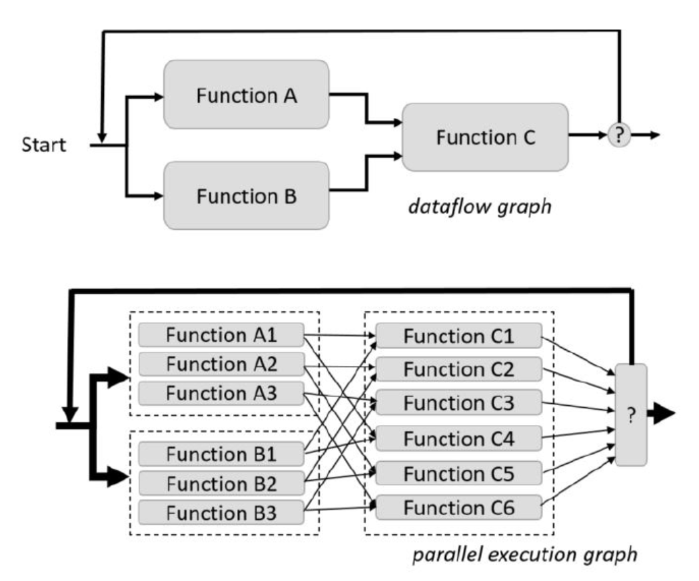
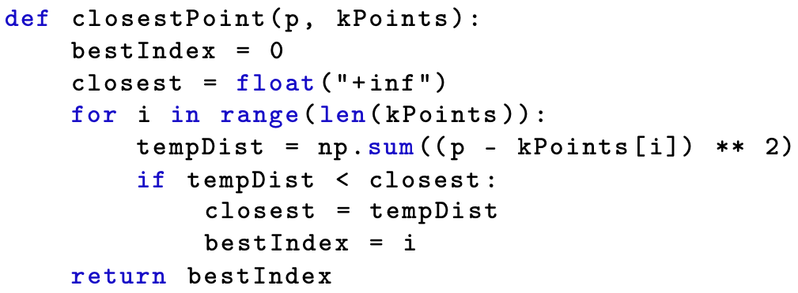
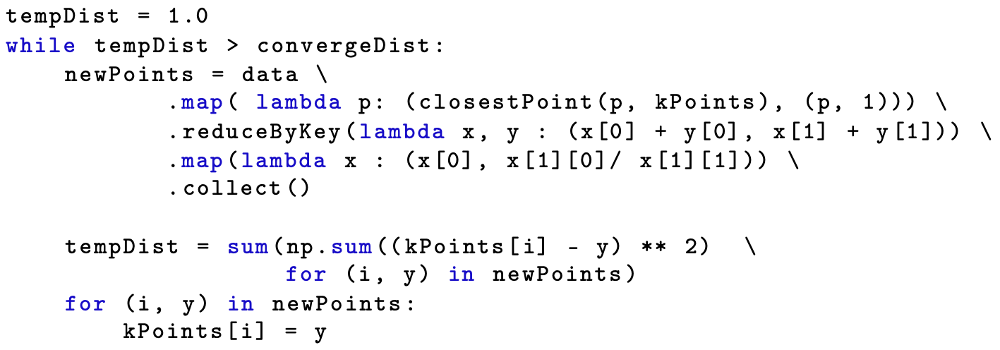
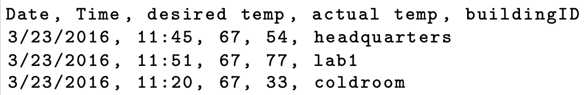
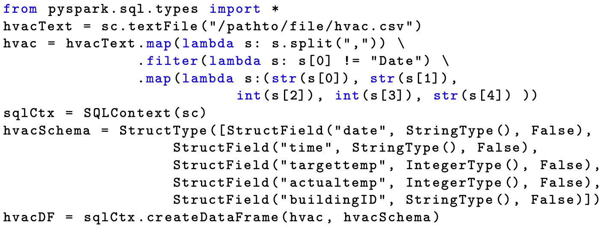
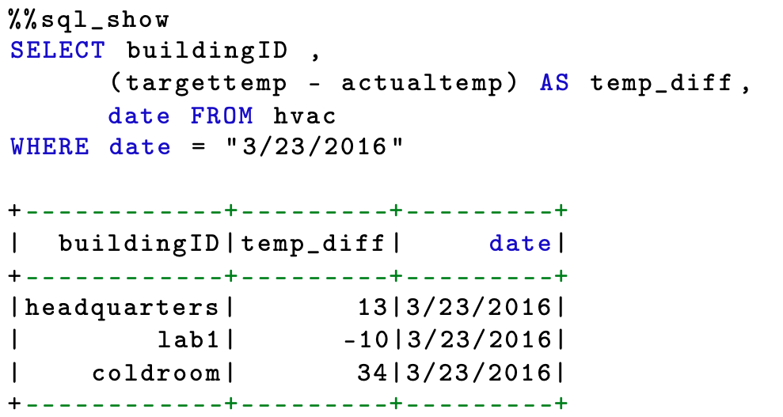
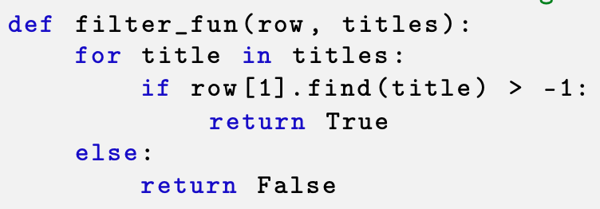
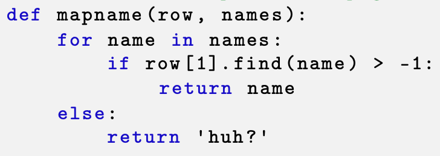

class: middle, center

# 大数据编程模型和使用技巧

## SPARK

陈一帅

[yschen@bjtu.edu.cn](mailto:yschen@bjtu.edu.cn)

.footnote[网络智能实验室]

北京交通大学电子信息工程学院

---

# 内容

- .red[图计算模型]
- Spark 简介
- 算法实例
- Spark SQL 和 DataFrame
- 编程实例

---

# 图执行模型

- 计算由有向图（通常为非循环图）的任务图表示
- 执行从图的源开始
- 当节点的所有父节点都已完成时，就安排该节点执行
- 图节点执行涉及一个或多个分布式节点的并行操作

---

# 图执行模型

- 可以手动构造图形，也可以由编译器从程序中隐式或显式地构造图形
- 大数据工具
  - Spark，Apache Flink，Storm，Google Dataflow
- 机器学习工具
  - Google TensorFlow，Microsoft Cognitive Toolkit

???

computation is represented by a directed, usually acyclic, graph of tasks. Execution begins at a source of the graph. Each node is scheduled for execution when all incoming edges to that node come from task nodes that have completed. Graphs can be constructed by hand or alternatively generated by a compiler from a more traditional-looking program that describes the graph either implicitly or explicitly. We describe graph execution systems in chapters 8 and 9, including the data analytics tool Spark and the Spark Streaming, Apache Flink, Storm, and Google Dataflow systems. The graph execution model is also used in machine learning tools, such as the Google TensorFlow and Microsoft Cognitive Toolkit systems that we discuss in chapter 10. In many of these cases, the execution of a graph node involves a parallel operation on one or more distributed data structures.

---

# 图 Dataflow 执行

- 数据流图，编译为并行执行图

.center[.width-80[]]

???

- 直到一个 barrier 点

Dataflow graph as defined by the program (above) and after the parallelism is unrolled during execution (below).

---

# 内容

- 图计算模型
- .red[Spark 简介]
- 算法实例
- Spark SQL 和 DataFrame
- 编程实例

---

# Hadoop 的局限

- 线性数据流结构
- 基于磁盘
  - 程序从磁盘读取输入数据
  - 对输入数据进行映射（Map）功能
  - 简化（Reduce）映射结果
  - 将结果存储在磁盘上
- 速度慢

---

# Spark

- 机器学习训练中需要大量迭代
- Hadoop
  - 在两个 MapReduce 作业之间重用数据，需要写入外部磁盘
  - 导致大量开销
- Spark
  - 在本地工作进程中的动态随机存取存储器（DRAM）上进行缓存，大大减少开销

???

“traditional Hadoop using distributed local disks.

Iterative data mining demands a user to run multiple ad hoc queries on the same subset of the data. Traditionally, the only way to reuse data between two MapReduce jobs is to write it to an external stable disk storage via a distributed file system. This incurs substantial overhead due to data replication, disk I/O, and serialization. In Spark, this overhead is significantly reduced by caching on the dynamic random access memory (DRAM) in local workers.

---

# Spark

- 基于内存
  - 比基于磁盘的 Hadoop 快得多
- 图执行模型
  - 允许 MapReduce 迭代以及更有效的数据重用
- 交互式操作界面
  - 类似 Matlab
- 可以在 YARN 和 Mesos 上运行，也可以在笔记本电脑和 Docker 容器中运行

???

Limitations in the original Hadoop MapReduce computing paradigm.

In Hadoop’s linear dataflow structure, programs read input data from disk, map a function across the data, reduce the results of the map, and store reduction results on disk.

Spark supports a more general graph execution model that allows for iterative MapReduce as well as more efficient data reuse.

Spark is also interactive and much faster than pure Hadoop.

It runs on both YARN and Mesos, as well as on a laptop and in a Docker container.

Spark

- 开放源代码群集计算框架
  - 最初在加利福尼亚大学伯克利分校的 AMPLab 开发
  - 与 Hadoop 一样，从批处理扩展而来
  - 提供内存计算范式
- 将线性的 MapReduce 计算范式扩展到 DAG 描述的任务的流水线处理
  - 将 Hadoop 扩展到流、迭代 MapReduce 和图形分析操作
  - 支持通用并行计算
  - Microsoft HDInsight，Amazon Elastic MapReduce 都支持 Spark

???

“Apache Spark is an open-source cluster computing framework. The package was originally developed at the AMPLab at the University of California, Berkeley. Spark extends from batch processing as is the case in Hadoop applications. It extends from a bipartite MapReduce paradigm to pipelined processing of tasks described by DAG. Spark provides an in-memory paradigm to extend Hadoop to streaming, iterative MapReduce, and graph analysis operations. In other word, Spark supports general-purpose parallel computations.

The package is maintained in a fault-tolerant way.

By removing the limitations imposed in the traditional MapReduce computing paradigm, Spark forces an extended dataflow DAG structure on distributed programs.

A typical Spark application consists of a driver program that runs the user’s tasks for parallel executions on a cluster of servers.

Spark is also part of Microsoft’s HDInsight toolkit and is supported on Amazon Elastic MapReduce.

---

# 伪分布式本地模式

- 在一台机器上运行
  - 每个 CPU 内核一个执行程序
- 不需要分布式存储，可使用本地文件系统
- 方便开发、测试

???

Spark also supports a pseudo-distributed local mode, usually used only for development or testing purposes. The distributed storage is not required and the local file system can be used instead. In other words, Spark can run on a single machine with one executor per CPU core.

---

# Spark Core

- 提供分布式任务调度、基本 I/O 功能
- 集群管理
  - 自己的独立调度程序，Hadoop YARN 或 Apache Mesos
- 存储接口
  - 支持 HDFS，MapR 文件系统（MapR-FS），Cassandra，OpenStack Swift，Amazon S3 等接口

---

# Spark 模块

- Spark SQL 处理结构化数据
- Spark Streaming 处理实时数据流
- MLlib 包含常见的机器学习功能
- GraphX 用于处理网络图

???

In summary, Spark SQL deals with structured data. Spark Streaming handles live streams of data, MLlib contains common machine learning functionality. GraphX is used for manipulating social network graphs.

---
# 分布式执行模型

- 开发人员编写驱动程序
  - 定义一个或多个 RDD，及其操作
  - 连接到一组 Worker
- Worker
  - 运行在集群服务器上
  - 可将 RDD 分区 存储在 RAM 中

???

Scala 闭包实现

用户通过传递闭包（函数文字）为 RDD 操作（如 map）提供参数。

Scala represents each closure as a Java object, and these objects can be serialized and loaded on another node to pass the closure across the network. Scala also saves any variables bound in the closure as fields in the Java object. The model reads data blocks from a distributed file system on disks and caches them as persisted RDDs on local RAMs. It is the effective use of the RAMs to hold intermediate computation results that contributes the most to the major speed gain in Spark programming over the ”

该系统提供了一种分区方法来避免改组开销。缓存的 RDD 通常存储为 Java 对象。 Spark 支持对 JVM 的最快访问，但可能超出理想范围。它也可以序列化格式存储。该计划受 Hadoop YARN，Google Meso 和 Spark 应用程序的独立计划支持。■”
“The Spark Core

As illustrated in Figure 8.12,

Spark core provides distributed task dispatching, scheduling, and basic I/O functionalities.

These are centered around the RDDs and exposed through APIs for Java, Python, Scala, and R.

Spark requires a cluster manager and a distributed storage system.

For cluster management, Spark supports its own standalone scheduler, Hadoop YARN, or Apache Mesos.
For distributed storage, Spark can interface with HDFS, MapR File System (MapR-FS), Cassandra, OpenStack Swift, Amazon S3, etc.

Figure 8.12
The core architecture of the Apache Spark software system.

We will study these features in subsequent subsections.”

“Spark Distributed Execution Model

To use Spark, developers write a driver program that connects to a cluster of workers, as shown in Figure 8.12. The driver defines one or more RDDs and invokes actions on them. Spark code on the driver also tracks the RDDs’ lineage. The workers are cluster servers that can store RDD partitions in RAM across operations. Users provide arguments to RDD operations like map by passing closures (function literals).


# 迭代图计算

- 在使用 Pregel 进行迭代图计算的情况下，必须将中间数据保留在内存中
- 但这些框架仅支持特定的计算模式，例如循环执行一系列 MapReduce 步骤
- 对于这些模式，数据共享是隐式完成的。它们不允许用户将多个数据集加载到内存中并在它们之间运行查询，因此无法为更广泛的重用提供抽象
- Spark 执行环境能够克服这些困难
- Spark 运行通用任务图，例如以 DAG 为特征的图，提供具有缓存感知的数据重用和本地性

???

In the case of using Pregel for iterative graph computations, one must keep intermediate data in memory, while Hadoop offers an iterative MapReduce interface. However, these frameworks only support specific computation patterns like looping a series of MapReduce steps. Data sharing is done implicitly for these patterns. They do not provide abstractions for more general reuse by letting users load several data sets into the memory and run ad hoc queries across them. The Spark execution environment is designed to overcome these difficulties.”

“Spark runs general-purpose task graphs such as those characterized by a DAG. Spark operates with cache-aware data reuse and locality. The system offers a partitioning approach to avoid shuffling overheads. Cached RDDs are normally stored as Java objects. Spark supports the fastest access on JVM, but can be larger than ideal. It can also store in serialized format. The scheduling is supported by Hadoop YARN, Google Meso, and the Standalone schedule for Spark applications.■”

---

# Spark RDD

- Resilient Distributed Dataset
  - 弹性分布式数据集（RDD）
  - Spark 的核心数据结构
- 分布在计算机集群上的一个只读的数据集
  - 利用集群中的持久性数据块得以缓存、复制和分发
  - 可以使用 join 和各种 Map and Reduce 转换操作来创建新的 RDD

---
# RDD 容错

- 一个RDD的lineage记录了它如何从其他稳定存储的数据集派生计算过来的
- 在某些数据丢失情况下，通过lineage可重建 RDD
- 但需要重新计算，因此耗费 CPU

???

“如前所述，Spark 提供了两种受限形式的共享变量：广播变量引用需要在所有节点上都可用的只读数据，而累加器则用于以命令式编程归约。 ”

Spark provides an interface for programming the entire clusters with implicit data parallelism and fault tolerance. The idea is centered around a new data structure, called the resilient distributed dataset (RDD).

This is a read-only multiset of data items distributed over a cluster of machines.

The RDDs provide a main abstraction of the Spark execution environment. The RDD offers a collection of data elements partitioned across the nodes of the[…]”

“Spark was developed to appeal to iterative algorithms often used in training processes in ML applications. ”

“The RDDs are immutable and their operations are lazy. In fact, RDDs offer a dynamic data structure for Spark. They enable the cache and distribution of persistent blocks of data around the cluster. New data blocks can be created with join and various Map and Reduce transformation operations. Without RDDs, it is difficult to implement the in-memory MapReduce operation in Spark.
Fault tolerance is achieved by tracking the lineage of each RDD or reconstructing the RDDs, in case of some data loss.”

“As noted earlier, Spark provides two restricted forms of shared variables: broadcast variables reference read-only data that needs to be available on all nodes, while accumulators are used to program reductions in an imperative style. ”

RDD fault tolerance

- 为了达到容错能力，RDD 提供了一种受限形式的共享内存，它基于粗粒度的转换而不是对共享状态的细粒度的更新。实际上，RDD 具有足够的表现力，可以捕获各种各样的计算，包括用于迭代作业的最新专业编程模型，例如 Pregel。数据重用在许多迭代 ML 和图形算法中很常见，包括 PageRank，k-means 聚类和逻辑回归。

集群中内存中存储的现有抽象（例如分布式共享内存，键值存储，数据库和 Piccolo）提供了基于对可变状态的细粒度更新的接口。使用此接口，提供容错能力的唯一方法是在计算机之间复制数据或在计算机之间记录更新。对于数据密集型工作负载，这两种方法都很昂贵，因为这两种方法都需要在群集网络上复制大量数据，而该群集网络的带宽远低于随机访问内存（RAM）的带宽，并且它们会招致巨大的存储开销。

“To achieve fault tolerance, RDDs provide a restricted form of shared memory, based on coarse-grained transformations rather than fine-grained updates to a shared state. In fact, RDDs are expressive enough to capture a wide class of computations, including recent specialized programming models for iterative jobs, such as Pregel. Data reuse is common in many iterative ML and graph algorithms, including PageRank, k-means clustering, and logistic regression.
Existing abstractions for in-memory storage on clusters, such as distributed shared memory, key-value stores, databases, and Piccolo, offer an interface based on fine-grained updates to a mutable state. With this interface, the only ways to provide fault tolerance are to replicate the data across machines or to log updates across machines. Both approaches are expensive for data-intensive workloads, as they require copying large amounts of data over the cluster network, whose bandwidth is far lower than that of random access memory (RAM), and they incur substantial storage overhead.
To understand the benefits of RDDs as a distributed memory abstraction, we compare them against distributed shared memory (DSM). In DSM systems, applications read and write to arbitrary locations in a global address space. DSM is a very[…]”

Spark 存储级别

- 根据应用特点选择不同的存储方式
- 重新计算分区可能与从磁盘读取分区一样快

- 在内存使用量和 CPU 之间提供不同的权衡。 Spark 开发人员推荐了以下选项供您选择：
  默认存储级别（MEMORY_ONLY）是 CPU 使用效率最高的选项，它允许对 RDD 的操作尽可能快地运行。

如果不是，请尝试使用 MEMORY_ONLY_SER 并选择一个快速的序列化库，以使对象的空间效率更高，但仍可以通过 Java 和 Scala 快速访问。
除非计算数据集的功能很昂贵，否则它们会过滤到磁盘上，否则它们会过滤大量数据。否则，重新计算分区可能与从磁盘读取分区一样快。
如果您想要快速的故障恢复（例如，如果使用 Spark 来处理来自 Web 应用程序的请求），请使用复制的存储级别。所有存储级别都通过重新计算丢失的数据来提供完全的容错能力，但是复制的存储级别使您可以继续在 RDD 上运行任务，而不必等待重新计算丢失的分区。

“Spark’s storage levels are meant to provide different trade-offs between memory usage and CPU efficiency. Spark developers have recommended the following options from which to select:
The default storage level (MEMORY_ONLY) is the most CPU-efficient option, allowing operations on the RDDs to run as fast as possible.
If not, try using MEMORY_ONLY_SER and selecting a fast serialization library to make the objects much more space-efficient, but still reasonably fast to access with Java and Scala.
Do not spill to disk unless the functions that computed your data sets are expensive, or they filter a large amount of the data. Otherwise, recomputing a partition may be as fast as reading it from disk.
Use the replicated storage levels if you want fast fault recovery (e.g., if using Spark to serve requests from a web application). All the storage levels provide full fault tolerance by recomputing lost data, but the replicated ones let you continue running tasks on the RDD without waiting to recompute a lost partition.”

“Formally, an RDD is a read-only partitioned collection of data records. RDDs can only be created through deterministic operations on either data in stable storage or from other RDDs. These operations are known as transformations. Examples include map, filter, and join.

RDDs do not need to be materialized at all times. Instead, an RDD has its lineage about how it was derived from other data sets to compute its partitions from data in stable storage. This is a powerful property, because a program cannot reference an RDD that it cannot reconstruct after a failure.

# Spark 并行运算

- Spark 用 Scala 实现
  - Scala 是一种解释性的，静态类型的对象功能语言
- Scala 并行运算符库，类似于 Hadoop 中使用的 Map 和 Reduce 操作
  - 在 RDD 上执行转换
  - 该库有不错的 Python 绑定，可以用 Python 编程

???

A central Spark construct is the Resilient Distributed Dataset (RDD), a data collection that is distributed across servers and mapped to disk or memory, providing a restricted form of distributed shared memory.

Spark is implemented in Scala, an interpreted, statically typed object-functional language. Spark has a library of Scala parallel operators, similar to the Map and Reduce operations used in Hadoop, that perform transformations on RDDs. (The library also has a nice Python binding.)

Scala represents each closure as a Java object, and these objects can be serialized and loaded on another node to pass the closure across the network. Scala also saves any variables bound in the closure as fields in the Java object. The model reads data blocks from a distributed file system on disks and caches them as persisted RDDs on local RAMs. It is the effective use of the RAMs to hold intermediate computation results that contributes the most to the major speed gain in Spark programming over the ”

---

# 性能 （2014 年）

- 对 100 TB 数据（1 万亿条记录）进行分类
- 前世界纪录
  - Yahoo!使用 2100 个节点的 Hadoop MapReduce 集群创造的 72 分钟
- Spark
  - 206 个 EC2 节点，23 分钟
  - 所有排序都在磁盘（HDFS）上进行，没有使用 Spark 的内存缓存

---

# 性能 （2014 年）

- 1 PB 数据（10 万亿条记录）排序
  - 190 台计算机
  - 不到 4 小时
- 比较
  - 基于 Hadoop MapReduce
  - 3,800 台计算机
  - 16 小时

???

“With help from AWS, the Databricks team participated in the Daytona Gray category, an industry benchmark on how fast a system can sort 100 TB of data (1 trillion records). The previous world record was 72 min, set by Yahoo! using a Hadoop MapReduce cluster of 2,100 nodes. Using Spark on 206 EC2 nodes, Databricks completed the benchmark in 23 min. This means that Spark sorted the same data three times faster using ten times fewer machines.
All the sorting took place on disk (HDFS), without using Spark’s in-memory cache. Additionally, while no official petabyte (PB) sort competition exists, Databricks pushed Spark further to also sort 1 PB of data (10 trillion records) on 190 machines in under 4 hr. This PB time beats previously reported results based on Hadoop MapReduce (16 hr on 3,800 machines). This was the first petabyte-scale sort ever done in a public cloud in 2014.■
”

---

# RDD 操作

- 两种类型的操作
- Transformations 变换
  - 将 RDD 映射到新 RDD
  - Lazy 操作，只记录要执行的操作，并不真正执行
- Action 动作
  - 返回值给主程序
  - 通常是 read-eval-print 循环，例如 Jupyter
  - 启动真正的计算，以将值返回到程序或将数据写入外部存储

???

two types of operations:

transformations that map RDDs into new RDDs

actions that return values to the main program: usually the read-eval-print-loop, such as Jupyter.

---

# Transformation

- map
  - 一一映射
- reduce
  - 合并 value
  - 多个 到 1个
- reducebykey
  - 按 Key 合并 Value

???

- Scala
  - https://sparkbyexamples.com/spark/spark-map-transformation/
  - https://sparkbyexamples.com/apache-spark-rdd/spark-rdd-reduce-function-example/
  -

---
# Map：一一映射

- 示例（scala）
  - https://sparkbyexamples.com/pyspark/pyspark-map-transformation/

```scala
rdd2=rdd.map(lambda x: (x,1))
```

---
# Reduce：合并

- 示例（scala）
  - https://sparkbyexamples.com/apache-spark-rdd/spark-rdd-reduce-function-example/

```scala
listRdd.reduce(_ + _)
```

---
# ReducebyKey：按“键”合“值”

- 示例（scala）
  - https://sparkbyexamples.com/apache-spark-rdd/spark-reducebykey-usage-with-examples/

```scala
val rdd2=rdd.reduceByKey(_ + _)
```

---

# Action

- count
  - 计数（返回数据集中元素的数量）
- collect
  - 收集（返回元素本身）
  - 示例（Python）：https://sparkbyexamples.com/pyspark/pyspark-collect/
- save
  - 保存（将数据集输出到存储系统）

???

- 在联接操作中，RDD 显示为键值对。选择功能名称以与 Scala 中的 API 匹配。例如，map 是一对一的映射，而 flatMap 将每个输入值映射到一个或多个输出。

Spark 通过类似于 Azure 和 FlumeJava 中使用的 DryadLINQ 的语言集成 API 公开 RDD。在这些情况下，每个数据集都表示为一个对象。在这些对象上调用转换。

“Transformations are lazy operations that define a new RDD. Actions launch a computation to return a value to the program or write data to external storage. In join operations, RDDs appear as key-value pairs. The function names are chosen to match with APIs in Scala. For example, map is a one-to-one mapping, while flatMap maps each input value to one or more outputs.

Spark exposes RDDs through a language-integrated API similar to DryadLINQ used in Azure and FlumeJava. In these cases, each data set is represented as an object. Transformations are invoked on these objects. Programmers start by defining one or more RDDs through transformations on data in stable storage. They can then use these RDDs in action operations that return a value to the application or export data to a storage system.

Examples of actions include count (which returns the number of elements in the data set), collect (which returns the elements themselves), and save (which outputs the data set to a storage system).

---

# 练习

- Spark By Examples
  - https://sparkbyexamples.com/
  - https://github.com/spark-examples
- Spark RDD Tutorial
  - https://sparkbyexamples.com/spark-rdd-tutorial/
- Spark with Python (PySpark) Tutorial For Beginners
  - https://sparkbyexamples.com/pyspark-tutorial/
- PySpark RDD Tutorial | Learn with Examples
  - https://sparkbyexamples.com/pyspark-rdd/

---

# RDD 编程 ：Persistence 控制

- 在多次迭代的工作中，可能有必要将一些版本的 RDD 存起来，以减少故障恢复时间
- 用户可以调用 persist，带上一个 reliable（可靠）标志，来执行此操作

???

“In a job with many iterations, it may be necessary to reliably replicate some of the versions of ranks to reduce fault recovery times. The user can call persist with a reliable flag to do this.

Spark users can control two other aspects of RDDs: persistence and partitioning.

Spark users can control two other aspects of RDDs: persistence and partitioning.

Users can indicate which RDDs they will reuse and choose an in-memory storage for them.

The elements in an RDD can be partitioned across machines based on a key in each record. This is useful for placement optimizations to make two data sets that will be joined together.

The RDD’s partition order is identified by a partitioner class. Operations groupByKey, reduceByKey, and sort automatically result in a partitioned RDD.

Spark computes RDDs lazily the first time they are[…]”

“In a job with many iterations, it may be necessary to reliably replicate some of the versions of ranks to reduce fault recovery times. The user can call persist with a reliable flag to do this.

- 实际上，Python 程序会编译一个图，然后由 Spark 引擎执行该图
  - Spark Python 库利用 Python lambda 运算符创建匿名函数的能力
  - 首先生成代码，然后由 Spark 工作调度器将它们传送给 Worker，在每个 RDD 分区上执行

???

Each Spark operation is executed on the cluster of cores in which the RDD is located.

In fact, what the Python program is doing is compiling a graph that is then executed by the Spark engine.

the partitions are distributed to the workers.

Parallelism is achieved by applying the computational parts of Spark operators on each partition in parallel, using, furthermore, multiple threads per worker.

For actions, such as a reduce, most of the work is done on each partition and then across partitions as needed.

The Spark Python library exploits Python’s ability to create anonymous functions using the lambda operator. Code is generated for these functions, and they can then be shipped by Spark’s work scheduler to the workers for execution on each RDD partition.

中的元素可以基于每个记录的键在计算机之间进行分区
- 分区顺序由 partitioner（分区程序）类确定
- groupByKey，reduceByKey 和 sort 将获得一个分区后的 RDD

---

# 基于 RDD Partition 的并行

- 在每个分区上进行并行计算
- Partition 优化
  - 如果两个数据集将要通过 join 连接到一起，可将它们通过相同的类分区，对后面的 join 有帮助
  - 要 join 的每行的两个数据都在一个分区上
  - join操作在一个分区上可以完成
- 可以编写一个自定义分区程序类来进行分区

```py
links = spark.textFile(…).map(…) .partitionBy(myPartFunc).persist()
```

???

The RDD’s partition order is identified by a partitioner class. Operations groupByKey, reduceByKey, and sort automatically result in a partitioned RDD.

The elements in an RDD can be partitioned across machines based on a key in each record. This is useful for placement optimizations to make two data sets that will be joined together.

“we can optimize communication in PageRank by controlling the partitioning of the RDDs. If we specify a partitioning for links (e.g., hash-partition the link lists by URL across nodes), we can partition ranks in the same way and ensure that the join operation between links and ranks requires no communication (as each URL’s rank will be on the same machine as its link list). We can also write a custom partitioner class to group pages that link to each other together. Both optimizations can be expressed by calling the partition, defined in the following links:
links = spark.textFile(…).map(…) .partitionBy(myPartFunc).persist()”

---

# 内容

- 图计算模型
- Spark 简介
- .red[算法实例]
- Spark SQL 和 DataFrame
- 编程实例

---

# Spark Euler 计算 Pi

- Euler 公式 $\lim\_{n \to \infty}\sum\_{i=1}^n \frac{1}{i^2} = \frac{\pi^2}{6}$

  - 双核 CPU，分为两个 partition，平行

```py
n = 1000000
ar = np.arange(n)
dat = ar.parallelize(ar, 2)
sqrs = dat.map(lambda i: 1.0/(i+1)**2)
t0 = time.time()
x = sqrs.reduce(lambda a,b: a+b)
t1 = time.time()
print("x=%f"%x)
print("time=%f"%(t1-t0))
```

???
spark-euler

---

# 例：K-means 聚类

- k 类
- 函数1：寻找最近的类中心点
  - 输入：输入点 p；当前 k 个 类的中心点列表 kPoints
  - 输出：KPoints 中和 p 最近的点的 index

.center[.width-100[]]

---

# 例：K-means 聚类

- 归到 k 类
- 将 data 中的每个点 p 都映射为
  - (j, (p,1))
  - j = closestPoint(p, kPoints)
  - (p,1)是一个常见的 MapReduce 习惯用法，请掌握

```py
data.map(lambda p:(closestPoint(p,kPoints),(p,1)))
```

---

# 例：聚类

- 求 k 类的中心点
  - 找出属于类 j 的所有的点，取它们坐标的均值
- 输入：$(j, (p,1))$
- 求均值
  - 用 reduceByKey
  - j 是 Key，x 是 p，y 是 1
  - 得到一个大小为 k 的数组 $(j, (\sum p, \sum 1))$

```py
reduceByKey(lambda x,y:(x[0]+y[0],x[1]+y[1]))
```

---

# 例：聚类完整代码

.center[.width-100[]]

- reduceByKey 得到大小为 k 数组 $(j, (\sum p, \sum 1))$
  - 对每一个类 j，计算 $\frac{\sum p}{\sum 1}$，得到属于它的所有点的均值
  - collect 它，作为新的 kPoints
  - 注：仅示例，这不是最好的 k-means 算法实现，Spark 机器学习库有更好的实现

???
# 练习

- 在 Docker 容器中运行 Spark
- 可以用这个容器 jupyter/all-spark-notebook

---

# 内容

- 图计算模型
- Spark 简介
- 算法实例
- .red[Spark SQL 和 DataFrame]
- 编程实例

---

# Spark SQL

- 对结构化数据，能够执行 SQL 命令
- Spark SQL 包括优化器，列存储和代码生成，可快速回答查询
- 可扩展到数千个工作节点

???

Spark SQL includes an optimizer, columnar storage, and code generation to answer queries fast. It can scale to thousands of worker nodes. ”

Python and Spark can also execute SQL commands

---

# 例：Spark SQL 文件输入

- 数据文件
  - 例：建筑温度

.center[.width-100[]]

---

# 例：Spark SQL 文件输入

- Spark SQL 文件读入
  - 将文件加载到 Spark 中，通过 textFile 应用于 Spark 上下文对象，创建文本文件 RDD
  - 过滤掉标题行，将其余行映射到类型化的元组，将文本文件 RDD 转换为元组 RDD

.center[.width-100[]]

???

load this file into Spark and create an RDD by applying the textFile operator to the Spark context object.

We convert the text file RDD into an RDD of tuples by stripping off the header and mapping the rest to typed tuples.

We create an SQL context object and schema type, and then an SQL DataFrame

---

# 例：Spark SQL

- 使用 sql()方法执行 SQL 命令
- 结果返回为 DataFrame

```py
x = sqlCtx.sql('SELECT buildingID from hvac')
```

???

use the sql() method to extract a new SQL RDD DataFrame consisting of the buildingID column

---

# 例：Spark SQL

- 魔术运算符 %% sql_show
  - Jupyter 和 IPython 魔术运算符定义语言小型扩展
  - 能以自然方式输入 SQL 命令，结果打印为表格

.center[.width-100[]]

???

Jupyter and IPython magic operators, which allow you to define small extensions to the language.

allows us to enter the SQL command in a more natural way and have the results printed as a table. Using this new magic operator %%sql_show, we can create a table

“introduces a data abstraction API called DataFrames ”

“The trick for using Spark SQL for query processing is to explore the ability to cache data sets (RDDs) in memory for interactive data analysis. The DataFrames can extract a working set, cache it, and query it, repeatedly. The official website for Spark SQL is: https://spark.apache.org/sql. A typical code to apply functions to results of SQL queries is given below in using Spark SQL:

context = HiveContext(sc)
results = context.sql (“Select \* from people”)
names = results.map (lambda p: p.name)

Spark SQL includes an optimizer, columnar storage, and code generation to answer queries fast. It can scale to thousands of worker nodes. ”

---

# Dataframe

- 针对结构化数据的一种数据抽象 API
- 例：按年龄统计人数

```python
countsByAge=df.groupBy(“age”).count()
countsByAge.show()
```

- 以 JSON 格式将结果保存到 S3

```python
countsByAge.write.format(“json”).save(“s3a://…”)
```

---

# DataFrame 示例：文本搜索
- 创建一个只有一个名为“line”的列的 DataFrame

```python
textFile=sc.textFile(“hdfs:// …”)
df=textFile.map(lambda r: Row(r)).toDF([“line”])
```

- 计数所有错误

```python
err=df.filter(col(“line”).like(“%ERROR%”))
err.count()
```

???
Creates a DataFrame having a single column named “line”
Counts all the errors

---

# DataFrame 示例

- 计数提及 MySQL 的错误

```python
err.filter(col(“line”).like(“%MySQL%”)).count()
```

- 以字符串数组的形式获取 MySQL 错误

```python
err.filter(col(“line”)
        .like(“%MySQL%”)).collect()
```

???
Counts errors mentioning MySQL
Fetches the MySQL errors as an array of strings

DataFrame 示例

- 连接多个源文件

```python
context.jsonFile(“s3n:// …”)
registerTempTable(“json”)
results = context.sql(
“””SELECT *
FROM people
JOIN json …”””)”
```

The following code is used for joining of several source files:

---

# 练习

- Spark DataFrame & Dataset Tutorial
  - https://sparkbyexamples.com/spark-dataframe-tutorial/
- Spark SQL tutorial
  - https://sparkbyexamples.com
---

# 内容

- 图计算模型
- Spark 简介
- 算法实例
- Spark SQL 和 DataFrame
- .red[编程实例]

???

# Amazon EMR

- 在集群上部署 Hadoop 需要一组系统的专业人员
- 在公有云上可以轻松创建 YARN 集群
- 需要做
  - 从预配置的列表中选择您喜欢的工具组合，
  - 指定实例类型
  - 指定所需的工作节点数
  - 设置安全规则
  - 单击创建集群
- 大约两分钟，就可以启动并运行

???

Deploying Hadoop on a cluster used to require a team of systems professionals.

轻松创建 YARN cluster

All you need to do is

select your favorite combination of tools from their preconfigured lists,

specify the instance type

specify number of worker nodes that you want

set up your usual security rules

click Create cluster

In about two minutes you are up and running.

建议

Spark, YARN, and an interactive web-based notebook tool called Zeppelin

---

# 例：网站用户访问计数

- 需求
  - 统计特定用户列表中的用户访问Wikipedia的总数
- 流程
  - 加载 Wikipedia 访问日志
  - 把每一行，转换为数组：用户，访问次数
  - 过滤出需要查找的用户的数据
  - 汇总每一个用户的访问记录，计算总数

---
# 加载数据

- 从 S3 加载一小部分 Wikipedia 访问日志（从 2008 年到 2010 年）

```py
rawdata = sc.textFile("s3://support.
     elasticmapreduce/bigdatademo/sample/wiki")
rawdata.count()
rawdata.getNumPartitions()
```

- 将 RDD 重新划分为 10 段，以便后面更好地利用 Spark 的并行性

```py
rawdata = rawdata.repartition(10)
```

---

# 文本拆分为数组

- 通过分割空白字符将每行转换为一个数组

```py
def parseline(line):
    return np.array([x for x in line.split(' ')])

data = rawdata.map(parseline)
```

---

# 过滤

- 过滤函数：检查row[1]是否在 namelist 中

.center[.width-70[]]

- 过滤数据

```py
fd=data.filter(lambda p:filter_fun(p,namelist))
```

---

# 统计

- 返回人名
.center[.width-70[]]
- 计数
  - Map：用（name，count）对替换每一行
  - Reduce by name: 加 count

```py
rd=fd.map(lambda row:(
        mapname(row,namelist),int(row[2])))
     .reduceByKey(lambda v1, v2: v1+v2)
```

???

pipeline defined by RDD remapped with a version of the take() function as follows.

排序显示

```py
remapped.takeOrdered(20, key = lambda x: -x[1])
```

load a small sample of Wikipedia access logs—from 2008 to 2010—from S3.

rawdata = sc.textFile("s3://support.elasticmapreduce/bigdatademo/sample/wiki")
rawdata.count()
rawdata.getNumPartitions()

repartition the RDD into 10 segments, so that we can better exploit the parallelism in the Spark operators in subsequent steps.

rawdata = rawdata.repartition(10)

transform each line into an array by splitting on blank characters.

data = rawdata.map(parseline)

    np.array([x for x in line.split(' ')])

define a function mapname that returns the name of the person in the page title

15-mapname.png
.center[.width-100[]]

execute a map to replace each row with a new pair consisting of the name and the value in the count field for that row

15-filter.png
.center[.width-100[]]

filterd = data.filter(lambda p: filter_fun(p, namelist))

remapped =filterd.map(lambda row:(mapname(row,namelist),int(row[2])))

reduce by the person name and add the hit counts.

.reduceByKey(lambda v1, v2: v1+v2)

pipeline defined by RDD remapped with a version of the take() function as follows.
排序显示

remapped.takeOrdered(20, key = lambda x: -x[1])

---

# 小结

- 图计算模型
- Spark 简介
- 算法实例
- Spark SQL 和 DataFrame
- 编程实例

---

# 练习：安装

.smaller[
- Windows安装
  - https://sparkbyexamples.com/spark/apache-spark-installation-on-windows/
  - https://bigdata-madesimple.com/guide-to-install-spark-and-use-pyspark-from-jupyter-in-windows/
  - https://blog.csdn.net/SunChao3555/article/details/84202769
- Linux
  - https://sparkbyexamples.com/spark/spark-installation-on-linux-ubuntu/
  - https://blog.csdn.net/weixin_42902669/article/details/103055046
  - https://cloud.tencent.com/developer/article/1614367
  - https://blog.csdn.net/hecongqing/article/details/102938435
]

???
# 在线练习
- 谷歌Colab Spark 编程环境入门
  - https://colab.research.google.com/drive/1gc6u6hItUKY9uJt6GXHaneSYCMaGcxp1

# 练习
- 单词计数
  - 在线版：Colab 1：Wordcount in Spark， https://colab.research.google.com/drive/1OYY1n6iSrpP7ET5H2PUchl6xEMnC1boD
  - Jupyter Notebook：也提供

---
# 练习：编程（Python）

- https://github.com/piotrszul/spark-tutorial

---
# 1、文本单词计数

- 0.1_Welcome.ipynb
- prince_by_machiavelli.txt 小王子
- RDD，DF，Word count

---
# 2、RDD基础练习
- 1.1_RDD-Basics.ipynb
- 字符串RDD
- saveAsTextFile，flatmap，filter number，map，reduce

---
# 3、DataFrame基础练习
- 2.1_StructuredData-Introduction.ipynb
- 示例数据 row
- DataFrame, Schema
- filter, sort, col, select, groupby, join
- limit, toPandas
- write.csv

---
# 4、输入输出练习

- 2.2_StructuredData-Formats.ipynb*
- read.csv: 气温，tweet
- 写csv，parquet存储

---
# 参考材料

- Spark 原理和实践
  - https://yishuai.github.io/spark
  - B站视频，PDF
  - 去年的材料，更详细的介绍
  - 华为实验环境可能不免费了，其它内容有效

- 张璇，Python机器学习入门指南（Sklearn)
  - https://yishuai.github.io/lab/zhangxuan-guide.docx

- Jupyter Notebook 介绍
  - https://www.bilibili.com/video/BV1WZ4y1g7Zt/


???

# 3、气温序列数据

- 1.2_RDD_Data-Processing.ipynb*
- csv文件读入（namedtuple）
- 基本统计
- 每年的数据量统计
- 年平均气温序列

# 4、练习
- https://github.com/piotrszul/spark-tutorial
  - 孙子兵法每一章代表字提取（TD-IDF）
  - 1.3_RDD_Text-Processing.ipynb*
  - title，heading提取


https://github.com/piotrszul/spark-tutorial
气温序列数据
2.3_StructuredData-Analyzing.ipynb*
dropna, avg, count, sort
groupby, stddev, avg
udf, select, where
窗口：window, partitionby, rowsbetween
SQL

https://github.com/piotrszul/spark-tutorial
垃圾邮件分类
3.2_ML_Classification-Text.ipynb*
mapPartitions
saveAsSequenceFile：Hadoop Sequence Files
union
HashingTF, IDF, Tokenizer
LogisticRegression
BinaryClassificationEvaluator
Pipeline
BinaryClassificationEvaluator，AUC
RandomForestClassifier

https://github.com/piotrszul/spark-tutorial
收入预测（超过5万）
复杂特征（数字，类别）
3.3_ML_Classification-Categorical.ipynb*
dataframe
StringIndexer：categorical values indexer
VectorAssembler
sampleBy, subtract
RandomForestClassifier
LogisticRegression
MulticlassClassificationEvaluator

https://github.com/piotrszul/spark-tutorial
染色体聚类
5.1_BigData_Genomics-Clustering.ipynb*
rdd, dataframe,
k-means
5.2_BigData_Genomics_Visualise.ipynb*
pandas
join, groupby, mean
scipy.spatial.distance pdist, linkage, hierarchy, cluster

https://github.com/piotrszul/spark-tutorial
酒质量预测
3.1_ML-Introduction.ipynb*
线性回归
VectorAssembler
RegressionEvaluator
lit
PipelineModel
ParamGridBuilder
CrossValidator
RandomForestRegressor
PCA


???

https://medium.com/@naomi.fridman/install-pyspark-to-run-on-jupyter-notebook-on-windows-4ec2009de21f

  - Colab 2 Frequent Pattern Mining in Spark https://colab.research.google.com/drive/1Db3fj_3jlDXgdrFWH6fUe03QF6ZT5EL5
  - Colab 3 K-Means & PCA https://colab.research.google.com/drive/1Tu7xeYM0qBB-RkqLSnYGrIyzb3q7bYo1
  - Colab 4 Collaborative Filtering https://colab.research.google.com/drive/1UWeDiyXiwDDqe7ksN2kt-myHsuSLObv8
  - Colab 5 PageRank https://colab.research.google.com/drive/1hsUcHynaFy4AaVFuoOjZl6EGf7GoDEAE
  - Colab 6 node2vec https://colab.research.google.com/drive/1U76DvMQlPNhkwdCFkhcs4s2gTVsh5Cnd
  - Colab 7 Decision Trees on Spark https://colab.research.google.com/drive/1g-EyfD4CwGwba-loIN4Hnn4rRXotFjVB
  - Colab 8 Bloom Filters https://colab.research.google.com/drive/1NI01jwKnxSITvK-0RZYJr8THMOFgNBcj
  - Colab 9 Studying COVID-19 https://colab.research.google.com/drive/173RadLSqWkfvJTVHFXVlfILfnF6shj4g
