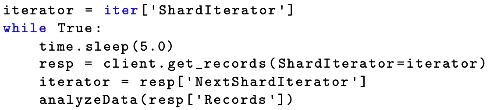

class: middle, center

# 大数据编程模型和使用技巧

## 流式计算

陈一帅

[yschen@bjtu.edu.cn](mailto:yschen@bjtu.edu.cn)

.footnote[网络智能实验室]

北京交通大学电子信息工程学院

---

# 内容

- .red[定义]
- 原理
- 系统

---

# 流式计算

- Streaming
- Batch 分析 vs 实时或近实时分析
  - 实时或近实时分析变得越来越关键
  - 自动驾驶汽车，电网传感器
  - 社会网络上的热门话题和主题标签
- 分析来自无限制流的数据的活动，即数据流分析
  - 可追溯到 1990 年代在斯坦福，加州理工学院和剑桥等地进行的复杂事件处理的基础研究

???

[87] K. M. Chandy, O. Etzion, and R. von Ammon. Event processing. Dagstuhl Seminar Proceedings 10201, Schloss Dagstuhl - Leibniz-Zentrum fuer Informatik, Germany, 2011.

is becoming increasingly critical

sensors onboard an autonomous vehicle or an energy power grid

trending topics and hashtags

activity of analyzing data coming from unbounded streams as data stream analytics.

dates back to basic research on complex event processing in the 1990s at places including Stanford, Caltech, and Cambridge [87].

---

# 内容

- 定义
- .red[原理]
- 系统

---

# 节点预分析

- 数据流的分析有时需要靠近源
- 正在出现执行预分析的工具，其目的是确定应发送到云以进行更深入分析的数据子集
- 如 Apache Edgent 边缘分析工具，能够在 Raspberry Pi 等小型系统中运行

???

analysis of instrument data streams sometimes needs to move closer to the source. Tools are emerging to perform preanalysis, with the goal of identifying the data subsets that should be sent to the cloud for deeper analysis. For example, the Apache Edgent edge-analytics tools edgent.apache.org are designed to run in small systems such as the Raspberry Pi. Kamburugamuve and Fox [165] survey many of these stream-processing technologies,

S. Kamburugamuve and G. Fox. Survey of distributed stream processing, Feb 2016. https://www.researchgate.net/publication/299411481.

---

# 基本挑战

- 正确性和一致性
- 无限流中的数据在时间上不受限制
- 但如果要显示分析结果，则不能等到时间结束
- 因此，需要在合理的时间窗口结束时显示结果
- 如，可以在当天结束时，基于当天事件得到每日摘要
- 但是，如果您想更频繁地（例如每秒）获得结果怎么办？
- 挑战：因为处理分布式，如果时间间隔太短，可能无法收集整个系统的全局状态，某些事件可能会丢失或计数两次。在这种情况下，报告可能不一致。

???

basic challenges, including correctness and consistency.

Data in an unbounded stream are unbounded in time. But if you want to present results from the analytics, you cannot wait until the end of time. So instead you present results at the end of a reasonable time window. For example, you may specify a daily summary based on a complete checkpoint of events for that day. But what if you want results more frequently, say, every second? If the processing is distributed and the window of time is short, you may not have a way to know the global state of the system, and some events may be missed or counted twice. In this case the reports may not be consistent.

---

# 四种时间窗口

- 固定时间窗口：将输入流分为逻辑段，每段对应于一个指定的处理时间间隔。间隔不重叠
- 滑动窗口：允许窗口重叠。例如，窗口大小为 10 秒，每 5 秒启动一次
- 以会话为单位的窗口：将流划分为与数据的某些键相关的活动的会话（Session）。例如，某位用户的一连串鼠标点击可以捆绑到一起，作为一个时间上临近的系列点击会话
- 全局窗口：封装整个有界流

---

# 触发

- 与窗口相关联
- 触发对窗口内容的分析，并发布结果

???

Fixed time windows divide the incoming stream into logical segments, each corresponding to a specified interval of processing time. The intervals do not overlap.

Sliding windows allow for the
windows to overlap: for example, windows of size 10 seconds that start every five seconds.

Per session windows divide the stream into sessions of activity related to some key in the data. For example, mouse clicks from a particular user may be bundled into a sequence of sessions of clicks nearby in time.

Global windows can encapsulate an entire bounded stream.

Trigger

Associated with windows there must be a mechanism to trigger an analysis of the content of the window and publish the summary.

---

# 内容

- 定义
- 原理
- .red[系统]

---

# 系统

- Spark Streaming
- Apache Storm, 来自 Twitter 的 Heron
- Apache Flink，来自德国 Stratosphere 项目
- Apache Beam，来自 Google 的 Cloud Dataflow，可以在 Flink, Spark, Google 云上运行
- Amazon Kinesis
- Azure Event Hubs
- IBM Stream Analytics

???

Spark Streaming spark.apache.org/streaming , derived from the Spark parallel data analysis system described in the next chapter;

Twitter’s Storm system storm.apache.org , redesigned by Twitter as Heron [173];

S. Kulkarni, N. Bhagat, M. Fu, V. Kedigehalli, C. Kellogg, S. Mittal, J. M. Patel, K. Ramasamy, and S. Taneja. Twitter Heron: Stream processing at scale. In ACM SIGMOD International Conference on Management of Data, pages 239–250, 2015.

Apache Flink flink.apache.org from the German Stratosphere project;

Google’s Cloud Dataflow [58], becoming Apache Beam beam.apache.org , which runs on top of Flink, Spark, and Google’s Cloud.

T. Akidau, R. Bradshaw, C. Chambers, S. Chernyak, R. J. Fernández-Moctezuma, R. Lax, S. McVeety, D. Mills, F. Perry, E. Schmidt, and S. Whittle. The dataflow model: A practical approach to balancing correctness, latency, and cost in massive- scale, unbounded, out-of-order data processing. Proceedings of the VLDB Endow- ment, 8(12):1792–1803, Aug. 2015.

commercially developed systems include Amazon Kinesis aws.amazon.com/kinesis

Azure Event Hubs [31], and IBM Stream Analytics [25].

Microsoft Azure Event Hubs. https://azure.microsoft.com/en-us/services/ event-hubs/.

IBM Analytics Stream Computing. http://www.ibm.com/analytics/us/en/ technology/stream-computing/.

---

# AWS Kinesis

- 来自亚马逊的事件流软件堆栈 Kinesis，包括三个服务
  - Kinesis Streams：提供有序的、可重播的实时流数据
  - Kinesis Firehose：支持极高规模的事件处理，可以将数据直接加载到 S3 或其他 Amazon 服务中
  - Kinesis Analytics：提供了基于 SQL 的分析工具，实时分析 Kinesis Streams 或 Firehose 中的流数据

???

Amazon Kinesis and Firehose
Amazon provides an impressive event-streaming software stack called Kinesis, comprising the following three services:

1. Kinesis Streams provides ordered, replayable real-time streaming data.

2. Kinesis Firehose, designed for extreme scale, can load data directly into S3 or other Amazon services.

3. Kinesis Analytics provides SQL-based tools for real-time analysis of stream- ing data from Kinesis Streams or Firehose.

---

# 分片

- 每个 Kinesis 流由一个或多个分片（Shard）组成
- 可以将一个流视为由许多股线组成的绳索
- 每条线都是一个分片（Shard），在流中移动的数据分布在组成该流的各个分片中
- 数据生产者向分片写入数据
- 消费者从分片读取数据

???

Each Kinesis stream is composed of one or more shards.

Think of a stream as a rope composed of many strands. Each strand is a shard, and the data that move through the stream are spread across the individual shards that make up the stream.

Data producers write to the shards and consumers read from the shards.

---

# 分片读写限制

- 写
  - 每个分片可以支持最高每秒 1000 条记录的写操作
  - 每秒最多可以写入 1 MB 数据
  - 但是，任何单个记录都不能大于 1 MB
- 读
  - 数据使用者每秒最多可以读五个事务（Transaction），总吞吐量 2 MB /秒
- 注意这是一个分片的限制
  - 你可以在一个流里包含数千个分片

???

Each shard can support writes from producers at up to 1,000 records per second, up to a maximum data write total of 1 MB per second.

However, no individual record can be bigger than 1 MB.

reads by data consumers can be at most five transactions per second, with a total throughput of 2 MB/sec.

While these bounds may seem rather limiting, you can have streams with thousands of shards.

---

# 和消息队列的区别

- Amazon Simple Queue Service（SQS）消息队列
- 工作机制
  - 消息（事件）生产者将项目添加到 SQS 队列
  - SQS 客户端可从队列中检索消息以进行处理
- 特点
  - 客户端不会删除队列中的消息。它们将保留一段时间（通常为 24 小时），或直到明确刷新整个队列为止
  - 队列中每个消息都有序列号。基于此号，客户端可用 API 一次获取该消息和所有后续消息（有最大数量限制）
  - 因此，客户端可随时重复对队列的分析，不同客户端也可以以相同或不同的方式处理相同的队列

???

Amazon Simple Queue Service (SQS)

SQS is based on the semantics of queues.

Message (event) producers add items to SQS queues; SQS clients can retrieve messages from queues for processing. Messages in a queue are not removed by clients, but are instead retained for a period of time (typically 24 hours) or until the entire queue is explicitly flushed.

Each message in a queue has a sequence number; knowing this number, the client can fetch that message and all subsequent messages (up to a limit) with a single call to the stream API.

Thus, a client can replay an analysis of a queue at any time, and different clients can process the same queue in the same or different ways.

---

# 发送温度传感器数据

- 创建一个 JSON 的温度记录（包括时间，温度）
- 将其转换为二进制数组

.center[.width-100[]]

???
create a string that encodes a JSON record and then convert the string to a binary array.

---

# 发送温度传感器数据

- 通过分区键标识分片
  - 因为只有一个分片，所以用字符串'a'
- 该键值将会被散列化为一个整数，然后被用来选择分片
  - 如果只有一个分片，则所有记录都将映射到分片 0

.center[.width-100[]]

???

We identify the shard by giving the record a partition key as a string: in this case, as we have just one shard, the string 'a'. This key is hashed to an integer that is used to select a shard. (If there is only one shard, all records are mapped to shard 0.)

---

# 读取流

- 先创建 Iterator
  - 每个被写入分片的记录都有一个序列号
  - 要读取这些记录，需要提供一个分片的迭代器
- 三种方法
  - 指定一个时间戳，读取在指定时间之后到达的记录
  - 将迭代器定位到流的最新点，获取该点之后的新记录
  - 根据分片号和序列号创建一个迭代器

???

将 ShardIteratorType 设置为等于“ LATEST”，并省略序列号

Every record loaded into a shard has a sequence number. To read the records, you need to provide a shard iterator,

三种方法

1）specify a timestamp so that you read only the records that arrive after the specified time.

2）request that the iterator be positioned to be the latest point in the stream so that you only get the new records that come after that point.

set the ShardIteratorType equal to “LATEST” and omit the sequence number

3）create an iterator from a sequence number. To do so, you also need the shardID. You can obtain both the shardID and a starting sequence number for that shard by calling describe_stream(StreamName)

---

# 读取流

- 第三种方法
  - 根据分片号（ShardId）和序列号（SequenceNumber）创建迭代器
  - 可通过调用 describe_stream(StreamName)函数获得分片及其起始序列号

.center[.width-100[]]

---

# 获取记录

- 循环 get_records（）函数返回记录列表和元数据
  - 返回“下一个分片的迭代器”，用于获取下一批记录
- 限制
  - 一次最多返回 10 MB，每秒最多返回 2 MB
  - 可以限制返回的记录数，避免 10 MB 的限制
  - 如接近极限，最好添加新分片，或使用拆分分片功能
- 读后分析数据（analyzeData）

.center[.width-100[]]

???

returns at most 10 MB in one call and can support only 2 MB per second.

To avoid the 10 MB limit, you can limit the number of records returned;

but if you are near the limit, it is better to add new shards or, alternatively, to use a split-shard function.

采用基于时间的窗口，对每个窗口内的内容进行分析

get_records() function returns a list of records and metadata that includes a “next shard iterator” that can be used to position the function for the next batch of records.

---

# 分析数据

- 对读出来的记录，逐个解析
  - 每个记录都包括近似到达时间
- 得到 JSON 格式的记录数据，里面包括
  - 记录的本地时间

.center[.width-100[]]

---

# Firehose Batch Stream 转存

- 和 SQS 不同，Kinesis Firehose 处理自动传输到 S3 或 Amazon Redshift 的大量数据流
- 它是面向批处理的：它将传入的数据缓存到最大 128 MB 的缓冲区中，并按照你指定的特定间隔（从每分钟到每 15 分钟）将缓冲区转储到 S3。你还可以指定数据被压缩和/或加密
- 因此，Firehose 并非为实时分析而设计，而是为近实时的大规模分析而设计

???

handle large streams of data that are automatically delivered to S3 or Amazon Redshift.

Firehose is batch oriented: it buffers incoming data into buffers of up to 128 MB and dumps the buffer to
your S3 blobs at specific intervals that you select, from every minute to every 15 minutes. You can also specify that the data be compressed and/or encrypted.

Consequently Firehose is not designed for real-time analysis but for near-real-time large-scale analysis.

---

# Spark Streaming

- 基于 Spark
- 高级库，旨在处理大多数云上的流数据
- 原理
  - 利用 Spark Core 的快速调度功能，按窗口获取流数据，将其转换为一种特殊的 RDD：Dstream
  - Dstream 进入流处理引擎，该引擎可以遵循 MapReduce 或任何 DAG 模型，完成计算
- 优点
  - 基于 RDD 的设计使为批处理分析编写的同一套应用程序代码可以在流分析中使用

???

D-stream

takes windows of streamed data and blocks them into Spark RDDs for analysis.

---

# Streaming 支持的 Transformation 操作

- Map
- Filter
- Repartition
- Union
- Reduce
- Join
- Transform
  - 通过对源 DStream 的每个 RDD 应用 RDD-to-RDD 函数来返回新的 DStream。这可用于在 DStream 上执行任意的 RDD 操作

---

# 部署

- 数据源
  - 可以部署为从 HDFS，Flume，Kafka，Twitter 和 ZeroMQ 源读取数据
- 可以应用于大型集群或单个引擎
  - 在大型集群的生产模式下，可使用 ZooKeeper 和 HDFS 来实现高可用性

???

“Spark Streaming is a high-level library designed for handling streaming data on most clouds.

This library leverages Spark Core’s fast scheduling capability to perform streaming analytics. It accepts data in mini-batches.

The system performs RDD transformations on those mini-batches of data. This design enables the same set of application code written for batch analytics to be used in streaming analytics. The package can be applied on a large cluster or on a single engine.

Spark Streaming can handle both batch and interactive queries. It enables the reuse of the same code for batch processing, joins streams against historical data, or runs ad hoc queries on the stream state. This makes it possible to build powerful interactive applications in addition to its use in data analytics. The streaming engine is modeled in Figure 8.17. Spark has extended Hadoop to execute not only in batch mode, but also for in-memory computation in streaming and real-time applications”

“The streaming module makes it easy to build scalable and fault-tolerant streaming applications. It supports Java, Scala, and Python. The input data streams come from the left-hand side. The receivers then accept them and convert them into a special type of RDDs, called Dstreams. These Dstreams feed into the streaming engine, which could follow the MapReduce or any DAG models. Finally, the answers to queries are output at the right end.
The streaming package can be deployed to read data from HDFS, Flume, Kafka, Twitter, and ZeroMQ sources. The streaming engine can run Spark’s Standalone cluster mode or on an EC2 cluster. In a production mode, Spark Streaming uses ZooKeeper and HDFS for high availability.”

---

# 部署

- 首先部署集群管理器，对其进行识别，分配资源
- 打包应用程序，将程序编译为 JAR
  - 如果程序使用高级资源（例如，Kafka，Flume，Twitter），程序须链接到它们
  - 比如使用 TwitterUtils 的程序必须包含 spark-streaming-twitter_2.10 及其依赖项
- 为程序配置足够内存以容纳接收到的数据。例如，如果要执行 10 分钟窗口操作，则必须至少将最后 10 分钟数据保留在内存中

---

# 部署：容错

- 部署检查点
  - 将 Hadoop API 兼容的容错存储中的目录（例如 HDFS，S3 等）配置为检查点目录。检查点信息可用于故障恢复。
- 配置重启
  - 配置程序驱动程序的自动重启，程序须监视驱动程序进程，在驱动程序失败时重新启动驱动程序
- 预写日志
  - 将接收的所有数据写入检查点目录中的预写日志，可以防止驱动程序恢复时丢失数据，从而确保零数据丢失。但会以单个接收器的接收吞吐量为代价。可通过并行运行更多接收器以提高总吞吐量来纠正此问题
  - 启用预写日志后，可以禁用 Spark 收到的数据的复制，因为该日志已经存储在复制的存储系统中

???

“To deploy a Spark Streaming application, the first thing is to identify it with a cluster manager to put together the needed machine resources. To package the application, you must compile your streaming application into a JAR. If the application uses advanced sources (e.g., Kafka, Flume, Twitter), then you will have to package the extra artifact they link to, along with their dependencies.
For example, an application using TwitterUtils has to include spark-streaming-twitter_2.10 and all its transitive dependencies in the application JAR. Since the received data must be stored in memory, the executors must be configured with sufficient memory to hold the received data. For example, if you are doing 10-min window operations, the system has to keep at least the last 10 min of data in memory. So the memory requirements for the
“application depend on the operations performed.
The next step is to deploy checkpointing. A directory in the Hadoop API compatible fault-tolerant storage (e.g., HDFS, S3, etc.) must be configured as the checkpoint directory. The streaming application is written in a way that checkpoint information can be used for failure recovery. Finally, we need to configure an automatic restart of the application driver. To automatically recover from a driver failure, the streaming application must monitor the driver process and relaunch the driver if it fails. Different cluster managers apply different tools as specified in what follows.
A Spark application driver can be submitted to run within the Spark Standalone cluster that is, the application driver itself runs on one of the worker nodes. Furthermore, the Standalone cluster manager can be instructed to supervise the driver and relaunch it if the driver fails either due to a non-zero exit code or failure of the node running the driver. YARN supports a similar mechanism for automatically restarting an application. Marathon software has been used to achieve this purpose with the use of MESOs as the cluster manager.
In Spark 1.2, a new experimental feature of write ahead logs was introduced[…]”

“ for achieving strong fault-tolerance guarantees. If enabled, all the data received from a receiver gets written into a write ahead log in the configuration checkpoint directory. This prevents data loss on driver recovery, thus ensuring zero data loss. This can be enabled by setting the configuration parameter spark.streaming.receiver.writeAheadLogs.enable to true. However, these stronger semantics may come at the cost of the receiving throughput of individual receivers. This can be corrected by running more receivers in parallel to increase aggregate throughput.
The replication of the received data within Spark can be disabled when the write ahead log is enabled as the log is already stored in a replicated storage system. Similar to that of RDDs, transformations allow the data from the input DStream to be modified. DStreams support many of the transformations available on normal Spark RDDs. Some of the common ones are given in Table 8.5 as a working example.”

---

# 示例

以下代码用于计算滑动窗口上的推文：

```py
TwitterUtils.createStream(…)
    .filter(_.getText.contains(“Spark”))
    .countByWindow(Seconds(5))
```

???

“The following code is used to count tweets on a sliding window:

以下代码查找频率高于某些历史数据的单词

```py
    stream.join(historicCounts).filter {
        case (word, (curCount, oldCount)) =>
            curCount > oldCount
```

The following code finds words with higher frequency than some historical data:

摘录来自: Kai Hwang. “Cloud Computing for Machine Learning and Cognitive Applications。” Apple Books.

---

# Kafka

- 包含发布-订阅（Pub-Sub）消息传递和数据流处理的开源消息系统
- 在服务器群集上运行，高度可扩展性
- 其中的流是记录流，记录被分为多个主题
- 每个记录有一个键、一个值和一个时间戳
- 流可以很简单
  - 一个单流客户端使用一个或多个主题的事件
- 也可以很复杂
  - 基于组织成图的生产者和消费者的集合，称为拓扑

???

an open source message system that incorporates publish-subscribe messaging and streaming.

It is designed to run on a cluster of servers and is highly scalable.

Streams in Kafka are streams of records that are segregated into topics.

Each record has a key, a value, and a timestamp.

Kafka streaming can be simple—a single-stream client consuming events from one or more topics—or more complex, based on sets of producers and consumers organized into graphs, called topologies.

---

# Storm 和 Heron Streams

- 执行有向图的任务
- 由 Nathan Marz 创建，2011 年 Twitter 开源
- 用 Lisp 的一个变种 Clojure 编写，可在 Java 虚拟机上运行
- 2015 年，Twitter 重新编写了 Storm，创建了 API 兼容的 Heron Streams

???

executing a directed graph of tasks

created by Nathan Marz and released as open source by Twitter in late 2011.

Storm was written in a dialect of Lisp called Clojure that runs on the Java virtual machine.

In 2015, Twitter rewrote Storm to create the API-compatible Heron [173]

S. Kulkarni, N. Bhagat, M. Fu, V. Kedigehalli, C. Kellogg, S. Mittal, J. M. Patel, K. Ramasamy, and S. Taneja. Twitter Heron: Stream processing at scale. In ACM SIGMOD International Conference on Management of Data, pages 239–250, 2015.

---

# Storm 拓扑

- DAG 有向无环图
  - 程序定义的抽象拓扑（左）
  - 运行时执行的展开并行拓扑（右）
  - 数据源节点：Spout（喷嘴，数据源）
  - 数据转换和处理节点：Bolt（螺栓）

.center[.width-80[]]

???

DAG

topologies, directed acyclic graphs whose nodes are spouts (data sources) and bolts (data transformation and processing).

An example Storm topology. On the left is the abstract topology as defined by the program; on the right is the unrolled parallel topology as executed at runtime.

---

# Storm 编程模型

- 执行有向图的任务
- Classic 和 Trident
- 扩展基本的 Spout 和 Bolt 类，使用拓扑生成器将所有内容绑定在一起
- 三种方法：prepare()，execute()和 clarifyOutputFields()

???

executing a directed graph of tasks

classic and Trident

Extending the basic spout and bolt classes and then using a topology builder to tie everything together.

Java

Three methods are required: prepare(), execute(), and declareOutputFields().

---

# Google Dataflow and Apache Beam

- Google Cloud Dataflow 系统的开源版本
- 各种最新数据流分析解决方案的常用入口
- 目标是是将批处理和流处理进行统一
- 各种 Trigger（触发器）

???

open source release of the Google Cloud Dataflow system [58], is the most recent entry to the zoo of data stream analytics solutions that we discuss here. An important motivation for Beam (we write Beam rather than Google Cloud Dataflow from now on, to save space) is to treat the batch and streaming cases uniformly.

T. Akidau, R. Bradshaw, C. Chambers, S. Chernyak, R. J. Fernández-Moctezuma, R. Lax, S. McVeety, D. Mills, F. Perry, E. Schmidt, and S. Whittle. The dataflow model: A practical approach to balancing correctness, latency, and cost in massive- scale, unbounded, out-of-order data processing. Proceedings of the VLDB Endow- ment, 8(12):1792–1803, Aug. 2015.

Beam 的 trigger 特别好

---

# Beam watermark（水印）

- 由 Google Dataflow 引入的概念
- 基于事件时间。当系统估计它已在给定窗口中看到所有数据时就用它来发送结果
- 基于指定水印的不同方法，你可以使用多种方法来定义触发器
- 建议参考 Google Dataflow 文档

???

a concept introduced by Google Dataflow called the watermark. A watermark is based on event time and is used to emit results when the system estimates that it has seen all the data in a given window. You can use a variety of methods to define triggers, based on different ways of specifying the watermark. We refer you to the Google Dataflow documents
for details cloud.google.com/dataflow/

---

# Beam vs Spark Streaming

- 原生
  - Spark 是一个批处理系统，流模式是在此基础上附加的
  - Beam 是为了数据流处理从头开始设计的，有批处理能力
- 窗口定义
  - Spark 窗口基于 DStream 中的 RDD，不如 Beam 窗口灵活
- 乱序事件处理
  - 乱序情况下，事件发生时间和处理时间并不相同，这在分布式处理时很常见
  - Beam 能够对此处理。它对事件时间窗口、触发器和水印的介绍是它的主要贡献。因此它可以在乱序情况下仍然及时地生成近似结果

???

Spark is a batch system for which a streaming mode has been attached, whereas Beam was designed from the ground up to be streaming with obvious batch capabilities.

Spark windowing is based on the RDD in the DStream, which is clearly not as flexible as Beam windows.

A more significant point concerns Beam’s recognition that event time and processing time are not the same. This difference becomes critical in dealing with out-of-order events, which clearly can arise in widely distributed situations.

Beam’s introduction of event-time windows, triggers, and watermarks are a major contribution that clarifies important correctness issues when events are out of order, while still allowing the generation of approximate results in a timely manner.

---

# Apache Flink

- 和 Beam 中存在许多相同的核心概念

???

Many of the same core concepts exist in Flink and Beam.

---

# 系统小结

- 系统
  - Kinesis
  - Spark Streaming
  - Azure 流分析
  - Storm / Heron
  - Google Dataflow / Beam
  - Flink
- 共享一些相同的概念，以相似方式创建流水线（Pipeline）
- Storm / Heron 构造图，其他使用函数风格的流水线构造

---

# 小结

- 定义
- 原理
- 系统

???

five different systems: Spark Streaming with Kinesis, Azure Stream Analytics, Storm/Heron, Google Dataflow/Beam, and Flink.

All share some of the same concepts and create pipelines in similar ways.

Storm/Heron explicitly constructs graphs from nodes and edges, whereas the others use a functional style of pipeline composition.

---

# 探索

- Spark Streaming
- AWS Streaming
